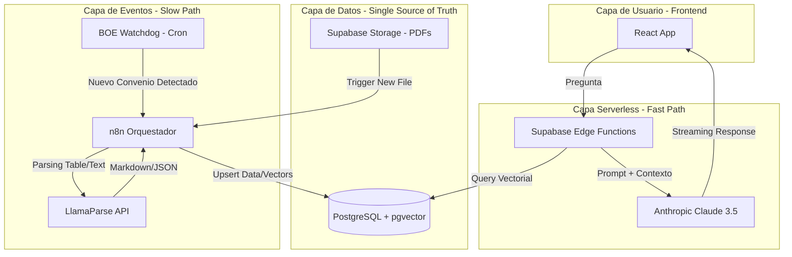
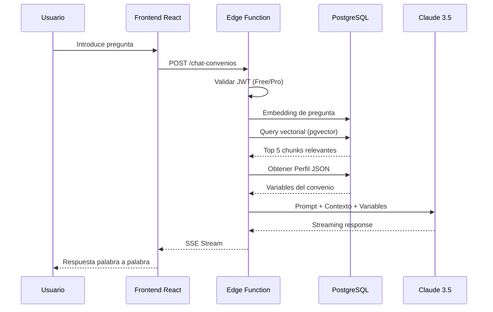
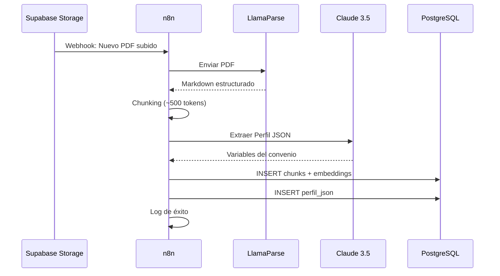

# Arquitectura

**Arquitecto:** Senior Software Architect (Solo-Dev Focus)
**Modelo de Arquitectura:** Serverless / Event-Driven Hybrid
**Stack Principal:** React 19 + Supabase + n8n + Anthropic

---

## 1. Patrón de Código: Monolito Modular

Se ha seleccionado un **Monolito Modular** (un único repositorio) frente a una arquitectura distribuida (microservicios).

### Razones de la decisión

| Factor | Justificación |
|---|---|
| **Equipo** | Desarrollo en solitario (solo-dev). Los microservicios resuelven problemas de coordinación entre equipos; sin equipos, solo añaden complejidad. |
| **Fase del proyecto** | Etapa temprana. La regla es: "empieza con monolito, divide cuando duela". |
| **Presupuesto** | 100€/mes. Un monolito reduce costes de infraestructura y DevOps. |
| **Modularidad interna** | Separación lógica por capas (domain/application/infrastructure) aplicada dentro de cada módulo, sin necesidad de repos separados. |
| **Pipeline ya aislado** | n8n corre en Docker de forma independiente, cubriendo la única separación física necesaria. |

### Estructura del repositorio

```javascript
workrules/
├── apps/
│   └── web/           # React 19 + Vite (Frontend)
├── supabase/
│   └── functions/     # Edge Functions (Backend)
├── packages/
│   └── shared/        # Tipos/DTOs compartidos
├── database/
│   └── schema.sql
└── docs/
```

### ¿Cuándo reconsiderar?

- Más de 2 desarrolladores trabajando en paralelo
- Necesidad de desplegar frontend y backend en cadencias diferentes
- Un componente requiere un lenguaje completamente diferente

---

## 2. Modelo de Despliegue: Serverless Híbrido

Se ha seleccionado un modelo **Serverless Híbrido** para minimizar la carga operativa (Ops).

| Aspecto | Beneficio |
|---|---|
| **Escalabilidad** | Delegada en proveedores (Vercel/Supabase) |
| **Mantenibilidad** | Separación clara entre ingesta de datos (n8n) y consulta (Edge Functions) |
| **Coste** | Optimizado para presupuesto de 100€/mes mediante capas gratuitas y procesamiento asíncrono |

---

## 2. Componentes del Sistema

### A. Frontend (Capa de Presentación)

- **Framework:** React 19 + Vite + TanStack Query
- **Gestión de Estado:** TanStack Query (Server state) + Zustand (Client state)
- **UI/UX:** shadcn/ui + Tailwind CSS
- **IA Integration:** Vercel AI SDK (para streaming de respuestas y hooks de chat)

### B. Backend & Lógica de Negocio (BaaS)

- **Auth & Gateway:** Supabase Auth (Manejo de niveles Free/Premium)
- **Compute:** Supabase Edge Functions (Deno) para lógica de búsqueda y orquestación de prompts
- **Database:** PostgreSQL + `pgvector` para almacenamiento de texto legal y búsqueda semántica

### C. Pipeline de Datos (Ingesta Asíncrona)

- **Orquestador:** n8n (Maneja el flujo pesado de PDF -\> Texto -\> Vectores)
- **Procesamiento de Documentos:** LlamaParse (Conversión de tablas complejas a Markdown estructurado)

---

## 3. Diagrama Lógico de Flujos



---

## 4. Flujo A: Consulta y Cálculo (Tiempo Real)



---

## 5. Flujo B: Ingesta de Convenios (Asíncrono)



---

## 6. Stack Tecnológico Resumido

| Capa | Tecnología |
|---|---|
| **Frontend** | React 19, TanStack Query, shadcn/ui, Zustand |
| **Backend** | Supabase Edge Functions (Deno) |
| **Base de Datos** | PostgreSQL + pgvector |
| **IA (Cerebro)** | Anthropic Claude 3.5 Sonnet |
| **Automatización** | n8n |
| **Parsing PDF** | LlamaParse (Markdown focus) |

---

## 7. Escalabilidad, Seguridad y Rendimiento

### Seguridad

- **RLS (Row Level Security):** Filtra a nivel de base de datos que un usuario solo acceda a convenios públicos o a sus propios PDFs privados
- **Validación de Esquemas:** Zod para validar los inputs del chat
- **Webhooks Firmados:** n8n solo acepta peticiones de Supabase mediante clave secreta

### Rendimiento

- **Semantic Cache:** Almacenamiento de respuestas comunes para evitar llamadas costosas a la IA
- **Tree Shaking:** Optimización de bundles vía Vite para un LCP \< 1.5s
- **Cold Starts:** Edge Functions en Deno con arranque \< 50ms

### Escalabilidad

- Capacidad de procesar desde 100 hasta 10.000 convenios sin cambiar la lógica del servidor
- Coste cero en reposo: si nadie usa la app, el consumo de CPU es cero

### Sub-páginas

- [Arquitectura en el Front](./arquitectura/arquitectura-front.md)
- [Arquitectura en el Back](./arquitectura/arquitectura-back.md)
- [Arquitectura Cloud & Contenedores](./arquitectura/arquitectura-cloud.md)
