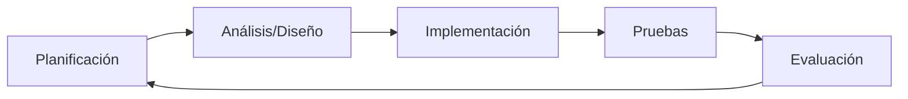

# Ciclo de vida

El modelo de ciclo de vida seleccionado para este proyecto es un modelo **iterativo-incremental**, con esto se busca poder ir obteniendo feedback de los usuarios de una forma constante y definida por fases, además de ir entregando valor continuamente.

---

## Modelo Iterativo-Incremental

El **modelo iterativo–incremental** combina los principios de la **iteración** (mejora continua en ciclos sucesivos) y la **incrementalidad** (entregas parciales funcionales).

### Características principales

| Característica | Descripción |
|:---|:---|
| **Iterativo** | Cada ciclo mejora el producto a partir de retroalimentación |
| **Incremental** | Cada entrega agrega funcionalidades tangibles |
| **Riesgo controlado** | Los errores se detectan temprano |
| **Flexibilidad** | Se pueden adaptar requisitos entre iteraciones |
| **Entrega temprana** | El cliente obtiene partes funcionales antes de finalizar |

### Fases de cada iteración

1. **Planificación del Incremento** - Objetivos, priorización, estimación
2. **Análisis y Diseño** - Modelado de requisitos, arquitectura
3. **Implementación** - Desarrollo e integración
4. **Pruebas y Validación** - Tests y feedback
5. **Evaluación y Ajustes** - Lecciones aprendidas, siguiente iteración

---

## Información General del Proyecto

| Campo | Valor |
|:---|:---|
| **Nombre del Proyecto** | [workrules.eu](http://workrules.eu) |
| **Fecha de inicio** | 09/01/2025 |
| **Responsable** | José María Ocaña |
| **Stakeholders** | BDL Eurofilms |
| **Objetivo general** | Consulta por chat de IA de detalles de convenios |

---

## Fases del Proyecto

| Fase | Nombre | Objetivo | Duración Est. |
|:---|:---|:---|:---|
| **1** | El Back | Pipeline ETL: PDF → Vectores + JSON | W1-W2 |
| **2** | El Brain | Motor RAG y lógica de cálculo | W3-W4 |
| **3** | El Face | Chat con streaming y UI dinámica | W5-W6 |
| **4** | El Business | Pagos, Auth y PDFs privados | W7-W8 |
| **5** | El Scale | Watchdog BOE y automatización total | W9-W10 |
| **6** | El Value | Features de valor añadido para ETTs | W11+ |

### Sub-páginas

- Fase 1: Cimientos y Pipeline de Datos (El "Back")
- Fase 2: El Cerebro RAG y Razonamiento (El "Brain")
- Fase 3: Interfaz de Usuario y Chat (El "Face")
- Fase 4: Usuarios, Pagos y PDFs Privados (El "Business")
- Fase 5: Watchdog del BOE y Escalado (El "Scale")
- Fase 6: Features de Valor Añadido (El "Value")
- Escalado de features en un futuro
