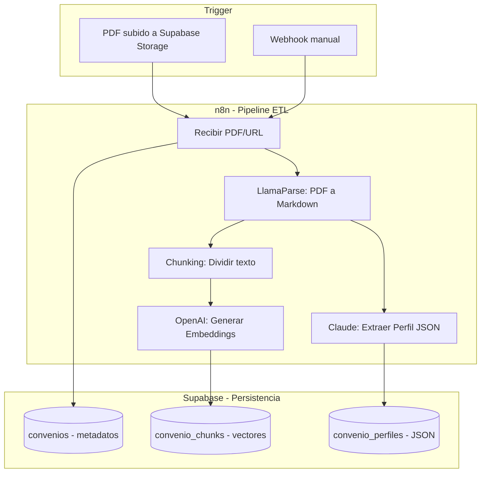

# Fase 1: Cimientos y Pipeline de Datos (El "Back")

## Objetivo Principal

**Construir la "fábrica de datos"** que transforma PDFs legales del BOE en datos estructurados y listos para la IA:

1. **Vectores:** Para búsqueda semántica (encontrar artículos relevantes)
2. **Perfil JSON:** Diccionario de variables del convenio (para cálculos precisos)

---

## Por qué empezar por aquí

> "El riesgo no está en si puedes hacer un botón bonito en React, sino en si la IA es capaz de extraer el dato correcto de un PDF mal escaneado de 1995."
> 
- **Evita el "Efecto Humo":** Resolver el problema más difícil primero
- **Ahorro de tiempo:** Validar viabilidad antes de invertir en UI
- **Motivación:** Ver la IA respondiendo correctamente es el impulso necesario

---

## Arquitectura del Pipeline



---

## Esquema de Base de Datos (SQL)

### Tabla: convenios (Metadatos)

```sql
CREATE TABLE convenios (
  id uuid PRIMARY KEY DEFAULT uuid_generate_v4(),
  nombre text NOT NULL,
  codigo_regcon text UNIQUE,
  ambito text,
  fecha_vigencia date,
  fecha_publicacion_boe date,
  url_pdf text,
  version int DEFAULT 1,
  estado text DEFAULT 'activo',
  created_at timestamptz DEFAULT now()
);
```

### Tabla: convenio_chunks (Vectores)

```sql
CREATE TABLE convenio_chunks (
  id uuid PRIMARY KEY DEFAULT uuid_generate_v4(),
  convenio_id uuid REFERENCES convenios(id) ON DELETE CASCADE,
  contenido text NOT NULL,
  embedding vector(1536),
  metadata jsonb,
  created_at timestamptz DEFAULT now()
);
```

### Tabla: convenio_perfiles (JSON de Variables)

```sql
CREATE TABLE convenio_perfiles (
  id uuid PRIMARY KEY DEFAULT uuid_generate_v4(),
  convenio_id uuid REFERENCES convenios(id) ON DELETE CASCADE,
  perfil_data jsonb NOT NULL,
  created_at timestamptz DEFAULT now(),
  UNIQUE(convenio_id)
);
```

### Tabla: configuracion_legal (Límites Legales)

```sql
CREATE TABLE configuracion_legal (
  id uuid PRIMARY KEY DEFAULT uuid_generate_v4(),
  clave text UNIQUE NOT NULL,
  valor numeric NOT NULL,
  descripcion text,
  vigente_desde date,
  created_at timestamptz DEFAULT now()
);

-- Datos iniciales
INSERT INTO configuracion_legal (clave, valor, descripcion, vigente_desde) VALUES
('SMI_MENSUAL_14_PAGAS', 1134.00, 'Salario Mínimo Interprofesional 2026', '2026-01-01'),
('SMI_MENSUAL_12_PAGAS', 1323.00, 'SMI con pagas prorrateadas', '2026-01-01'),
('SMI_ANUAL', 15876.00, 'SMI anual 2026', '2026-01-01'),
('HORAS_EXTRA_MAX_ANUAL', 80, 'Límite legal Art. 35.2 ET', '1980-01-01'),
('JORNADA_MAX_SEMANAL', 40, 'Límite legal Art. 34.1 ET', '1980-01-01');
```

**Propósito de esta tabla:**

- Validar que los cálculos no resulten por debajo del SMI
- Detectar valores fuera de límites legales (horas extra, jornada)
- Actualizar fácilmente cuando cambie la legislación

---

## El Perfil JSON (Pieza Maestra)

Este JSON es el **diferenciador técnico** que permite cálculos precisos:

```json
{
  "convenio": "Hostelería de Madrid",
  "codigo_regcon": "28000335011982",
  "variables_criticas": [
    "Categoría Profesional",
    "Categoría Hotel", 
    "Años Antigüedad"
  ],
  "valores_posibles": {
    "Categoría Hotel": ["3 estrellas", "4 estrellas", "5 estrellas"],
    "Categoría Profesional": ["Gobernanta", "Camarera de Pisos", "Recepcionista"]
  },
  "datos_economicos": {
    "numero_pagas": 14,
    "jornada_anual_horas": 1760,
    "tablas_salariales": {
      "Gobernanta": {"base_anual": 18500, "plus_transporte": 600},
      "Camarera de Pisos": {"base_anual": 16200, "plus_transporte": 600}
    }
  }
}
```

---

## Desglose de Tareas Atómicas

---

### **Bloque 1: Infraestructura Base** (Setup inicial)

### ✅ [I1.3] Crear esquema SQL base

- **Estado:** COMPLETADO
- **Descripción:** Crear tabla convenios, convenio_chunks (embeddings), convenio_perfiles (JSONB)
- **Archivos:** `database/schema.sql`, `database/[README.md](http://README.md)`
- **Dependencias:** Ninguna
- **Siguiente paso:** Desplegar en Supabase

---

### 🔲 [I1.1] Crear proyecto Supabase

- **Estado:** PENDIENTE
- **Prioridad:** 🔴 Alta
- **Descripción:**
    - Crear cuenta en Supabase
    - Crear nuevo proyecto (región EU para GDPR)
    - Obtener credenciales (anon key, service role key, URL)
    - Guardar credenciales en archivo `.env`
- **Dependencias:** Ninguna
- **Bloquea:** I1.2, I1.4
- **Tiempo estimado:** 15-20 minutos
- **Entregables:**
    - Proyecto Supabase activo
    - Archivo `.env` con credenciales
    - URL del proyecto documentada

**Recursos necesarios:**

- Email para registro
- Navegador web

---

### 🔲 [I1.2] Configurar extensiones PostgreSQL

- **Estado:** PENDIENTE
- **Prioridad:** 🔴 Alta
- **Descripción:**
    - Habilitar extensión `pgvector` para embeddings
    - Habilitar extensión `uuid-ossp` para generación de IDs
    - Ejecutar el esquema SQL (`database/schema.sql`)
- **Dependencias:** I1.1 (necesita proyecto Supabase activo)
- **Bloquea:** I1.8 (embeddings)
- **Tiempo estimado:** 10 minutos
- **Entregables:**
    - Extensiones habilitadas en Supabase
    - Tablas creadas y verificadas
    - Screenshot de SQL Editor con tablas visibles

**Comandos SQL:**

```sql
-- Se ejecutarán desde el SQL Editor de Supabase
CREATE EXTENSION IF NOT EXISTS vector;
CREATE EXTENSION IF NOT EXISTS "uuid-ossp";
-- Luego copiar/pegar todo el contenido de database/schema.sql
```

---

### 🔲 [I1.4] Configurar Storage bucket

- **Estado:** PENDIENTE
- **Prioridad:** 🔴 Alta
- **Descripción:**
    - Crear bucket `convenios-pdf` para almacenar PDFs originales
    - Configurar políticas de acceso público para lectura
    - Probar subida de archivo de prueba
- **Dependencias:** I1.1 (necesita proyecto Supabase)
- **Bloquea:** I1.6 (workflow necesita almacenar PDFs)
- **Tiempo estimado:** 10 minutos
- **Entregables:**
    - Bucket creado en Supabase Storage
    - Políticas de acceso configuradas
    - PDF de prueba subido y accesible

**Políticas RLS sugeridas:**

```sql
-- Permitir lectura pública
CREATE POLICY "Public read access"
ON storage.objects FOR SELECT
USING (bucket_id = 'convenios-pdf');

-- Permitir subida autenticada
CREATE POLICY "Authenticated upload"
ON storage.objects FOR INSERT
WITH CHECK (bucket_id = 'convenios-pdf' AND auth.role() = 'authenticated');
```

---

### **Bloque 2: Pipeline n8n** (Orquestación)

### 🔲 [I1.5] Instalar n8n (self-hosted)

- **Estado:** PENDIENTE
- **Prioridad:** 🔴 Alta
- **Descripción:**
    - Opción A: Desplegar en Railway/Render (recomendado para inicio)
    - Opción B: Instalación local con Docker
    - Configurar persistencia de workflows
    - Configurar credenciales de Supabase en n8n
- **Dependencias:** I1.1, I1.2 (necesita credenciales de Supabase)
- **Bloquea:** I1.6, I1.7, I1.8, I1.9
- **Tiempo estimado:** 30-45 minutos
- **Entregables:**
    - n8n instalado y accesible
    - Credenciales de Supabase configuradas
    - API keys de OpenAI y Anthropic configuradas
    - Workflow de prueba ejecutado

**Opciones de instalación:**

**Opción A - Railway (más fácil):**

1. Ir a [railway.app](http://railway.app)
2. "New Project" → "Deploy n8n"
3. Configurar variables de entorno
4. Obtener URL pública

**Opción B - Docker local:**

```bash
docker run -d \
  --name n8n \
  -p 5678:5678 \
  -v ~/.n8n:/home/node/.n8n \
  n8nio/n8n
```

---

### 🔲 [I1.6] Crear workflow de ingesta

- **Estado:** PENDIENTE
- **Prioridad:** 🔴 Alta
- **Descripción:**
    - **Trigger:** Webhook HTTP POST con URL del PDF
    - **Nodo 1:** Descargar PDF desde URL
    - **Nodo 2:** Subir a Supabase Storage
    - **Nodo 3:** Llamar a LlamaParse API
    - **Nodo 4:** Recibir markdown parseado
    - **Nodo 5:** Guardar registro en tabla `convenios`
- **Dependencias:** I1.4 (Storage), I1.5 (n8n instalado)
- **Bloquea:** I1.7, I1.9
- **Tiempo estimado:** 1-2 horas
- **Entregables:**
    - Workflow funcional en n8n
    - URL de webhook documentada
    - Prueba exitosa con PDF de ejemplo

**Estructura del webhook POST:**

```json
{
  "pdf_url": "[https://example.com/convenio.pdf](https://example.com/convenio.pdf)",
  "nombre": "Convenio Colectivo Ejemplo",
  "codigo_regcon": "REG-2024-001",
  "ambito": "Provincial - Madrid",
  "fecha_vigencia": "2024-01-01"
}
```

---

### 🔲 [I1.7] Implementar chunking inteligente

- **Estado:** PENDIENTE
- **Prioridad:** 🟡 Media
- **Descripción:**
    - Dividir markdown en chunks de ~500 tokens
    - Preservar contexto de secciones (artículos, capítulos)
    - Añadir metadata a cada chunk (sección, página origen)
    - Numerar chunks secuencialmente
- **Dependencias:** I1.6 (workflow base debe existir)
- **Bloquea:** I1.8 (embeddings necesitan chunks)
- **Tiempo estimado:** 1-2 horas
- **Entregables:**
    - Función/nodo de chunking en n8n
    - Chunks con metadata estructurada
    - Validación de tamaño de tokens

**Ejemplo de metadata:**

```json
{
  "seccion": "Capítulo III - Jornada Laboral",
  "articulo": "Artículo 15",
  "pagina_origen": 12,
  "tipo": "normativa"
}
```

---

### 🔲 [I1.8] Integrar generación de embeddings

- **Estado:** PENDIENTE
- **Prioridad:** 🔴 Alta
- **Descripción:**
    - Conectar con OpenAI Embeddings API
    - Usar modelo `text-embedding-3-small`
    - Generar vector de 1536 dimensiones por chunk
    - Almacenar en campo `convenio_chunks.embedding`
- **Dependencias:** I1.2 (pgvector habilitado), I1.7 (chunks listos)
- **Bloquea:** I1.11 (testing requiere búsqueda semántica)
- **Tiempo estimado:** 1 hora
- **Entregables:**
    - Integración con OpenAI API
    - Embeddings generados y almacenados
    - Prueba de búsqueda vectorial

**Llamada API ejemplo:**

```jsx
// En n8n - HTTP Request Node
POST [https://api.openai.com/v1/embeddings](https://api.openai.com/v1/embeddings)
{
  "input": "texto del chunk",
  "model": "text-embedding-3-small"
}
```

---

### 🔲 [I1.9] Crear nodo de extracción de perfil

- **Estado:** PENDIENTE
- **Prioridad:** 🔴 Alta
- **Descripción:**
    - Enviar texto completo del convenio a Claude 3.5 Sonnet
    - Usar prompt estructurado para extraer variables clave
    - Parsear respuesta JSON y validar schema
    - Guardar en tabla `convenio_perfiles`
- **Dependencias:** I1.6 (workflow base)
- **Bloquea:** I1.11 (testing completo)
- **Tiempo estimado:** 2-3 horas
- **Entregables:**
    - Prompt de extracción optimizado
    - Validación de schema JSON
    - Perfiles extraídos correctamente

**Estructura esperada del JSON de perfil:**

```json
{
  "categorias": [
    {
      "nombre": "Oficial de Primera",
      "grupo": "Grupo II",
      "nivel": 3,
      "salario_base": 1800.50,
      "complementos": ["antiguedad", "nocturnidad"]
    }
  ],
  "jornada_laboral": {
    "horas_anuales": 1760,
    "vacaciones": 30
  },
  "pluses": {
    "nocturnidad": 15.5,
    "peligrosidad": 20.0
  }
}
```

---

### **Bloque 3: Calidad y Documentación** (Finalizando)

### 🔲 [I1.10] Implementar manejo de errores

- **Estado:** PENDIENTE
- **Prioridad:** 🟡 Media
- **Descripción:**
    - Retry automático en fallos de API (3 intentos)
    - Logging de errores en tabla dedicada
    - Webhook de notificación de fallos
    - Circuit breaker para APIs externas
- **Dependencias:** I1.6, I1.7, I1.8, I1.9 (todos los nodos implementados)
- **Bloquea:** I1.11 (testing debe validar manejo de errores)
- **Tiempo estimado:** 1-2 horas
- **Entregables:**
    - Error handling en todos los nodos
    - Tabla de logs creada
    - Notificaciones funcionando

**Tabla de logs (añadir a schema.sql):**

```sql
CREATE TABLE pipeline_logs (
    id UUID PRIMARY KEY DEFAULT uuid_generate_v4(),
    workflow_execution_id TEXT,
    node_name TEXT,
    error_message TEXT,
    error_stack TEXT,
    input_data JSONB,
    created_at TIMESTAMP WITH TIME ZONE DEFAULT CURRENT_TIMESTAMP
);
```

---

### 🔲 [I1.11] Testing con convenio real

- **Estado:** PENDIENTE
- **Prioridad:** 🔴 Alta
- **Descripción:**
    - Seleccionar convenio de prueba (ej: Oficinas y Despachos Madrid)
    - Ejecutar pipeline completo end-to-end
    - Verificar chunks generados correctamente
    - Validar embeddings almacenados
    - Comprobar perfil extraído
    - Probar búsqueda semántica
- **Dependencias:** TODAS las anteriores (I1.1 a I1.10)
- **Bloquea:** I1.12 (documentación debe reflejar resultados reales)
- **Tiempo estimado:** 1-2 horas
- **Entregables:**
    - Reporte de testing con métricas
    - Screenshots del pipeline ejecutado
    - Validación de calidad de datos

**Métricas a validar:**

- ✅ PDF procesado sin errores
- ✅ Número de chunks generados (esperado: 50-200)
- ✅ Embeddings con dimensión correcta (1536)
- ✅ Perfil JSON con al menos 80% de categorías extraídas
- ✅ Búsqueda semántica devuelve resultados relevantes

---

### 🔲 [I1.12] Documentar APIs y endpoints

- **Estado:** PENDIENTE
- **Prioridad:** 🟢 Baja
- **Descripción:**
    - Documentar webhook de ingesta
    - Documentar estructura de tablas
    - Crear README del pipeline
    - Añadir ejemplos de uso
- **Dependencias:** I1.11 (todo debe estar probado)
- **Bloquea:** Ninguna (es final)
- **Tiempo estimado:** 1 hora
- **Entregables:**
    - `docs/[API.md](http://API.md)` con endpoints
    - `docs/[PIPELINE.md](http://PIPELINE.md)` con diagrama de flujo
    - Ejemplos en formato curl/Postman

---

## 📈 Progreso Visual

```
Bloque 1: Infraestructura Base
├─ ✅ I1.3 Crear esquema SQL base
├─ ⬜ I1.1 Crear proyecto Supabase
├─ ⬜ I1.2 Configurar extensiones PostgreSQL
└─ ⬜ I1.4 Configurar Storage bucket

Bloque 2: Pipeline n8n
├─ ⬜ I1.5 Instalar n8n
├─ ⬜ I1.6 Crear workflow de ingesta
├─ ⬜ I1.7 Implementar chunking inteligente
├─ ⬜ I1.8 Integrar generación de embeddings
└─ ⬜ I1.9 Crear nodo de extracción de perfil

Bloque 3: Calidad y Documentación
├─ ⬜ I1.10 Implementar manejo de errores
├─ ⬜ I1.11 Testing con convenio real
└─ ⬜ I1.12 Documentar APIs y endpoints
```

**Progreso Total:** 1/12 tareas (8.3%)

---

## 🔑 Credenciales y API Keys Necesarias

Antes de empezar, asegúrate de tener:

- [ ]  Cuenta Supabase (gratis)
- [ ]  API Key de OpenAI (para embeddings) - [Obtener aquí](https://platform.openai.com/api-keys)
- [ ]  API Key de Anthropic (para Claude) - [Obtener aquí](https://console.anthropic.com/)
- [ ]  API Key de LlamaParse - [Obtener aquí](https://cloud.llamaindex.ai/)
- [ ]  Cuenta Railway/Render (para n8n) - Opcional si usas Docker local

---

## 📝 Convención de Archivos

```
workrules/
├── database/
│   ├── schema.sql           ✅ Creado
│   ├── [README.md](http://README.md)            ✅ Creado
│   └── migrations/          (futuro)
├── docs/
│   ├── [API.md](http://API.md)               (I1.12)
│   ├── [PIPELINE.md](http://PIPELINE.md)          (I1.12)
│   └── [setup-supabase.md](http://setup-supabase.md)    (I1.1)
├── n8n-workflows/
│   ├── ingesta-convenio.json    (I1.6)
│   └── [README.md](http://README.md)                (I1.12)
├── .env.example             (I1.1)
├── .env                     (I1.1 - NO subir a git)
└── [ROADMAP-FASE1.md](http://ROADMAP-FASE1.md)         ✅ Este archivo
```

---

## 🎯 Siguientes Pasos

**AHORA MISMO:** Comenzar con **[I1.1] Crear proyecto Supabase**

Una vez completado I1.1, continuar en orden:

1. I1.2 - Configurar extensiones
2. I1.4 - Configurar Storage
3. I1.5 - Instalar n8n
4. ... (seguir roadmap)

---

## 🆘 Ayuda y Recursos

- **Supabase Docs:** [https://supabase.com/docs](https://supabase.com/docs)
- **n8n Docs:** [https://docs.n8n.io/](https://docs.n8n.io/)
- **pgvector Docs:** [https://github.com/pgvector/pgvector](https://github.com/pgvector/pgvector)
- **LlamaParse:** [https://docs.llamaindex.ai/en/stable/llama_cloud/llama_parse/](https://docs.llamaindex.ai/en/stable/llama_cloud/llama_parse/)

---

## Criterios de Exito

- [ ]  Pipeline n8n ejecuta sin errores manuales
- [ ]  3 convenios distintos procesados correctamente
- [ ]  Busqueda semantica devuelve fragmentos relevantes
- [ ]  Perfil JSON mapea >90% de categorias del convenio
- [ ]  Business Dev Leader valida utilidad del output