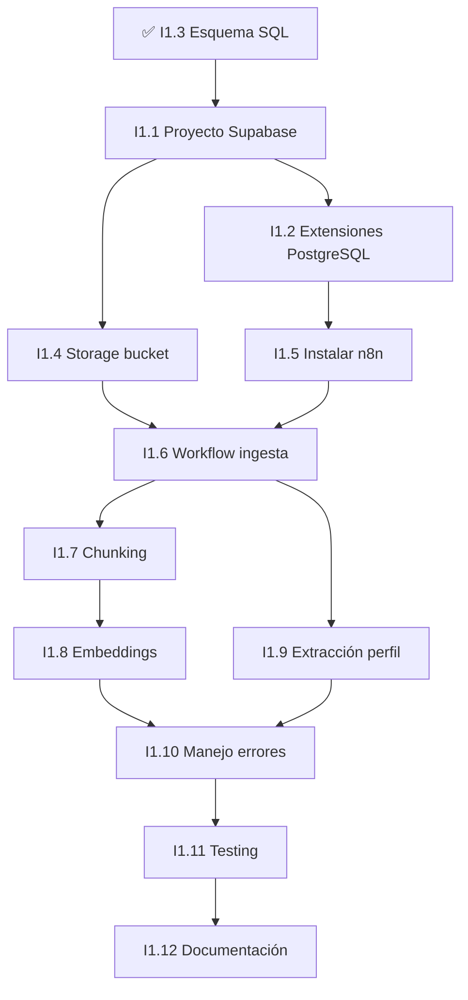

# Tareas Fase 1 - Fundamentos

## Resumen de Progreso

| Estado | Cantidad |
|--------|----------|
| ✅ Listo | 1 |
| 🔄 En progreso | 0 |
| ⬜ Sin empezar | 11 |
| **Total** | **12** |

**Progreso:** 8.3% completado (1/12 tareas)

---

## Tareas por Estado

### ✅ Completadas (1)

#### [I1.3] Crear esquema SQL base
- **ID:** I1.3
- **Prioridad:** 🔴 Alta
- **Estado:** ✅ COMPLETADO
- **Descripción:**
  - Crear tabla convenios, convenio_chunks (embeddings), convenio_perfiles (JSONB)
  - Archivos: `database/schema.sql`, `database/README.md`
- **Dependencias:** Ninguna
- **Bloquea:** I1.2 (desplegar en Supabase)
- **Entregables:**
  - ✅ Tablas creadas: convenios (metadata), convenio_chunks (embeddings vectoriales 1536 dims), convenio_perfiles (JSONB)
  - ✅ Archivos: database/schema.sql, database/README.md

---

### ⬜ Pendientes (11)

#### [I1.1] Crear proyecto Supabase
- **ID:** I1.1
- **Prioridad:** 🔴 Alta
- **Estado:** ✅ COMPLETADO
- **Descripción:**
  - Crear cuenta en Supabase
  - Crear nuevo proyecto (región EU para GDPR)
  - Obtener credenciales (anon key, service role key, URL)
  - Guardar credenciales en archivo `.env`
- **Dependencias:** Ninguna
- **Bloquea:** I1.2, I1.4
- **Tiempo estimado:** 15-20 minutos
- **Entregables:**
  - Proyecto Supabase activo
  - Archivo `.env` con credenciales
  - URL del proyecto documentada
- **Recursos necesarios:**
  - Email para registro
  - Navegador web

---

#### [I1.2] Configurar extensiones PostgreSQL
- **ID:** I1.2
- **Prioridad:** 🔴 Alta
- **Estado:** ✅ COMPLETADO
- **Descripción:**
  - Habilitar extensión `pgvector` para embeddings
  - Habilitar extensión `uuid-ossp` para generación de IDs
  - Ejecutar el esquema SQL (`database/schema.sql`)
- **Dependencias:** I1.1 (necesita proyecto Supabase activo)
- **Bloquea:** I1.8 (embeddings)
- **Tiempo estimado:** 10 minutos
- **Entregables:**
  - Extensiones habilitadas en Supabase
  - Tablas creadas y verificadas
  - Screenshot de SQL Editor con tablas visibles
- **Comandos SQL:**
```sql
-- Se ejecutarán desde el SQL Editor de Supabase
CREATE EXTENSION IF NOT EXISTS vector;
CREATE EXTENSION IF NOT EXISTS "uuid-ossp";
-- Luego copiar/pegar todo el contenido de database/schema.sql
```

---

#### [I1.4] Configurar Storage bucket
- **ID:** I1.4
- **Prioridad:** 🔴 Alta
- **Estado:** ✅ COMPLETADO
- **Descripción:**
  - Crear bucket `convenios-pdf` para almacenar PDFs originales
  - Configurar políticas de acceso público para lectura
  - Probar subida de archivo de prueba
- **Dependencias:** I1.1 (necesita proyecto Supabase)
- **Bloquea:** I1.6 (workflow necesita almacenar PDFs)
- **Tiempo estimado:** 10 minutos
- **Entregables:**
  - Bucket creado en Supabase Storage
  - Políticas de acceso configuradas
  - PDF de prueba subido y accesible
- **Políticas RLS sugeridas:**
```sql
-- Permitir lectura pública
CREATE POLICY "Public read access"
ON storage.objects FOR SELECT
USING (bucket_id = 'convenios-pdf');

-- Permitir subida autenticada
CREATE POLICY "Authenticated upload"
ON storage.objects FOR INSERT
WITH CHECK (bucket_id = 'convenios-pdf' AND auth.role() = 'authenticated');
```

---

#### [I1.5] Instalar n8n (self-hosted)
- **ID:** I1.5
- **Prioridad:** 🔴 Alta
- **Estado:** 🔄 EN PROGRESO
- **Descripción:**
  - Desplegar en Hostinger
  - Configurar persistencia de workflows
  - Configurar credenciales de Supabase en n8n
- **Dependencias:** I1.1, I1.2 (necesita credenciales de Supabase)
- **Bloquea:** I1.6, I1.7, I1.8, I1.9
- **Tiempo estimado:** 30-45 minutos
- **Entregables:**
  - n8n instalado y accesible
  - Credenciales de Supabase configuradas
  - API keys de OpenAI y Anthropic configuradas
  - Workflow de prueba ejecutado
- **Opciones de instalación:**

**Opción A - Hostinger VPS con Docker (recomendado):**
```bash
# 1. Instalar Docker (si no está instalado)
curl -fsSL https://get.docker.com -o get-docker.sh
sudo sh get-docker.sh

# 2. Instalar Docker Compose
sudo apt update
sudo apt install docker-compose -y

# 3. Crear directorio para n8n
mkdir -p ~/.n8n

# 4. Crear docker-compose.yml
cat > docker-compose.yml <<EOF
version: '3.8'
services:
  n8n:
    image: n8nio/n8n
    restart: always
    ports:
      - "5678:5678"
    environment:
      - N8N_BASIC_AUTH_ACTIVE=true
      - N8N_BASIC_AUTH_USER=admin
      - N8N_BASIC_AUTH_PASSWORD=tu_password_seguro
      - N8N_HOST=tu-dominio.com
      - WEBHOOK_URL=https://tu-dominio.com/
    volumes:
      - ~/.n8n:/home/node/.n8n
EOF

# 5. Iniciar n8n
docker-compose up -d

# 6. Verificar que está corriendo
docker ps
```

**Opción B - Instalación directa con PM2:**
```bash
# 1. Instalar Node.js (si no está instalado)
curl -fsSL https://deb.nodesource.com/setup_20.x | sudo -E bash -
sudo apt install -y nodejs

# 2. Instalar n8n globalmente
npm install -g n8n

# 3. Instalar PM2 para mantener n8n corriendo
npm install -g pm2

# 4. Crear script de inicio
cat > ~/start-n8n.sh <<EOF
#!/bin/bash
export N8N_BASIC_AUTH_ACTIVE=true
export N8N_BASIC_AUTH_USER=admin
export N8N_BASIC_AUTH_PASSWORD=tu_password_seguro
n8n
EOF

chmod +x ~/start-n8n.sh

# 5. Iniciar n8n con PM2
pm2 start ~/start-n8n.sh --name n8n

# 6. Guardar configuración PM2
pm2 save
pm2 startup
```

**Configuración de variables de entorno en n8n:**
Una vez instalado, configurar las credenciales en la interfaz web:
- Supabase URL y API Keys
- OpenAI API Key
- Anthropic API Key
- LlamaParse API Key

---

#### [I1.6] Crear workflow de ingesta
- **ID:** I1.6
- **Prioridad:** 🔴 Alta
- **Estado:** ⬜ PENDIENTE
- **Descripción:**
  - **Trigger:** Webhook HTTP POST con URL del PDF
  - **Nodo 1:** Descargar PDF desde URL
  - **Nodo 2:** Subir a Supabase Storage
  - **Nodo 3:** Llamar a LlamaParse API
  - **Nodo 4:** Recibir markdown parseado
  - **Nodo 5:** Guardar registro en tabla `convenios`
- **Dependencias:** I1.4 (Storage), I1.5 (n8n instalado)
- **Bloquea:** I1.7, I1.9
- **Tiempo estimado:** 1-2 horas
- **Entregables:**
  - Workflow funcional en n8n
  - URL de webhook documentada
  - Prueba exitosa con PDF de ejemplo

---

#### [I1.7] Implementar chunking inteligente
- **ID:** I1.7
- **Prioridad:** 🟡 Media
- **Estado:** ⬜ PENDIENTE
- **Descripción:**
  - Dividir markdown en chunks de ~500 tokens
  - Preservar contexto de secciones (artículos, capítulos)
  - Añadir metadata a cada chunk (sección, página origen)
  - Numerar chunks secuencialmente
- **Dependencias:** I1.6 (workflow base debe existir)
- **Bloquea:** I1.8 (embeddings necesitan chunks)
- **Tiempo estimado:** 1-2 horas
- **Entregables:**
  - Función/nodo de chunking en n8n
  - Chunks con metadata estructurada
  - Validación de tamaño de tokens
- **Ejemplo de metadata:**
```json
{
  "seccion": "Capítulo III - Jornada Laboral",
  "articulo": "Artículo 15",
  "pagina_origen": 12,
  "tipo": "normativa"
}
```

---

#### [I1.8] Integrar generación de embeddings
- **ID:** I1.8
- **Prioridad:** 🔴 Alta
- **Estado:** ⬜ PENDIENTE
- **Descripción:**
  - Conectar con OpenAI Embeddings API
  - Usar modelo `text-embedding-3-small`
  - Generar vector de 1536 dimensiones por chunk
  - Almacenar en campo `convenio_chunks.embedding`
- **Dependencias:** I1.2 (pgvector habilitado), I1.7 (chunks listos)
- **Bloquea:** I1.11 (testing requiere búsqueda semántica)
- **Tiempo estimado:** 1 hora
- **Entregables:**
  - Integración con OpenAI API
  - Embeddings generados y almacenados
  - Prueba de búsqueda vectorial

---

#### [I1.9] Crear nodo de extracción de perfil
- **ID:** I1.9
- **Prioridad:** 🔴 Alta
- **Estado:** ⬜ PENDIENTE
- **Descripción:**
  - Enviar texto completo del convenio a Claude 3.5 Sonnet
  - Usar prompt estructurado para extraer variables clave
  - Parsear respuesta JSON y validar schema
  - Guardar en tabla `convenio_perfiles`
- **Dependencias:** I1.6 (workflow base)
- **Bloquea:** I1.11 (testing completo)
- **Tiempo estimado:** 2-3 horas
- **Entregables:**
  - Prompt de extracción optimizado
  - Validación de schema JSON
  - Perfiles extraídos correctamente
- **Estructura esperada del JSON de perfil:**
```json
{
  "categorias": [
    {
      "nombre": "Oficial de Primera",
      "grupo": "Grupo II",
      "nivel": 3,
      "salario_base": 1800.50,
      "complementos": ["antiguedad", "nocturnidad"]
    }
  ],
  "jornada_laboral": {
    "horas_anuales": 1760,
    "vacaciones": 30
  },
  "pluses": {
    "nocturnidad": 15.5,
    "peligrosidad": 20.0
  }
}
```

---

#### [I1.10] Implementar manejo de errores
- **ID:** I1.10
- **Prioridad:** 🟡 Media
- **Estado:** ⬜ PENDIENTE
- **Descripción:**
  - Retry automático en fallos de API (3 intentos)
  - Logging de errores en tabla dedicada
  - Webhook de notificación de fallos
  - Circuit breaker para APIs externas
- **Dependencias:** I1.6, I1.7, I1.8, I1.9 (todos los nodos implementados)
- **Bloquea:** I1.11 (testing debe validar manejo de errores)
- **Tiempo estimado:** 1-2 horas
- **Entregables:**
  - Error handling en todos los nodos
  - Tabla de logs creada
  - Notificaciones funcionando
- **Tabla de logs (añadir a schema.sql):**
```sql
CREATE TABLE pipeline_logs (
    id UUID PRIMARY KEY DEFAULT uuid_generate_v4(),
    workflow_execution_id TEXT,
    node_name TEXT,
    error_message TEXT,
    error_stack TEXT,
    input_data JSONB,
    created_at TIMESTAMP WITH TIME ZONE DEFAULT CURRENT_TIMESTAMP
);
```

---

#### [I1.11] Testing con convenio real
- **ID:** I1.11
- **Prioridad:** 🔴 Alta
- **Estado:** ⬜ PENDIENTE
- **Descripción:**
  - Seleccionar convenio de prueba (ej: Oficinas y Despachos Madrid)
  - Ejecutar pipeline completo end-to-end
  - Verificar chunks generados correctamente
  - Validar embeddings almacenados
  - Comprobar perfil extraído
  - Probar búsqueda semántica
- **Dependencias:** TODAS las anteriores (I1.1 a I1.10)
- **Bloquea:** I1.12 (documentación debe reflejar resultados reales)
- **Tiempo estimado:** 1-2 horas
- **Entregables:**
  - Reporte de testing con métricas
  - Screenshots del pipeline ejecutado
  - Validación de calidad de datos
- **Métricas a validar:**
  - ✅ PDF procesado sin errores
  - ✅ Número de chunks generados (esperado: 50-200)
  - ✅ Embeddings con dimensión correcta (1536)
  - ✅ Perfil JSON con al menos 80% de categorías extraídas
  - ✅ Búsqueda semántica devuelve resultados relevantes

---

#### [I1.12] Documentar APIs y endpoints
- **ID:** I1.12
- **Prioridad:** 🟢 Baja
- **Estado:** ⬜ PENDIENTE
- **Descripción:**
  - Documentar webhook de ingesta
  - Documentar estructura de tablas
  - Crear README del pipeline
  - Añadir ejemplos de uso
- **Dependencias:** I1.11 (todo debe estar probado)
- **Bloquea:** Ninguna (es final)
- **Tiempo estimado:** 1 hora
- **Entregables:**
  - `docs/API.md` con endpoints
  - `docs/PIPELINE.md` con diagrama de flujo
  - Ejemplos en formato curl/Postman

---

## Bloques de Tareas

### Bloque 1: Infraestructura Base
- ✅ I1.3 - Crear esquema SQL base
- ⬜ I1.1 - Crear proyecto Supabase
- ⬜ I1.2 - Configurar extensiones PostgreSQL
- ⬜ I1.4 - Configurar Storage bucket

### Bloque 2: Pipeline n8n
- ⬜ I1.5 - Instalar n8n
- ⬜ I1.6 - Crear workflow de ingesta
- ⬜ I1.7 - Implementar chunking inteligente
- ⬜ I1.8 - Integrar generación de embeddings
- ⬜ I1.9 - Crear nodo de extracción de perfil

### Bloque 3: Calidad y Documentación
- ⬜ I1.10 - Implementar manejo de errores
- ⬜ I1.11 - Testing con convenio real
- ⬜ I1.12 - Documentar APIs y endpoints

---

## Orden Recomendado de Ejecución



---

## Dependencias Entre Tareas

| Tarea | Depende de | Bloquea |
|-------|-----------|---------|
| I1.3 | - | I1.2 |
| I1.1 | - | I1.2, I1.4 |
| I1.2 | I1.1 | I1.8 |
| I1.4 | I1.1 | I1.6 |
| I1.5 | I1.1, I1.2 | I1.6, I1.7, I1.8, I1.9 |
| I1.6 | I1.4, I1.5 | I1.7, I1.9 |
| I1.7 | I1.6 | I1.8 |
| I1.8 | I1.2, I1.7 | I1.11 |
| I1.9 | I1.6 | I1.11 |
| I1.10 | I1.6, I1.7, I1.8, I1.9 | I1.11 |
| I1.11 | Todas las anteriores | I1.12 |
| I1.12 | I1.11 | - |

---

## Próximos Pasos Inmediatos

1. **Iniciar I1.1** - Crear proyecto Supabase (🔴 Alta prioridad, desbloquea I1.2 e I1.4)
2. **Completar I1.2** - Configurar extensiones PostgreSQL (depende de I1.1)
3. **Completar I1.4** - Configurar Storage bucket (depende de I1.1, desbloquea I1.6)

---

## Credenciales y API Keys Necesarias

Antes de empezar, asegúrate de tener:
- [ ] Cuenta Supabase (gratis)
- [ ] API Key de OpenAI (para embeddings) - [Obtener aquí](https://platform.openai.com/api-keys)
- [ ] API Key de Anthropic (para Claude) - [Obtener aquí](https://console.anthropic.com/)
- [ ] API Key de LlamaParse - [Obtener aquí](https://cloud.llamaindex.ai/)
- [ ] Cuenta Railway/Render (para n8n) - Opcional si usas Docker local

---

## Criterios de Éxito

- [ ] Pipeline n8n ejecuta sin errores manuales
- [ ] 3 convenios distintos procesados correctamente
- [ ] Búsqueda semántica devuelve fragmentos relevantes
- [ ] Perfil JSON mapea >90% de categorías del convenio
- [ ] Business Dev Leader valida utilidad del output
