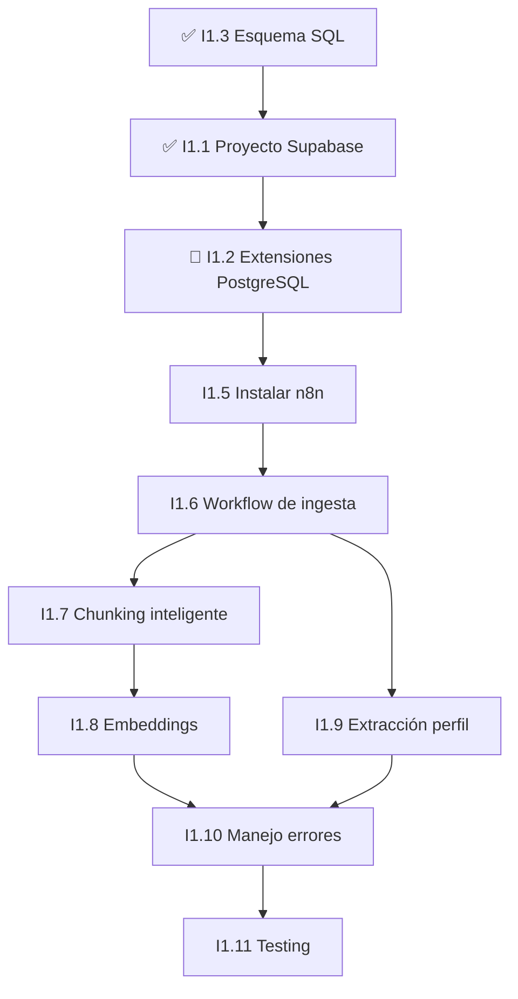

# Tareas Fase 1 - Fundamentos

## Resumen de Progreso

| Estado | Cantidad |
|--------|----------|
| ✅ Listo | 2 |
| 🔄 En progreso | 1 |
| ⬜ Sin empezar | 7 |
| **Total** | **10** |

**Progreso:** 20% completado

---

## Tareas por Estado

### ✅ Completadas (2)

#### [I1.3] Crear esquema SQL base
- **ID:** I1.3
- **Prioridad:** 🔴 Alta
- **Estado:** ✅ Listo
- **Descripción:**
  - ✅ COMPLETADO. Creadas tablas: convenios (metadata), convenio_chunks (embeddings vectoriales 1536 dims), convenio_perfiles (JSONB).
  - Archivos: database/schema.sql, database/README.md.
  - Siguiente: Desplegar en Supabase (I1.2).

---

#### [I1.1] Crear proyecto Supabase
- **ID:** I1.1
- **Prioridad:** 🔴 Alta
- **Estado:** ✅ Listo
- **Descripción:**
  - Crear cuenta en Supabase.
  - Crear nuevo proyecto (región EU para GDPR).
  - Obtener credenciales (anon key, service role key, URL).
  - Guardar en archivo .env.
  - **Entregables:** Proyecto activo, archivo .env con credenciales, URL documentada.

---

### 🔄 En Progreso (1)

#### [I1.2] Configurar extensiones PostgreSQL
- **ID:** I1.2
- **Prioridad:** 🔴 Alta
- **Estado:** ✅ Listo
- **Descripción:**
  - Habilitar pgvector para embeddings.
  - Habilitar uuid-ossp para IDs.
  - Ejecutar database/schema.sql desde SQL Editor.
  - Verificar tablas creadas.
  - **Entregables:** Extensiones habilitadas, tablas creadas (convenios, convenio_chunks, convenio_perfiles), screenshot de verificación.

---

### ⬜ Pendientes (7)

#### [I1.5] Instalar n8n (self-hosted)
- **ID:** I1.5
- **Prioridad:** 🔴 Alta
- **Estado:** ⬜ Sin empezar
- **Descripción:**
  - Desplegar n8n self-hosted en Railway (GRATIS, tier gratuito 500h/mes) o Render.
  - Configurar persistencia workflows.
  - Configurar credenciales: Supabase (DB + Storage), OpenAI (embeddings), Anthropic (Claude), LlamaParse.
  - **Entregables:** n8n en cloud 24/7, URL pública, credenciales configuradas, workflow prueba OK.

---

#### [I1.6] Crear workflow de ingesta
- **ID:** I1.6
- **Prioridad:** 🔴 Alta
- **Estado:** ⬜ Sin empezar
- **Descripción:**
  - Trigger: Webhook HTTP POST.
  - Nodos: Descargar PDF → Subir a Storage → LlamaParse API → Recibir markdown → Guardar en tabla convenios.
  - **Entregables:** Workflow funcional, URL webhook documentada, prueba exitosa con PDF.

---

#### [I1.8] Integrar generación de embeddings
- **ID:** I1.8
- **Prioridad:** 🔴 Alta
- **Estado:** ⬜ Sin empezar
- **Descripción:**
  - Conectar OpenAI Embeddings API.
  - Usar text-embedding-3-small (1536 dims).
  - Generar vector por chunk.
  - Almacenar en convenio_chunks.embedding.
  - **Entregables:** Integración API, embeddings almacenados, prueba búsqueda vectorial.

---

#### [I1.9] Crear nodo de extracción de perfil
- **ID:** I1.9
- **Prioridad:** 🔴 Alta
- **Estado:** ⬜ Sin empezar
- **Descripción:**
  - Enviar texto completo a Claude 3.5 Sonnet.
  - Prompt estructurado para extraer categorías, salarios, jornadas.
  - Parsear JSON y validar schema.
  - Guardar en convenio_perfiles.
  - **Entregables:** Prompt optimizado, validación schema, perfiles extraídos.

---

#### [I1.11] Testing con convenio real
- **ID:** I1.11
- **Prioridad:** 🔴 Alta
- **Estado:** ⬜ Sin empezar
- **Descripción:**
  - Ejecutar pipeline completo end-to-end con convenio real (ej: Oficinas y Despachos Madrid).
  - Verificar chunks, embeddings, perfil.
  - Probar búsqueda semántica.
  - **Métricas:** 50-200 chunks, embeddings 1536 dims, 80%+ categorías extraídas.
  - **Entregables:** Reporte testing, screenshots, validación calidad.

---

#### [I1.7] Implementar chunking inteligente
- **ID:** I1.7
- **Prioridad:** 🟡 Media
- **Estado:** ⬜ Sin empezar
- **Descripción:**
  - Dividir markdown en chunks de ~500 tokens.
  - Preservar contexto (artículos, capítulos).
  - Añadir metadata (sección, artículo, página).
  - Numerar chunks secuencialmente.
  - **Entregables:** Función de chunking, chunks con metadata, validación de tamaño.

---

#### [I1.10] Implementar manejo de errores
- **ID:** I1.10
- **Prioridad:** 🟡 Media
- **Estado:** ⬜ Sin empezar
- **Descripción:**
  - Retry automático (3 intentos) en fallos API.
  - Crear tabla pipeline_logs para errores.
  - Webhook notificación fallos.
  - Circuit breaker para APIs.
  - **Entregables:** Error handling en todos nodos, tabla logs, notificaciones funcionando.

---

## Orden Recomendado de Ejecución

---

## Dependencias Entre Tareas

| Tarea | Depende de | Bloquea |
|-------|-----------|---------|
| I1.1 | I1.3 | I1.2, I1.5 |
| I1.2 | I1.1 | I1.8 |
| I1.5 | I1.1, I1.2 | I1.6, I1.7, I1.8, I1.9 |
| I1.6 | I1.5 | I1.7, I1.9 |
| I1.7 | I1.6 | I1.8 |
| I1.8 | I1.2, I1.7 | I1.11 |
| I1.9 | I1.6 | I1.11 |
| I1.10 | I1.6, I1.7, I1.8, I1.9 | I1.11 |
| I1.11 | Todas las anteriores | - |

---

## Próximos Pasos Inmediatos

1. **Completar I1.2** - Configurar extensiones PostgreSQL (En progreso)
2. **Iniciar I1.5** - Instalar n8n (Alta prioridad, desbloquea workflow)
3. **Planificar I1.6** - Diseñar workflow de ingesta mientras se instala n8n

---

## Notas

- Las tareas con prioridad 🔴 Alta deben completarse antes que las de 🟡 Media
- I1.11 (Testing) es la última tarea y valida que todo funciona correctamente
- El orden secuencial es crítico debido a las dependencias técnicas
