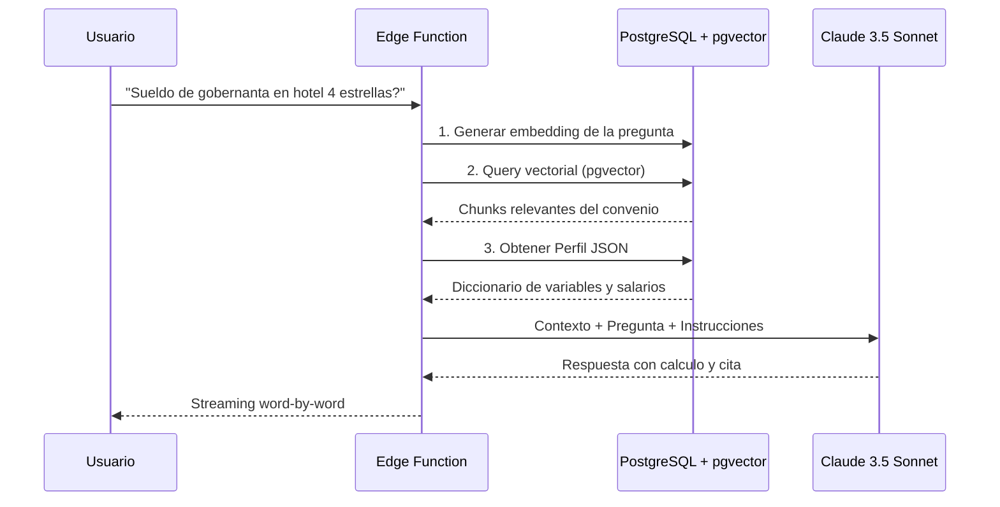

# Fase 2: El Cerebro RAG y Razonamiento (El "Brain")

## Objetivo Principal

**Que la IA responda preguntas y realice cálculos precisos** basados en los datos estructurados de la Fase 1.

Esta fase convierte los datos en bruto (vectores + JSON) en un **sistema de razonamiento inteligente** capaz de:

- Responder preguntas sobre convenios
- Calcular salarios según variables del usuario
- Citar siempre la fuente oficial (artículo del BOE)

---

## Contexto Técnico: RAG (Retrieval-Augmented Generation)



---

## Arquitectura de la Edge Function

### Clean Architecture Lite (Estructura de Carpetas)

```
supabase/
  functions/
    _shared/
      domain/
        entities/          # Convenio, Calculo, Usuario
        interfaces/         # IConvenioRepository, IIAService
      application/
        use-cases/          # ask-question.ts, calculate-salary.ts
        dtos/               # Request/Response types
      infrastructure/
        repositories/       # SupabaseRepository
        external-services/  # AnthropicClient, OpenAIClient
    chat-bot/
      index.ts              # Entry point HTTP
    salary-calculator/
      index.ts              # Entry point HTTP
```

### Por qué Clean Architecture en el Backend

- **Testabilidad:** Puedes probar la lógica de cálculo sin gastar tokens
- **Simetría:** Mismas entidades que el Frontend (TypeScript compartido)
- **Pivot-ready:** Si cambias de Claude a OpenAI, solo tocas infraestructura

---

## Flujo de Consulta (Request Lifecycle)

### Paso 1: Recepción de la Petición

```tsx
// POST /functions/v1/chat-convenios
{
  "convenio_id": "uuid-del-convenio",
  "pregunta": "Cuanto cobra una camarera de pisos en hotel 4 estrellas?",
  "variables": {
    "categoria_hotel": "4 estrellas",
    "jornada": "completa"
  }
}
```

### Paso 2: Búsqueda Vectorial

```sql
-- Buscar los 5 fragmentos mas relevantes
SELECT contenido, metadata 
FROM convenio_chunks 
WHERE convenio_id = $1
ORDER BY embedding <=> $embedding_pregunta
LIMIT 5;
```

### Paso 3: Enriquecimiento con Perfil JSON

```sql
SELECT perfil_data 
FROM convenio_perfiles 
WHERE convenio_id = $1;
```

### Paso 4: Construcción del Prompt

```
[SISTEMA]
Eres un experto en derecho laboral espanol. Responde SOLO basandote en el contexto proporcionado.
Si no encuentras la informacion, di "No encuentro este dato en el convenio".
Siempre cita el articulo exacto.

[PERFIL DEL CONVENIO]
{perfil_json}

[FRAGMENTOS RELEVANTES]
{chunks_encontrados}

[PREGUNTA DEL USUARIO]
{pregunta}

[INSTRUCCIONES DE CALCULO]
Si te piden calcular un salario:
1. Identifica la categoria profesional
2. Busca el salario base en el perfil
3. Aplica los pluses correspondientes
4. Muestra el desglose paso a paso
```

### Paso 5: Streaming de Respuesta

```tsx
// Server-Sent Events para respuesta en tiempo real
const stream = await anthropic.messages.stream({
  model: "claude-3-5-sonnet-20241022",
  max_tokens: 1024,
  messages: [{ role: "user", content: prompt }]
});

for await (const chunk of stream) {
  controller.enqueue(encoder.encode(`data: ${chunk}\n\n`));
}
```

---

## Desglose de Tareas Atómicas

### Módulo 1: Infraestructura de la Edge Function

### [I2.1] Setup del Proyecto Supabase Functions

| Campo | Valor |
| --- | --- |
| :--- | :--- |
| **Descripción** | Inicializar estructura de carpetas y configuración |
| **Criterios de Aceptación** | `supabase functions serve` ejecuta sin errores |
| **DoD** | Hello World desplegado y accesible via HTTP |
| **Tokens estimados** | 0 |

### [I2.2] Implementar SupabaseRepository

| Campo | Valor |
| --- | --- |
| :--- | :--- |
| **Descripción** | Clase que encapsula queries a PostgreSQL y pgvector |
| **Criterios de Aceptación** | Metodos: getChunksByQuery(), getPerfilByConvenio() |
| **DoD** | Tests unitarios pasando con datos mock |
| **Tokens estimados** | 0 |

---

### Módulo 2: Motor de Embeddings

### [I2.3] Integración con OpenAI Embeddings

| Campo | Valor |
| --- | --- |
| :--- | :--- |
| **Descripción** | Servicio para convertir preguntas en vectores |
| **Criterios de Aceptación** | Genera embeddings de 1536 dimensiones |
| **DoD** | Funcion embedQuestion() funcionando |
| **Tokens estimados** | ~100 por pregunta |

---

### Módulo 3: Integración con Anthropic

### [I2.4] Cliente de Anthropic con Streaming

| Campo | Valor |
| --- | --- |
| :--- | :--- |
| **Descripción** | Wrapper para llamadas a Claude 3.5 Sonnet |
| **Criterios de Aceptación** | Soporte para streaming SSE |
| **DoD** | Respuesta palabra por palabra en el cliente |
| **Tokens estimados** | ~500-2000 por consulta |

### [I2.5] Prompt Engineering para Calculos

| Campo | Valor |
| --- | --- |
| :--- | :--- |
| **Descripción** | Diseñar prompts que garanticen precisión en cálculos |
| **Criterios de Aceptación** | Chain of Thought visible, citas obligatorias |
| **DoD** | 10 preguntas de prueba respondidas correctamente |
| **Tokens estimados** | ~5000 (pruebas iterativas) |

---

### Módulo 4: Casos de Uso

### [I2.6] UseCase: AskQuestion

| Campo | Valor |
| --- | --- |
| :--- | :--- |
| **Descripción** | Caso de uso para preguntas generales |
| **Criterios de Aceptación** | Orquesta busqueda vectorial + IA |
| **DoD** | Preguntas como "Que dice el articulo 14?" respondidas |
| **Tokens estimados** | Variable |

### [I2.7] UseCase: CalculateSalary

| Campo | Valor |
| --- | --- |
| :--- | :--- |
| **Descripción** | Caso de uso especializado en calculos economicos |
| **Criterios de Aceptación** | Usa Perfil JSON + Chain of Thought |
| **DoD** | Caso "gobernanta hotel 4 estrellas" calculado correctamente |
| **Tokens estimados** | ~1500 por calculo |

---

### Módulo 5: Validación

### [I2.8] Test de Stress con Preguntas Complejas

| Campo | Valor |
| --- | --- |
| :--- | :--- |
| **Descripción** | Bateria de 20 preguntas reales del stakeholder |
| **Criterios de Aceptación** | >90% de respuestas correctas |
| **DoD** | Informe de precision validado por Business Dev Leader |
| **Tokens estimados** | ~30,000 |

---

### Módulo 6: Validación y Guardrails

Este módulo implementa el **Protocolo de Interacción del Chat** definido en el Brief, garantizando precisión legal del 100%.

### [I2.9] Clasificador de Estado de Datos

| Campo | Valor |
| --- | --- |
| :--- | :--- |
| **Descripción** | Servicio que clasifica cada consulta en: Completos, Incompletos, Ambiguos, Inválidos o Conflictivos |
| **Criterios de Aceptación** | Cruza input del usuario contra Perfil JSON del convenio |
| **DoD** | Función classifyDataState() retorna estado + parámetros faltantes |
| **Tokens estimados** | 0 (lógica pura) |

### [I2.10] Validador de Límites Legales

| Campo | Valor |
| --- | --- |
| :--- | :--- |
| **Descripción** | Detecta valores imposibles o ilegales (horas extra > 80/año, jornada > 40h/semana) |
| **Criterios de Aceptación** | Consulta tabla configuracion_legal para obtener límites |
| **DoD** | Rechaza datos inválidos con mensaje explicativo y sugerencia |
| **Tokens estimados** | 0 (lógica pura) |

### [I2.11] Validador de SMI

| Campo | Valor |
| --- | --- |
| :--- | :--- |
| **Descripción** | Compara resultado del cálculo contra SMI vigente |
| **Criterios de Aceptación** | Si resultado < SMI, añade alerta y muestra salario ajustado |
| **DoD** | Función validateAgainstSMI() retorna {isValid, adjustedSalary, alert} |
| **Tokens estimados** | 0 (lógica pura) |

### [I2.12] Detector de Conflictos

| Campo | Valor |
| --- | --- |
| :--- | :--- |
| **Descripción** | Identifica datos contradictorios (ej: "jornada completa" + "20h/semana") |
| **Criterios de Aceptación** | Reglas de coherencia configurables por tipo de convenio |
| **DoD** | Retorna conflictos detectados con opciones de resolución |
| **Tokens estimados** | 0 (lógica pura) |

### [I2.13] Generador de Respuestas por Estado

| Campo | Valor |
| --- | --- |
| :--- | :--- |
| **Descripción** | Templates de respuesta para cada estado (A-G del protocolo) |
| **Criterios de Aceptación** | Respuestas estructuradas con menús de opciones cuando aplique |
| **DoD** | 7 templates implementados y testeados |
| **Tokens estimados** | ~2000 (generación de menús dinámicos) |

---

## Definición del Contrato de API

### Endpoint: POST /functions/v1/chat

**Request:**

```json
{
  "convenio_id": "string (uuid)",
  "pregunta": "string",
  "variables": {
    "key": "value"
  },
  "stream": true
}
```

**Response (SSE):**

```
data: {"type": "text", "content": "El salario"}
data: {"type": "text", "content": " base para"}
...
data: {"type": "citation", "articulo": "Art. 24", "url": "https://boe.es/..."}
data: {"type": "done"}
```

---

## Estrategias Anti-Alucinación

| Estrategia | Implementación |
| --- | --- |
| :--- | :--- |
| **Contexto limitado** | Solo pasar chunks relevantes, no el convenio entero |
| **Instrucciones explicitas** | "Di 'no lo se' si no esta en el contexto" |
| **Citas obligatorias** | Forzar citacion de articulo en cada respuesta |
| **Chain of Thought** | Mostrar razonamiento paso a paso |
| **Validacion numerica** | Verificar que los numeros estan en el Perfil JSON |

---

## Estimación de Costes (Fase 2)

| Concepto | Coste | Notas |
| --- | --- | --- |
| :--- | :--- | :--- |
| OpenAI Embeddings | ~5EUR | ~100k tokens desarrollo |
| Anthropic Claude | ~15EUR | ~50k tokens pruebas |
| Supabase (Edge Functions) | 0EUR | Dentro de free tier |
| **Total Fase 2** | **~20EUR** |  |

---

## Criterios de Exito

- [ ]  Edge Function desplegada y accesible
- [ ]  Streaming funcionando (respuesta palabra a palabra)
- [ ]  Calculos de salario correctos en 10/10 casos de prueba
- [ ]  Citas al articulo del BOE en cada respuesta
- [ ]  Latencia < 3 segundos para primera palabra
- [ ]  Business Dev Leader aprueba precision