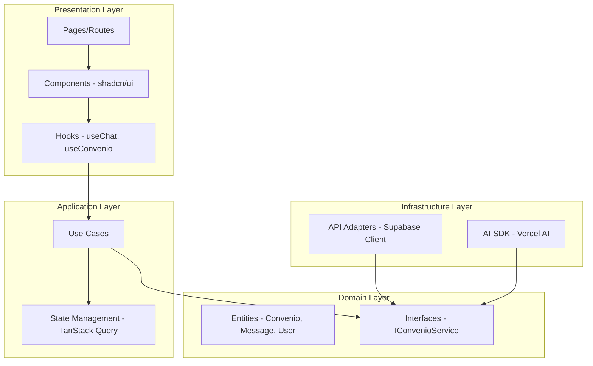
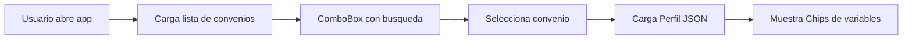
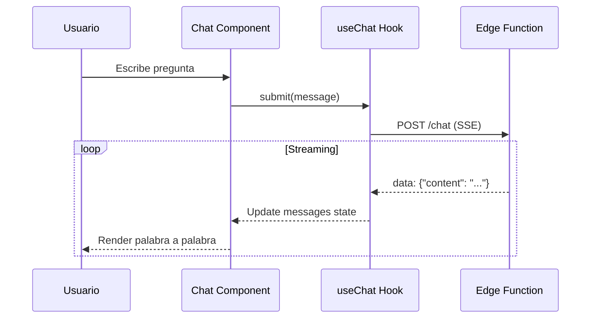

# Fase 3: Interfaz de Usuario y Chat (El "Face")

## Objetivo Principal

**MVP funcional donde el usuario pueda elegir un convenio y chatear** con la IA para obtener respuestas y cálculos.

Esta fase conecta el "cerebro" (Fase 2) con una interfaz de usuario pulida, optimizada para SEO y con una experiencia de chat fluida.

---

## Arquitectura Frontend (Clean Architecture)



### Stack Frontend

| Tecnología | Propósito |
| :--- | :--- |
| **React 19 + Vite** | Framework base |
| **TanStack Query** | Server state management |
| **Zustand** | Client state (UI) |
| **shadcn/ui** | Componentes accesibles |
| **Tailwind CSS** | Estilos |
| **Vercel AI SDK** | Streaming de chat |
| **React Markdown** | Renderizado de respuestas |

---

## Componentes Principales

### 1. Selector de Convenios



**Implementación con shadcn/ui:**

- Combobox con autocomplete
- Badges para mostrar ambito (Estatal, Provincial, Empresa)
- Skeleton loading mientras carga

### 2. Chat con Streaming



**Características:**

- Streaming word-by-word (Vercel AI SDK)
- Indicador de "escribiendo..."
- Botones de accion: Copiar, Compartir
- Enlace a fuente BOE en cada respuesta

### 3. Chips de Sugerencias Dinámicas

Basados en el Perfil JSON del convenio seleccionado:

```jsx
// Ejemplo de chips dinamicos
<div className="flex gap-2 flex-wrap">
  {perfil.valores_posibles["Categoria Profesional"].map((cat, index) => (
    <Button key={`${cat}-${index}`} variant="outline" size="sm" onClick={() => insertVariable(cat)}>
      {cat}
    </Button>
  ))}
</div>
```

**Beneficios:**

- Evita errores de escritura del usuario
- Garantiza que el input coincide con el convenio
- Mejora UX y precision de calculos

---

## Desglose de Tareas Atómicas

### Módulo 1: Setup y Estructura

### [I3.1] Fork y Configuración del Proyecto

| Campo | Valor |
| --- | --- |
| **Descripción** | Clonar template con Clean Architecture |
| **Criterios de Aceptación** | npm run dev funciona, estructura de carpetas lista |
| **DoD** | README actualizado con instrucciones |
| **Tokens estimados** | 0 |

### [I3.2] Configuración de Supabase Client

| Campo | Valor |
| --- | --- |
| **Descripción** | Adaptador para conectar con el backend |
| **Criterios de Aceptación** | Autenticacion y queries funcionando |
| **DoD** | Hook useSupabase() disponible |
| **Tokens estimados** | 0 |

---

### Módulo 2: Componentes de UI

### [I3.3] Selector de Convenios (ComboBox)

| Campo | Valor |
| --- | --- |
| **Descripción** | Componente para buscar y seleccionar convenio |
| **Criterios de Aceptación** | Busqueda fuzzy, muestra ambito, loading state |
| **DoD** | Integrado con TanStack Query |
| **Tokens estimados** | 0 |

### [I3.4] Componente de Chat

| Campo | Valor |
| --- | --- |
| **Descripción** | Interfaz de chat con streaming |
| **Criterios de Aceptación** | Mensajes usuario/IA, scroll automatico, markdown |
| **DoD** | Vercel AI SDK useChat integrado |
| **Tokens estimados** | 0 |

### [I3.5] Chips de Variables Dinámicas

| Campo | Valor |
| --- | --- |
| **Descripción** | Botones con opciones del Perfil JSON |
| **Criterios de Aceptación** | Se actualizan al cambiar convenio |
| **DoD** | Click inserta variable en el input |
| **Tokens estimados** | 0 |

### [I3.6] Componente de Citación BOE

| Campo | Valor |
| --- | --- |
| **Descripción** | Card que muestra enlace a la fuente oficial |
| **Criterios de Aceptación** | Muestra articulo, pagina y link al PDF |
| **DoD** | Abre en nueva pestana el PDF del BOE |
| **Tokens estimados** | 0 |

---

### Módulo 3: SEO y Performance

### [I3.7] Optimización Core Web Vitals

| Campo | Valor |
| --- | --- |
| **Descripción** | Garantizar 100/100 en Lighthouse |
| **Criterios de Aceptación** | LCP < 2.5s, FID < 100ms, CLS < 0.1 |
| **DoD** | Report de Lighthouse guardado |
| **Tokens estimados** | 0 |

### [I3.8] Landing Page SEO

| Campo | Valor |
| --- | --- |
| **Descripción** | Pagina de inicio optimizada para busquedas |
| **Criterios de Aceptación** | HTML semantico, meta tags, [schema.org](http://schema.org) |
| **DoD** | Indexable por Google Search Console |
| **Tokens estimados** | 0 |

### [I3.9] Páginas Estáticas por Convenio

| Campo | Valor |
| --- | --- |
| **Descripción** | URLs como /convenio/hosteleria-madrid |
| **Criterios de Aceptación** | SSG para los 100 convenios principales |
| **DoD** | URLs indexables con contenido unico |
| **Tokens estimados** | 0 |

---

### Módulo 4: Integración y Testing

### [I3.10] Integración End-to-End

| Campo | Valor |
| --- | --- |
| :--- | :--- |
| **Descripción** | Conectar UI con Edge Functions |
| **Criterios de Aceptación** | Flujo completo: Seleccionar -> Preguntar -> Respuesta |
| **DoD** | Demo funcional |
| **Tokens estimados** | ~5000 (pruebas) |

### [I3.11] Test de Usabilidad

| Campo | Valor |
| --- | --- |
| :--- | :--- |
| **Descripción** | Sesion con Business Dev Leader |
| **Criterios de Aceptación** | 5 tareas completadas sin ayuda |
| **DoD** | Feedback documentado |
| **Tokens estimados** | Variable |

---

## Wireframes de Referencia

### Layout Principal

```
+------------------------------------------+
|  LOGO    [Selector Convenio v]    [Login]|
+------------------------------------------+
|                                          |
|  +------------------------------------+  |
|  |  [Chips: Gobernanta] [Camarera]   |  |
|  +------------------------------------+  |
|                                          |
|  +------------------------------------+  |
|  |  [Mensaje Usuario]                 |  |
|  |  [Respuesta IA con markdown...]    |  |
|  |  [Cita: Art. 24 - Ver PDF]         |  |
|  +------------------------------------+  |
|                                          |
|  +------------------------------------+  |
|  |  [Input: Escribe tu pregunta...]   |  |
|  +------------------------------------+  |
+------------------------------------------+
```

---

## Estimación de Costes (Fase 3)

| Concepto | Coste | Notas |
| --- | --- | --- |
| :--- | :--- | :--- |
| Vercel Hosting | 0EUR | Plan Hobby |
| Dominio .eu | ~12EUR/ano | Prorrateado ~1EUR/mes |
| Tokens de pruebas | ~5EUR | Testeo E2E |
| **Total Fase 3** | **~6EUR** |  |

---

## Criterios de Exito

- [ ]  Chat con streaming funcionando
- [ ]  Selector de convenios con busqueda
- [ ]  Chips dinamicos segun el convenio
- [ ]  Core Web Vitals 100/100
- [ ]  Enlace a fuente BOE en cada respuesta
- [ ]  Business Dev Leader completa 5 consultas sin ayuda