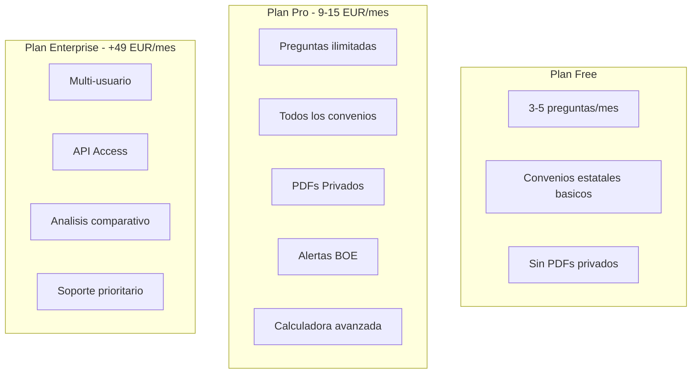
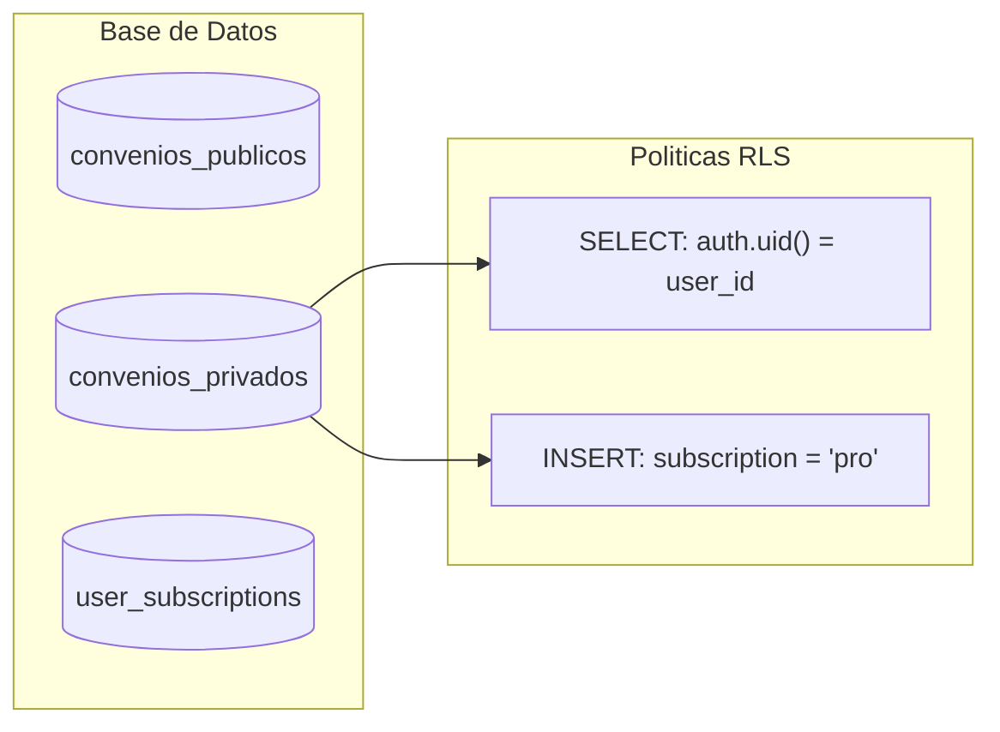
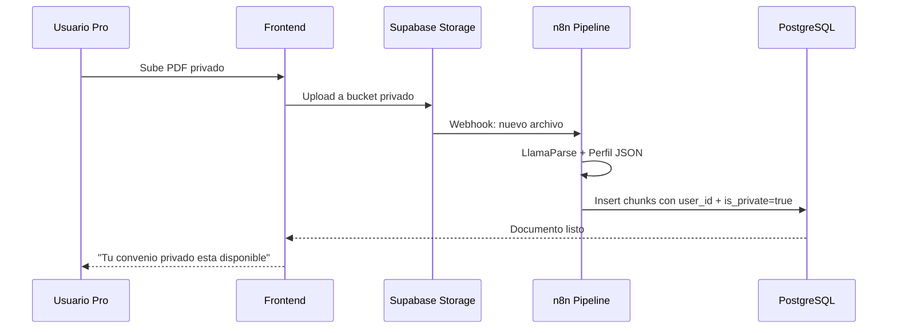
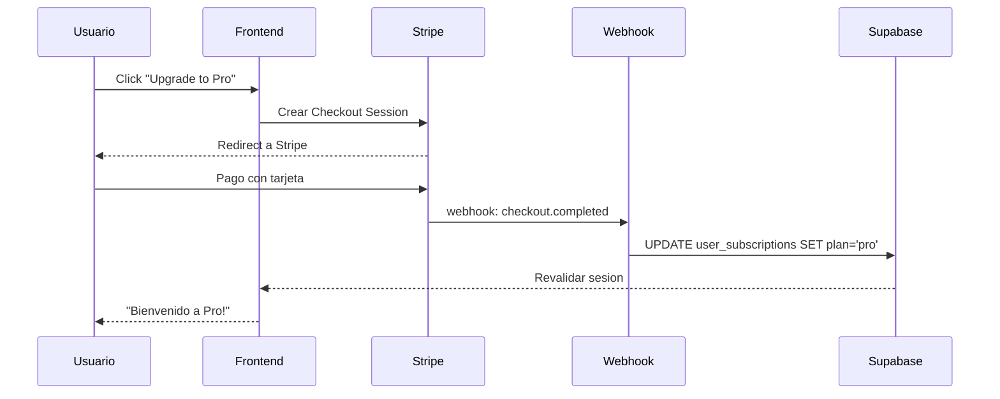

# Fase 4: Usuarios, Pagos y PDFs Privados (El "Business")

## Objetivo Principal

**Monetizar el producto y permitir que los usuarios suban sus propios documentos privados.**

Esta fase transforma el MVP en un producto comercial con:

- Sistema de autenticación
- Planes de suscripción (Free/Pro/Enterprise)
- Funcionalidad de PDFs privados para usuarios de pago

---

## Modelo de Negocio Detallado



### Limites por Plan

| Feature | Free | Pro | Enterprise |
| --- | --- | --- | --- |
| :--- | :--- | :--- | :--- |
| **Preguntas/mes** | 5 | Ilimitadas | Ilimitadas |
| **Convenios** | 10 estatales | Todos (100+) | Todos + Custom |
| **PDFs Privados** | No | 5 documentos | Ilimitados |
| **Alertas BOE** | No | Si | Si + Personalizadas |
| **Usuarios** | 1 | 1 | 10+ |
| **API** | No | No | Si |

---

## Arquitectura de Seguridad (RLS)

### Row Level Security en Supabase



### Políticas SQL de Seguridad

```sql
-- Politica: Solo el propietario puede ver sus PDFs privados
CREATE POLICY "Users can view own private documents"
ON convenio_chunks FOR SELECT
USING (
  is_private = false 
  OR auth.uid() = user_id
);

-- Politica: Usuarios pueden actualizar sus propios documentos
CREATE POLICY "Users can update own private documents"
ON convenio_chunks FOR UPDATE
USING (
  is_private = false 
  OR auth.uid() = user_id
);

-- Politica: Usuarios pueden eliminar sus propios documentos
CREATE POLICY "Users can delete own private documents"
ON convenio_chunks FOR DELETE
USING (
  is_private = false 
  OR auth.uid() = user_id
);

-- Politica: Solo Pro puede insertar PDFs privados y debe ser el propietario
CREATE POLICY "Pro users can upload private docs"
ON convenio_chunks FOR INSERT
WITH CHECK (
  user_id = auth.uid()
  AND EXISTS (
    SELECT 1 FROM user_subscriptions 
    WHERE user_id = auth.uid() 
    AND plan IN ('pro', 'enterprise')
    AND status = 'active'
  )
);
```

---

## Flujo de PDFs Privados



### Estructura de Storage

```
supabase-storage/
  public/
    convenios/          # PDFs oficiales del BOE
  private/
    {user_id}/
      uploads/          # PDFs subidos por el usuario
      processed/        # Markdown generado
```

### Políticas de Storage (Supabase)

```sql
-- Policy: Users can upload to own folder
CREATE POLICY "Users can upload to own folder"
ON storage.objects FOR INSERT
WITH CHECK (
  bucket_id = 'private' 
  AND (storage.foldername(name))[1] = auth.uid()::text
);

-- Policy: Users can read own files
CREATE POLICY "Users can read own files"
ON storage.objects FOR SELECT
USING (
  bucket_id = 'private' 
  AND (storage.foldername(name))[1] = auth.uid()::text
);

-- Policy: Users can delete own files
CREATE POLICY "Users can delete own files"
ON storage.objects FOR DELETE
USING (
  bucket_id = 'private' 
  AND (storage.foldername(name))[1] = auth.uid()::text
);
```

**Limitaciones de archivos:**
- Tamaño máximo: 10 MB
- Tipo MIME: application/pdf
- Límite por usuario: según plan (Free: 5 archivos, Pro: 50, Enterprise: ilimitado)

---

## Integración con Stripe

### Flujo de Suscripción



### Productos en Stripe

| Producto | Price ID | Precio | Billing |
| --- | --- | --- | --- |
| :--- | :--- | :--- | :--- |
| Pro Monthly | price_xxx | 9.99 EUR | Mensual |
| Pro Annual | price_yyy | 99 EUR | Anual (17% dto) |
| Enterprise | price_zzz | 49 EUR | Mensual |

---

## Desglose de Tareas Atómicas

### Módulo 1: Autenticación

### [I4.1] Configurar Supabase Auth

| Campo | Valor |
| --- | --- |
| :--- | :--- |
| **Descripción** | Setup de autenticacion con email/password y OAuth |
| **Criterios de Aceptación** | Login, registro, recuperacion de password |
| **DoD** | Flujo completo funcionando en produccion |
| **Tokens estimados** | 0 |

### [I4.2] Componentes de Auth UI

| Campo | Valor |
| --- | --- |
| :--- | :--- |
| **Descripción** | Formularios de login/registro con shadcn |
| **Criterios de Aceptación** | Validacion, loading states, errores |
| **DoD** | Integrado con rutas protegidas |
| **Tokens estimados** | 0 |

---

### Módulo 2: Sistema de Suscripciones

### [I4.3] Crear Tabla user_subscriptions

| Campo | Valor |
| --- | --- |
| :--- | :--- |
| **Descripción** | Modelo de datos para planes y limites |
| **Criterios de Aceptación** | Campos: plan, status, stripe_customer_id, queries_used |
| **DoD** | Migracion SQL ejecutada |
| **Tokens estimados** | 0 |

```sql
CREATE TABLE user_subscriptions (
  id uuid PRIMARY KEY DEFAULT uuid_generate_v4(),
  user_id uuid REFERENCES auth.users(id) ON DELETE CASCADE,
  plan text DEFAULT 'free',
  status text DEFAULT 'active',
  stripe_customer_id text,
  stripe_subscription_id text,
  queries_used int DEFAULT 0,
  queries_reset_at timestamptz,
  created_at timestamptz DEFAULT now(),
  UNIQUE(user_id)
);
```

### [I4.4] Integración con Stripe Checkout

| Campo | Valor |
| --- | --- |
| :--- | :--- |
| **Descripción** | Crear sesiones de pago y webhooks |
| **Criterios de Aceptación** | Checkout funciona en modo test |
| **DoD** | Upgrade Free->Pro completado |
| **Tokens estimados** | 0 |

### [I4.5] Webhook de Stripe

| Campo | Valor |
| --- | --- |
| :--- | :--- |
| **Descripción** | Edge Function para procesar eventos |
| **Criterios de Aceptación** | checkout.completed, subscription.updated, subscription.deleted |
| **DoD** | Sincronizacion automatica con DB |
| **Tokens estimados** | 0 |

---

### Módulo 3: Control de Cuotas

### [I4.6] Middleware de Límites

| Campo | Valor |
| --- | --- |
| :--- | :--- |
| **Descripción** | Verificar cuota antes de cada consulta |
| **Criterios de Aceptación** | Bloquea si queries_used >= limite_plan |
| **DoD** | Usuario Free bloqueado tras 5 consultas |
| **Tokens estimados** | 0 |

### [I4.7] UI de Uso y Upgrade

| Campo | Valor |
| --- | --- |
| :--- | :--- |
| **Descripción** | Mostrar consultas restantes y CTA de upgrade |
| **Criterios de Aceptación** | Barra de progreso, modal de upgrade |
| **DoD** | Integrado en el header |
| **Tokens estimados** | 0 |

---

### Módulo 4: PDFs Privados

### [I4.8] Configurar Storage Privado

| Campo | Valor |
| --- | --- |
| :--- | :--- |
| **Descripción** | Bucket con politicas RLS |
| **Criterios de Aceptación** | Solo el propietario puede acceder |
| **DoD** | Politicas testeadas |
| **Tokens estimados** | 0 |

### [I4.9] UI de Subida de PDFs

| Campo | Valor |
| --- | --- |
| :--- | :--- |
| **Descripción** | Drag & drop para subir documentos |
| **Criterios de Aceptación** | Validacion de tipo, limite de tamano, progreso |
| **DoD** | Solo visible para usuarios Pro |
| **Tokens estimados** | 0 |

### [I4.10] Pipeline n8n para PDFs Privados

| Campo | Valor |
| --- | --- |
| :--- | :--- |
| **Descripción** | Flujo que procesa PDFs con user_id |
| **Criterios de Aceptación** | Vectores marcados como is_private=true |
| **DoD** | PDF privado consultable solo por su dueno |
| **Tokens estimados** | ~15,000 por PDF |

---

### Módulo 5: Testing de Seguridad

### [I4.11] Test de Aislamiento de Datos

| Campo | Valor |
| --- | --- |
| :--- | :--- |
| **Descripción** | Verificar que RLS funciona correctamente |
| **Criterios de Aceptación** | Usuario A no puede ver datos de Usuario B |
| **DoD** | Tests automatizados pasando |
| **Tokens estimados** | 0 |

### [I4.12] Test de Pagos en Sandbox

| Campo | Valor |
| --- | --- |
| :--- | :--- |
| **Descripción** | Flujo completo con tarjetas de test |
| **Criterios de Aceptación** | Upgrade, downgrade, cancelacion |
| **DoD** | Documentacion de casos de prueba |
| **Tokens estimados** | 0 |

---

## Estimación de Costes (Fase 4)

| Concepto | Coste | Notas |
| --- | --- | --- |
| :--- | :--- | :--- |
| Stripe (setup) | 0 EUR | Solo comisiones por transaccion |
| Supabase Pro | ~25 EUR | Si se necesita mas storage |
| Tokens procesamiento | ~10 EUR | PDFs privados de prueba |
| **Total Fase 4** | **~35 EUR** |  |

---

## Criterios de Exito

- [ ]  Login/Registro funcionando
- [ ]  Pago con Stripe completado (modo test)
- [ ]  Usuario Free bloqueado tras limite
- [ ]  Usuario Pro puede subir PDF privado
- [ ]  PDF privado NO visible por otros usuarios
- [ ]  Webhook sincroniza estado de suscripcion