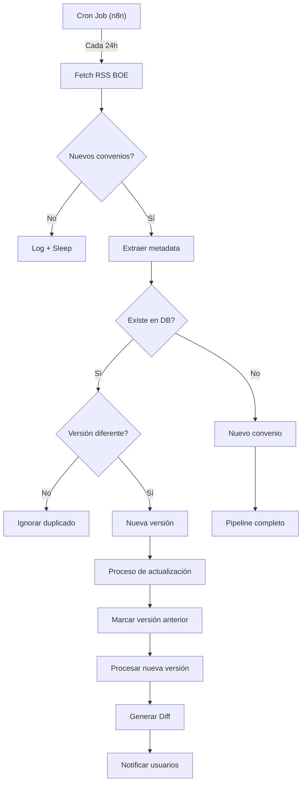
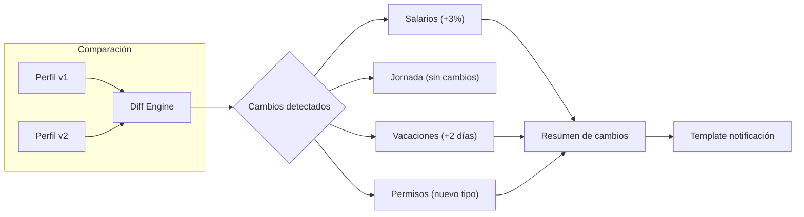
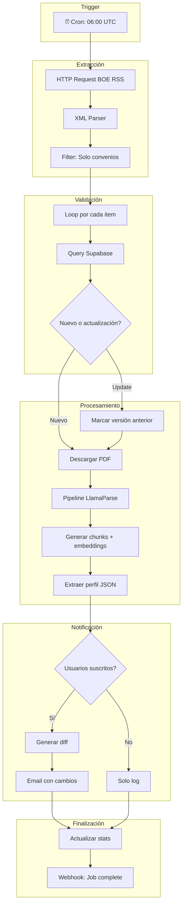
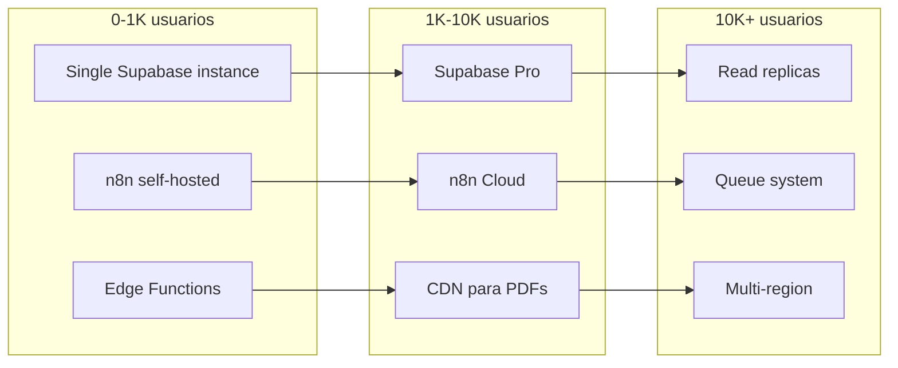

# Fase 5: Watchdog del BOE y Escalado (El "Scale")

> **El "Scale"** - Automatización del ciclo de vida de convenios y preparación para crecimiento
> 

---

## Objetivo Principal

Automatizar la actualización de convenios sin intervención manual, creando un sistema que detecte cambios en el BOE, procese nuevas versiones y notifique a los usuarios afectados.

---

## Justificación de la Fase

Los convenios colectivos se actualizan periódicamente en el BOE. Sin un sistema de monitorización:

- Los usuarios consultarían información desactualizada
- El mantenimiento manual sería insostenible
- La credibilidad del servicio se vería comprometida

Esta fase convierte WorkRules en un servicio **"siempre actualizado"**.

---

## Fuentes de Datos del BOE

### RSS/API del BOE

```
[https://www.boe.es/rss/](https://www.boe.es/rss/)
├── Sección III - Otras disposiciones
│   └── Convenios colectivos
├── Filtros por:
│   ├── Comunidad Autónoma
│   ├── Sector
│   └── Fecha de publicación
```

### Identificación de Convenios

| Campo | Uso |
| --- | --- |
| `codigo_regcon` | Identificador único del convenio |
| `nombre` | Match por similitud para detectar actualizaciones |
| `fecha_vigencia` | Determinar si es versión más reciente |
| `ámbito` | Categorización geográfica |

---

## Sistema de Versionado

### Flujo de Detección de Cambios



### Lógica de Diff



---

## Workflow n8n - Watchdog



---

## Sistema de Notificaciones

### Tipos de Notificación

| Evento | Canal | Usuarios |
| --- | --- | --- |
| Nuevo convenio en sector | Email | Suscritos al sector |
| Actualización de convenio | Email + In-app | Usuarios que lo consultaron |
| Cambios salariales | Email destacado | Pro + Enterprise |
| Error en procesamiento | Slack | Administradores |

### Template de Email

```
📋 Actualización de Convenio

{nombre_convenio} ha sido actualizado en el BOE.

📊 Cambios detectados:
• Tablas salariales: +{porcentaje}%
• Jornada anual: {horas} horas
• Nuevo permiso: {descripcion}

🔗 Ver convenio actualizado: {link}
🔗 Comparar con versión anterior: {link_diff}

--
[WorkRules.eu](http://WorkRules.eu) - Siempre actualizado
```

---

## Esquema de Base de Datos - Extensiones

```sql
-- Historial de versiones
CREATE TABLE convenio_versiones (
  id uuid PRIMARY KEY DEFAULT uuid_generate_v4(),
  convenio_id uuid REFERENCES convenios(id),
  version int NOT NULL,
  fecha_boe date NOT NULL,
  url_pdf text NOT NULL,
  cambios_resumen jsonb,
  created_at timestamptz DEFAULT now()
);

-- Suscripciones a convenios
CREATE TABLE suscripciones (
  id uuid PRIMARY KEY DEFAULT uuid_generate_v4(),
  user_id uuid REFERENCES auth.users(id) ON DELETE CASCADE,
  convenio_id uuid REFERENCES convenios(id) ON DELETE CASCADE,
  notify_email boolean DEFAULT true,
  notify_app boolean DEFAULT true,
  created_at timestamptz DEFAULT now(),
  UNIQUE(user_id, convenio_id)
);

-- Log de ejecuciones del watchdog
CREATE TABLE watchdog_logs (
  id uuid PRIMARY KEY DEFAULT uuid_generate_v4(),
  executed_at timestamptz DEFAULT now(),
  convenios_checked int,
  convenios_nuevos int,
  convenios_actualizados int,
  errores jsonb,
  duracion_ms int
);

-- Cola de notificaciones
CREATE TABLE notification_queue (
  id uuid PRIMARY KEY DEFAULT uuid_generate_v4(),
  user_id uuid REFERENCES auth.users(id),
  tipo text NOT NULL,
  payload jsonb NOT NULL,
  enviado boolean DEFAULT false,
  created_at timestamptz DEFAULT now(),
  sent_at timestamptz
);
```

---

## Estrategia de Escalado

### Métricas de Capacidad Actual

| Recurso | Límite Free Tier | Uso Estimado Fase 5 |
| --- | --- | --- |
| Supabase DB | 500 MB | ~200 MB |
| Edge Function invocations | 500K/mes | ~50K/mes |
| n8n executions | 5K/mes (self-hosted ilimitado) | ~1K/mes |
| Almacenamiento PDFs | 1 GB | ~500 MB |

### Plan de Escalado por Usuarios



### Optimizaciones de Rendimiento

1. **Caché de consultas frecuentes**
    - Redis/Upstash para queries populares
    - TTL basado en fecha de actualización
2. **Procesamiento por lotes**
    - Agrupar embeddings en batches
    - Limitar concurrencia de LlamaParse
3. **Índices optimizados**
    
    ```sql
    CREATE INDEX idx_chunks_convenio ON convenio_chunks(convenio_id);
    CREATE INDEX idx_chunks_embedding ON convenio_chunks 
      USING ivfflat (embedding vector_cosine_ops);
    CREATE INDEX idx_suscripciones_user ON suscripciones(user_id);
    ```
    

---

## Monitorización y Alertas

### Dashboard de Salud

| Métrica | Umbral Warning | Umbral Critical |
| --- | --- | --- |
| Watchdog sin ejecutar | > 26h | > 48h |
| Tasa de error parsing | > 5% | > 15% |
| Cola notificaciones | > 1000 | > 5000 |
| Latencia consultas | > 2s | > 5s |

### Integración con Servicios de Monitoreo

- **Uptime**: Better Uptime / UptimeRobot
- **Logs**: Supabase Logs + Logflare
- **Alertas**: Slack webhook + Email

---

## Desglose de Tareas Atómicas

### [I5.1] Investigar API/RSS del BOE

- Documentar endpoints disponibles
- Identificar estructura de datos
- Determinar rate limits
- Definir estrategia de parsing

### [I5.2] Diseñar sistema de versionado

- Crear tablas de historial
- Definir lógica de detección de cambios
- Implementar marcado de versiones

### [I5.3] Implementar workflow Watchdog en n8n

- Configurar trigger cron
- Crear nodos de extracción RSS
- Integrar con pipeline existente
- Añadir manejo de errores

### [I5.4] Desarrollar motor de Diff

- Comparar perfiles JSON
- Generar resumen de cambios
- Crear templates de visualización

### [I5.5] Implementar sistema de suscripciones

- UI para gestionar suscripciones
- Lógica de seguimiento de convenios
- Preferencias de notificación

### [I5.6] Crear sistema de notificaciones

- Cola de notificaciones
- Worker de envío de emails
- Notificaciones in-app
- Templates responsive

### [I5.7] Dashboard de administración

- Vista de logs del watchdog
- Estadísticas de procesamiento
- Gestión manual de convenios

### [I5.8] Optimización y caché

- Implementar capa de caché
- Optimizar queries frecuentes
- Configurar índices adicionales

### [I5.9] Testing de carga

- Simular volumen de usuarios
- Identificar cuellos de botella
- Documentar límites del sistema

### [I5.10] Documentación de operaciones

- Runbooks para incidentes
- Guía de troubleshooting
- Procedimientos de escalado

---

## Dependencias de Fases Anteriores

| Fase | Dependencia Requerida |
| --- | --- |
| Fase 1 | Pipeline n8n funcional |
| Fase 2 | Sistema de embeddings operativo |
| Fase 3 | Frontend con área de usuario |
| Fase 4 | Sistema de autenticación + emails |

---

## Criterios de Éxito

- [ ]  Watchdog ejecuta diariamente sin fallos
- [ ]  Detección de nuevos convenios < 24h desde publicación BOE
- [ ]  Diff genera resumen comprensible de cambios
- [ ]  Notificaciones enviadas en < 1h tras detección
- [ ]  Sistema soporta 1000+ usuarios concurrentes
- [ ]  Documentación de operaciones completa

---

## Notas de Implementación

> **Prioridad de escalado**: Primero validar el producto con usuarios reales antes de invertir en infraestructura de escalado. El free tier de Supabase es suficiente para los primeros 6-12 meses.
> 

> **Watchdog resiliente**: Implementar reintentos automáticos y circuit breaker para manejar indisponibilidad temporal del BOE.
> 

> **Diff inteligente**: Usar LLM para generar resúmenes en lenguaje natural de los cambios detectados, no solo comparación técnica.
>