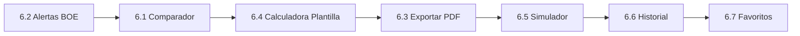

# Fase 6: Features de Valor Añadido (El "Value")

**Objetivo:** Implementar funcionalidades que aprovechan la arquitectura existente para aportar valor diferencial a ETTs y gestorías.

**Requisitos previos:** Fases 1-5 completadas

---

## Visión General

Esta fase se centra en **maximizar el valor de la arquitectura ya construida** sin cambios estructurales significativos. Todas las features utilizan el pipeline PDF → Vectores + JSON existente.

---

## Features Planificadas

### 6.1 Comparador de Convenios

| Campo | Descripción |
| --- | --- |
| **Descripción** | Permite comparar 2-3 convenios lado a lado para una misma categoría profesional |
| **Caso de uso** | "¿Qué convenio me conviene más para contratar camareras: Madrid o Baleares?" |
| **Esfuerzo** | Bajo |
| **Valor** | Alto |
| **Cambios técnicos** | Query a múltiples convenios + prompt de comparación |

### 6.2 Alertas BOE Personalizadas

| Campo | Descripción |
| --- | --- |
| **Descripción** | Notificaciones por email/push cuando cambia un convenio que el usuario sigue |
| **Caso de uso** | "Avísame cuando se actualice el convenio de Hostelería Madrid" |
| **Esfuerzo** | Bajo |
| **Valor** | Alto |
| **Cambios técnicos** | Tabla de suscripciones + integración con BOE Watchdog existente |

### 6.3 Exportar Informes PDF/Excel

| Campo | Descripción |
| --- | --- |
| **Descripción** | Generar documento con el cálculo realizado, desglose y fuentes citadas |
| **Caso de uso** | "Necesito un informe para justificar el coste de plantilla ante dirección" |
| **Esfuerzo** | Bajo |
| **Valor** | Medio |
| **Cambios técnicos** | Librería de generación PDF (react-pdf o similar) |

### 6.4 Calculadora de Plantilla Completa

| Campo | Descripción |
| --- | --- |
| **Descripción** | Calcular coste total de N empleados con diferentes categorías simultáneamente |
| **Caso de uso** | "¿Cuánto me cuesta contratar 5 camareras + 2 gobernantas + 1 recepcionista?" |
| **Esfuerzo** | Medio |
| **Valor** | Alto |
| **Cambios técnicos** | UI para múltiples perfiles + agregación de cálculos |

### 6.5 Simulador de Escenarios

| Campo | Descripción |
| --- | --- |
| **Descripción** | Comparar diferentes configuraciones de plantilla para optimizar costes |
| **Caso de uso** | "¿Me sale mejor 5 a jornada completa o 7 a media jornada?" |
| **Esfuerzo** | Medio |
| **Valor** | Alto |
| **Cambios técnicos** | Extensión de calculadora + visualización comparativa |

### 6.6 Historial de Consultas

| Campo | Descripción |
| --- | --- |
| **Descripción** | Ver y recuperar consultas anteriores realizadas |
| **Caso de uso** | "¿Qué calculé la semana pasada para el cliente X?" |
| **Esfuerzo** | Mínimo |
| **Valor** | Medio |
| **Cambios técnicos** | UI para mostrar `chat_history` existente |

### 6.7 Favoritos/Guardados

| Campo | Descripción |
| --- | --- |
| **Descripción** | Guardar respuestas importantes para consultar rápidamente |
| **Caso de uso** | "Quiero tener a mano el cálculo de mi cliente principal" |
| **Esfuerzo** | Mínimo |
| **Valor** | Medio |
| **Cambios técnicos** | Campo `is_favorite` en `chat_history` + filtro en UI |

---

## Priorización Recomendada

**Justificación:**

1. **Alertas BOE** - Ya tienes el 80% hecho con el Watchdog
2. **Comparador** - Gran diferenciador en demos comerciales
3. **Calculadora Plantilla** - Necesidad real expresada por ETTs
4. **Exportar PDF** - Profesionaliza el producto
5. **Simulador** - Extensión natural de la calculadora
6. **Historial/Favoritos** - Mejoras de UX con mínimo esfuerzo

---

## KPIs de Éxito

| Métrica | Objetivo |
| --- | --- |
| Alertas activas por usuario | > 2 convenios seguidos |
| Uso de comparador | > 20% de sesiones |
| Informes exportados | > 10% de cálculos |
| Retención | +50% consultas por sesión |