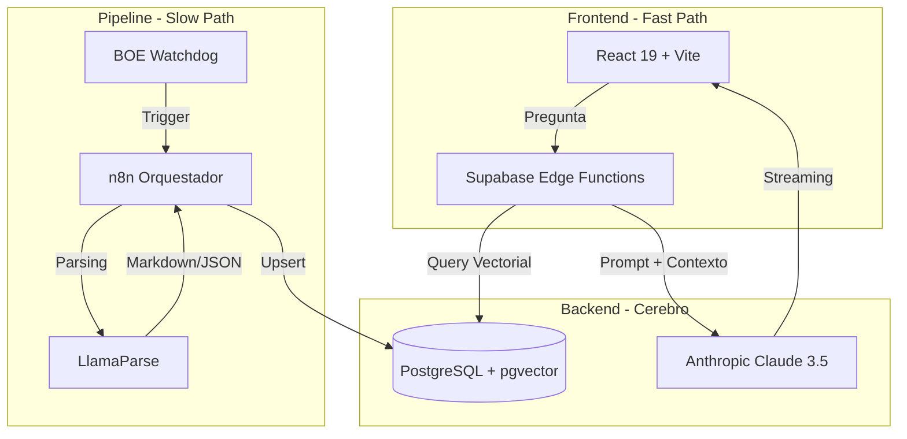

# workrules.eu

**Concepto:** Plataforma LegalTech que utiliza IA (RAG) para actuar como un **Consultor Laboral Automatizado**. No solo resume texto de convenios colectivos, sino que **interpreta estructuras complejas** (categorías, niveles, pluses) mediante un "Perfil JSON" para realizar **cálculos de costes laborales precisos**.

---

## 1. Propuesta de Valor

> "[WorkRules.eu](http://WorkRules.eu): La inteligencia que traduce el BOE en respuestas exactas. Calcula salarios, periodos de prueba y pluses de forma instantánea y fiable."

### Diferenciador Clave

A diferencia de herramientas genéricas como ChatGPT, WorkRules:

- **Extrae la estructura lógica** de cada convenio (Perfil JSON)
- **Realiza cálculos precisos** según variables del usuario (categoría, antigüedad, jornada)
- **Vincula cada respuesta** al artículo y PDF oficial del BOE (Zero Hallucinations)
- **Guía al usuario** sugiriendo las categorías reales presentes en el convenio

### Ejemplo de uso real

*"Tengo que contratar camareras de piso y gobernantas que van a trabajar X horas a la semana en el horario X, en el hotel X que es de categoría X ¿Cuánto tendría que pagar?"*

---

## 2. Arquitectura Técnica

### Modelo: Serverless / Event-Driven Hybrid

### Stack Tecnológico

| Capa | Tecnología | Función |
|:---|:---|:---|
| **Frontend** | React 19, Vite, Tailwind, shadcn/ui | UI/UX con Clean Architecture |
| **Backend** | Supabase Edge Functions (Deno) | API Gateway y lógica RAG |
| **Base de Datos** | PostgreSQL + pgvector | Datos relacionales + búsqueda semántica |
| **IA Cerebro** | Anthropic Claude 3.5 Sonnet | Razonamiento y cálculo |
| **ETL/Automatización** | n8n + LlamaParse | Pipeline de ingesta de PDFs |
| **Embeddings** | OpenAI text-embedding-3-small | Vectorización de texto |

---

## 3. Modelo de Negocio (SaaS Freemium)

| Plan | Precio | Características |
|:---|:---|:---|
| **Free** | 0€ | 3-5 preguntas/mes, convenios estatales básicos |
| **Premium** | 9-15€/mes | Ilimitadas, calculadora, alertas BOE, PDFs privados |
| **Enterprise** | +49€/mes | Análisis masivo, exportación, soporte para gestorías |

### Viabilidad Económica

- **Presupuesto operativo:** ~100€/mes
- **Costes fijos:** n8n (~20€) + Supabase (~25€) = ~45€
- **Costes variables:** API Anthropic/OpenAI (~30-50€ según uso)
- **Guardrails:** Hard limits en APIs, cuotas por usuario, semantic cache

---

## 4. Retos Críticos y Mitigaciones

| Reto | Riesgo | Mitigación |
|:---|:---|:---|
| **Extracción de tablas** | Datos numéricos incorrectos | LlamaParse + Markdown estructurado |
| **Vigencia normativa** | Información obsoleta | BOE Watchdog + versionado en DB |
| **Alucinaciones** | Cálculos erróneos | Sistema "Zero Hallucinations" + citas obligatorias |
| **Escalabilidad** | Código específico por convenio | Arquitectura agnóstica basada en Perfiles JSON |

---

## 5. Roadmap (Ciclo Iterativo-Incremental)

| Fase | Nombre | Objetivo | Duración Est. |
|:---|:---|:---|:---|
| **1** | El Back | Pipeline ETL: PDF → Vectores + JSON | W1-W2 |
| **2** | El Brain | Motor RAG y lógica de cálculo | W3-W4 |
| **3** | El Face | Chat con streaming y UI dinámica | W5-W6 |
| **4** | El Business | Pagos, Auth y PDFs privados | W7-W8 |
| **5** | El Scale | Watchdog BOE y automatización total | W9+ |

---

## 6. KPIs de Éxito

- **Precisión:** 100% de éxito en tests sobre 10 convenios piloto
- **SEO:** Top 10 para 50 keywords de convenios en 6 meses
- **Conversión:** 2% Free → Premium
- **Retención:** +3 consultas por sesión
- **Calidad:** >95% respuestas con enlace correcto al artículo

---

### Documentación del Proyecto

- [Ciclo de vida](./ciclo-de-vida.md)
- [Gestor de tareas](./gestor-de-tareas.md)
- [Brief](./brief.md)
- [Arquitectura](./arquitectura.md)
