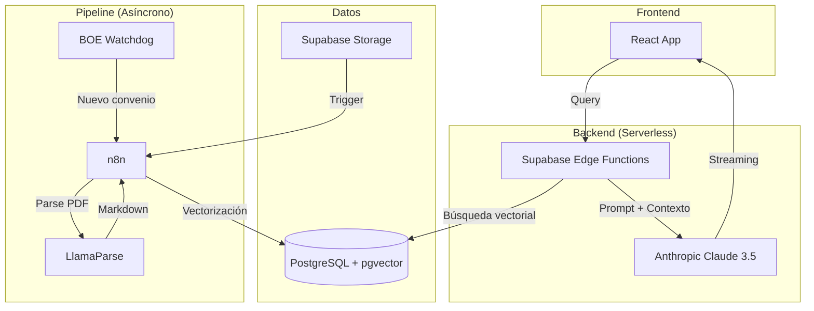

# WorkRules.eu

> Consultor Laboral Automatizado basado en IA que transforma convenios colectivos españoles en respuestas precisas y cálculos de costes laborales exactos.

[](https://github.com/yourusername/workrules/actions)
[](https://opensource.org/licenses/MIT)

## Descripción

WorkRules.eu es una plataforma LegalTech que utiliza arquitectura RAG (Retrieval-Augmented Generation) especializada para interpretar y calcular condiciones laborales basadas en convenios colectivos del BOE. A diferencia de herramientas genéricas, WorkRules:

- **Calcula con precisión**: Interpreta variables complejas (categoría, jornada, horario) para dar cifras exactas
- **Cero alucinaciones**: Respuestas basadas estrictamente en el texto del BOE/REGCON con citas de la fuente
- **Guía inteligente**: Interfaz que sugiere variables basadas en el convenio seleccionado

### Caso de uso típico

*"Necesito contratar camareras de piso que trabajarán 30 horas semanales en horario nocturno en un hotel de 4 estrellas en Valencia. ¿Cuánto debo pagar?"*

WorkRules extrae automáticamente del convenio el salario base, calcula el prorrateo de pagas extras, aplica el plus de nocturnidad y valida que el resultado cumple con el SMI vigente.

## Quick Start

### Requisitos previos

- Node.js 18+
- pnpm 8+
- Cuenta en [Supabase](https://supabase.com)
- API Keys: [OpenAI](https://platform.openai.com), [LlamaParse](https://llamaparse.com), [Anthropic](https://console.anthropic.com)

### Instalación

```bash
# Clonar el repositorio
git clone https://github.com/yourusername/workrules.git
cd workrules

# Instalar dependencias
pnpm install

# Configurar variables de entorno
cp .env.example .env
# Editar .env con tus credenciales

# Configurar base de datos
pnpm db:setup

# Iniciar desarrollo
pnpm dev
```

### Comandos disponibles

```bash
pnpm dev              # Inicia el servidor de desarrollo
pnpm build            # Build para producción
pnpm test             # Ejecuta tests con Playwright
pnpm lint             # Ejecuta ESLint
pnpm format           # Formatea código con Prettier
pnpm db:setup         # Configura esquema de Supabase
pnpm db:reset         # Resetea la base de datos
```

### Configuración de Supabase

1. Crear proyecto en Supabase
2. Habilitar extensión `pgvector`
3. Ejecutar migraciones:
   ```bash
   cd database
   # Aplicar schema.sql y funciones en Supabase SQL Editor
   ```

### Configuración de n8n

Los workflows de n8n están en `n8n/workflows/`. Antes de importarlos:

1. Reemplazar `<SUPABASE_PROJECT_REF>` con tu project ref
2. Configurar credenciales en n8n (Supabase API, OpenAI, LlamaParse)
3. Importar workflows desde la UI de n8n

Ver [n8n/docs/setup.md](./n8n/docs/setup.md) para detalles completos.

## Estructura del Proyecto

```
workrules/
├── .claude/                    # Documentación del proyecto
│   ├── docs/                   # Documentos de arquitectura y fases
│   └── commands/               # Comandos personalizados de Claude
│
├── .github/                    # CI/CD workflows
│   └── workflows/              # GitHub Actions
│
├── database/                   # Esquemas y funciones de PostgreSQL
│   ├── schema.sql             # Definición de tablas
│   ├── functions/             # Funciones SQL (búsqueda vectorial)
│   └── README.md              # Documentación de base de datos
│
├── n8n/                       # Workflows de automatización
│   ├── workflows/             # Definiciones JSON de workflows
│   ├── nodes/                 # Nodos personalizados
│   │   ├── indexer/          # Pipeline de ingesta de PDFs
│   │   └── errors/           # Gestión de errores
│   ├── prompts/              # Templates de prompts para IA
│   └── docs/                 # Documentación de workflows
│
├── supabase/                  # Backend serverless
│   ├── functions/            # Edge Functions (Deno)
│   │   ├── chat/            # Función de chat con streaming
│   │   ├── webhook-pdf/     # Webhook para procesamiento PDF
│   │   └── _shared/         # Código compartido
│   │       ├── core/        # Lógica de negocio
│   │       └── lib/         # Utilidades
│   └── snippets/            # SQL snippets para desarrollo
│
└── tests/                    # Tests E2E con Playwright
    └── e2e/                 # Test suites

```

## Resumen de Arquitectura

### Stack Tecnológico

| Capa | Tecnología | Propósito |
|------|------------|-----------|
| **Frontend** | React 19 + Vite + Tailwind | UI/UX responsiva |
| **Backend** | Supabase Edge Functions (Deno) | API serverless |
| **Base de Datos** | PostgreSQL + pgvector | Datos relacionales + búsqueda semántica |
| **IA** | Anthropic Claude 3.5 Sonnet | Motor de razonamiento y cálculo |
| **Pipeline** | n8n + LlamaParse | Ingesta y procesamiento de PDFs |
| **Embeddings** | OpenAI text-embedding-3-small | Vectorización de texto |

### Arquitectura de Alto Nivel



### Modelo de Datos

El sistema gestiona tres tipos principales de datos:

1. **convenios**: Metadatos de convenios colectivos (nombre, código REGCON, ámbito)
2. **convenio_chunks**: Fragmentos de texto con embeddings para búsqueda semántica (RAG)
3. **convenio_perfiles**: Perfiles JSON con variables extraídas (categorías, salarios, pluses)

Ver [database/README.md](./database/README.md) para el esquema completo.

## Testing

```bash
# Ejecutar todos los tests
pnpm test

# Tests específicos
pnpm test:unit
pnpm test:e2e

# Con UI de Playwright
pnpm test:ui
```

## Documentación

- **[Brief del Proyecto](./.claude/docs/brief.md)**: Contexto, problema y propuesta de valor
- **[Arquitectura Completa](./.claude/docs/arquitectura.md)**: Diseño técnico detallado
- **[Ciclo de Vida](./.claude/docs/ciclo-de-vida.md)**: Roadmap y fases de desarrollo
- **[WorkRules EU](./.claude/docs/workrules-eu.md)**: Análisis integral del negocio

## Roadmap

| Fase | Nombre | Estado |
|------|--------|--------|
| 1 | El Back (Pipeline ETL) | ✅ Completado |
| 2 | El Brain (Motor RAG) | 🚧 En progreso |
| 3 | El Face (Chat UI) | 📋 Planificado |
| 4 | El Business (Monetización) | 📋 Planificado |
| 5 | El Scale (Automatización) | 📋 Planificado |

## Licencia

MIT License - Ver [LICENSE](./LICENSE) para detalles.

## Contribuir

Este es un proyecto en desarrollo activo. Las contribuciones son bienvenidas. Por favor:

1. Fork el repositorio
2. Crea una rama para tu feature (`git checkout -b feature/AmazingFeature`)
3. Commit tus cambios (`git commit -m 'Add some AmazingFeature'`)
4. Push a la rama (`git push origin feature/AmazingFeature`)
5. Abre un Pull Request

## Contacto

- Web: [workrules.eu](https://workrules.eu)
- Email: info@workrules.eu
- Issues: [GitHub Issues](https://github.com/yourusername/workrules/issues)

---

**Disclaimer Legal**: La información proporcionada por WorkRules.eu tiene carácter meramente informativo y no constituye asesoramiento jurídico, laboral ni fiscal. Ver [aviso legal completo](./.claude/docs/brief.md#51-disclaimer-legal-obligatorio).
