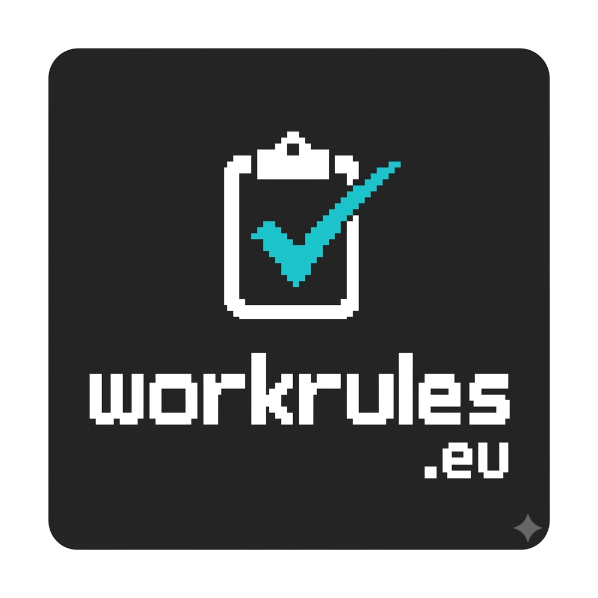
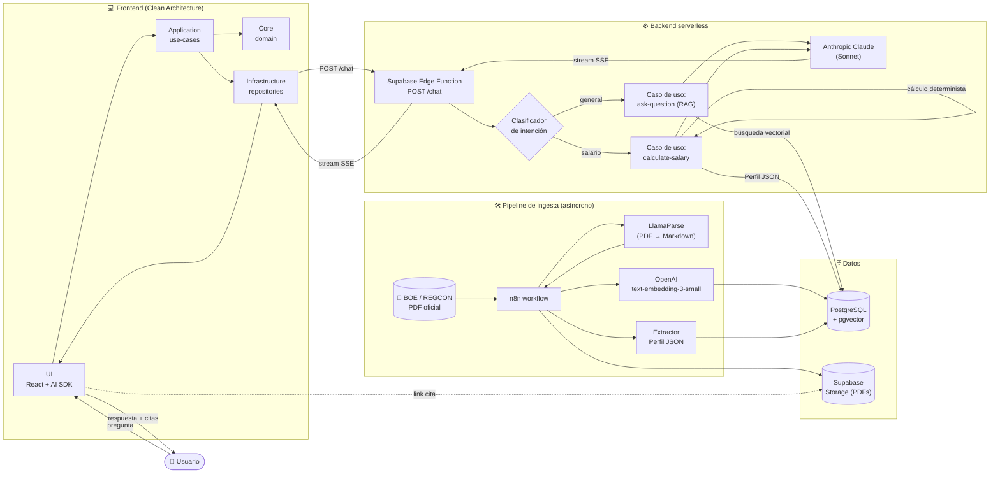

<p align="center">
  
</p>

> La inteligencia que traduce el BOE en respuestas exactas.
> Consulta convenios colectivos españoles y calcula salarios con precisión.

[Demo en vivo](https://workrules.eu) · [Slides TFM](https://workrules.eu/presentacion-TFM) · [Video TFM](https://workrules.eu/presentacion-TFM-video) · [Storybook](https://workrules.eu/storybook)

---

## Qué es WorkRules

WorkRules es una plataforma LegalTech que interpreta convenios colectivos españoles publicados en el BOE y los convierte en respuestas verificables y cálculos salariales deterministas. Frente a las IAs generalistas, evita alucinaciones combinando **RAG** (Retrieval-Augmented Generation) sobre el texto oficial con un **Perfil JSON** estructurado por convenio que alimenta un motor de cálculo determinista. Cada respuesta cita la fuente exacta del BOE.

**Diferenciadores clave:**
- Cálculos salariales exactos (no aproximaciones del LLM).
- Cero alucinaciones: todo apoyado en chunks citables del convenio.
- UI personalizada para cálculos salariales, con desglose paso a paso y trazabilidad de cada concepto retributivo.

---

## Probarlo en producción

1. Entra en https://workrules.eu
2. Selecciona **"Hostelería Madrid"** en el selector de convenios.
3. Prueba estas preguntas:
   - *"¿Cuánto cobra un recepcionista de hotel 4 estrellas?"*
   - *"Calcula el salario de un camarero con 12 horas extra este mes"* — para esta pregunta puedes activar el **switch de cálculo salarial** en la UI y obtener el desglose determinista del Perfil JSON.
   - *"¿Cuál es la jornada máxima del convenio?"*

Cada respuesta incluye citas con enlace al PDF oficial del convenio.

---

## Stack

| Capa | Tecnología | Rol |
|---|---|---|
| Frontend | React 19 + Vite 7 + Tailwind 4 | UI/UX, streaming de chat |
| Chat UI | Vercel AI SDK (`@ai-sdk/react`) | Streaming SSE, `useChat()` |
| Estado | Zustand + TanStack Query | Local + server state |
| Componentes | shadcn/ui (Radix) + atoms/molecules/organisms propios | Design System |
| Backend | Supabase Edge Functions (Deno) | API serverless |
| BD | PostgreSQL + `pgvector` | Relacional + búsqueda semántica |
| LLM | Anthropic Claude (Sonnet) | Razonamiento y respuesta |
| Embeddings | OpenAI `text-embedding-3-small` | Vectorización de chunks |
| Ingesta | n8n + LlamaParse | Pipeline ETL de PDFs del BOE |
| Observabilidad | Sentry | Errores frontend y backend |
| Tests | Playwright (E2E) · Vitest (unit) · Deno test (edge) | Cobertura por capa |
| Design tokens | Style Dictionary | Tokens → CSS variables |

---

## Instalación local

### Requisitos

- Node.js 20+
- pnpm 10+
- Docker (para Supabase local)
- Cuentas y API keys: [Supabase](https://supabase.com), [OpenAI](https://platform.openai.com), [Anthropic](https://console.anthropic.com), [LlamaParse](https://cloud.llamaindex.ai/)

### Pasos

```bash
git clone https://github.com/jmocana2/workrules.git
cd workrules

pnpm install

# Configurar variables de entorno
cp .env.example .env.local
# Edita .env.local con tus claves (Supabase, Sentry, etc.)

# Arrancar Supabase local (Postgres + pgvector + Edge Functions)
supabase start

# Servidor de desarrollo
pnpm dev
```

La app queda disponible en http://localhost:5173.

> **Edge Functions:** `supabase start` ya levanta el runtime de Edge Functions dentro de Docker, así que no necesitas `supabase functions serve` para ejecutar la app. Úsalo solo si estás iterando sobre `supabase/functions/*` y quieres recarga en caliente y trazas de `console.log`.
>
> **Pipeline de ingesta (n8n):** el workflow de ingesta de convenios corre en una instancia de **n8n auto-alojada vía Docker**, independiente del stack de Supabase. No hace falta para ejecutar el frontend contra los convenios ya cargados; ver [docs/n8n.md](./docs/n8n.md) si quieres reproducirlo.

### Scripts disponibles

| Script | Descripción |
|---|---|
| `pnpm dev` | Servidor de desarrollo Vite (puerto 5173) |
| `pnpm build` | Build de producción + Storybook estático |
| `pnpm preview` | Servir el build localmente |
| `pnpm lint` / `pnpm lint:fix` | ESLint (incluye SonarJS) |
| `pnpm typecheck` | `tsc --noEmit` |
| `pnpm test` | Tests E2E con Playwright |
| `pnpm test:ui` | Playwright en modo UI |
| `pnpm test:unit` | Tests unitarios con Vitest |
| `pnpm test:deno` | Tests de Supabase Edge Functions (Deno) |
| `pnpm storybook` | Storybook en http://localhost:6006 |
| `pnpm build-storybook` | Storybook estático |
| `pnpm tokens:build` | Compila design tokens a `src/styles/tokens/variables.css` |

---

## Estructura del proyecto

El frontend sigue **Clean Architecture**: las dependencias apuntan siempre hacia adentro (`ui → application → core`), y la `infrastructure` implementa los **puertos** definidos en `application/` para que el dominio quede aislado de Supabase, fetch y otros detalles técnicos.

```
workrules/
├── src/                              # Frontend React — Clean Architecture
│   ├── core/                         # 🟢 DOMAIN — entidades y reglas de negocio puras
│   │   ├── auth/                     #   (sin imports de React, Supabase ni HTTP)
│   │   ├── chat/
│   │   ├── convenio/
│   │   ├── types/
│   │   └── constants/
│   │
│   ├── application/                  # 🔵 APPLICATION — casos de uso + puertos
│   │   ├── use-cases/                #   orquestan el dominio
│   │   └── ports/                    #   interfaces que la infra debe implementar
│   │
│   ├── infrastructure/               # 🟠 INFRASTRUCTURE — adaptadores concretos
│   │   ├── clients/                  #   Supabase, fetch, SDKs externos
│   │   └── repositories/             #   implementaciones de los ports
│   │
│   ├── ui/                           # 🟣 PRESENTATION — React (depende hacia adentro)
│   │   └── components/
│   │       ├── shadcn/               #   primitivas (Radix-based)
│   │       ├── ai-elements/          #   chat, citaciones, reasoning
│   │       └── workrules/            #   atoms / molecules / organisms / pages
│   │
│   ├── providers/                    # React context (Query, theme, auth)
│   ├── styles/tokens/                # Variables CSS generadas por Style Dictionary
│   ├── lib/                          # Helpers transversales (cliente Supabase singleton)
│   └── App.tsx                       # Entry point del chat
│
├── supabase/
│   ├── functions/
│   │   ├── chat/                     # Endpoint POST /chat (clasifica y enruta)
│   │   ├── webhook-pdf/              # Webhook de ingesta de convenios
│   │   └── _shared/
│   │       ├── core/chat/            # Casos de uso: ask-question, calculate-salary
│   │       └── lib/                  # Wrappers Supabase, OpenAI, Anthropic, CORS
│   └── migrations/                   # Migraciones SQL
│
├── database/                         # Schema + funciones SQL (búsqueda vectorial)
├── n8n/workflows/                    # Pipeline de ingesta (PDF → chunks + Perfil JSON)
├── design-system/tokens/             # Fuente de tokens (Style Dictionary)
├── tests/e2e/                        # Playwright
├── docs/                             # Documentación técnica del TFM
└── .claude/docs/fases/               # Trazabilidad de fases del proyecto
```

---

## Flujo completo de la aplicación

Desde que un convenio entra en el sistema (ingesta) hasta que el usuario recibe una respuesta con cita verificable (consulta):



**Lectura rápida:**
- **Ingesta (offline):** n8n orquesta el procesado de cada convenio nuevo del BOE: LlamaParse lo convierte a Markdown, se extrae un **Perfil JSON** estructurado y los chunks se vectorizan con OpenAI antes de guardarse en Postgres/`pgvector`.
- **Consulta (online):** la UI envía la pregunta a través de los casos de uso del frontend (Clean Arch) → Edge Function → clasificador → `ask-question` (RAG) o `calculate-salary` (determinista sobre el Perfil JSON) → Claude redacta la respuesta y se devuelve en streaming SSE al usuario con citas que enlazan al PDF original.

---

## Funcionalidades principales

- **Chat sobre convenios colectivos** con streaming SSE y citaciones al PDF oficial.
- **Cálculo determinista de salarios** a partir del **Perfil JSON** del convenio (categoría, horas extra, plus de nocturnidad, prorrateo de pagas, validación SMI).
- **Selector de convenios** activos con metadata REGCON.
- **Pipeline de ingesta automatizado**: BOE → n8n → LlamaParse → embeddings → Postgres.
- **Sistema de citas** con enlace al PDF original almacenado en Supabase Storage.
- **Light / Dark mode** y design system propio basado en tokens.
- **Documentación viva** del Design System publicada en Storybook.

---

## Documentación técnica

- [Brief del proyecto](docs/brief.md) — problema, propuesta de valor, KPIs.
- [Arquitectura completa](docs/arquitectura.md) — diseño técnico end-to-end.
- [Flujo de aplicación](docs/flujo-aplicacion.md) — recorrido de una consulta.
- [Ciclo de vida](docs/ciclo-de-vida.md) — fases del proyecto.
- [Estrategia de tests](docs/tests/estrategia-testing.md) — cobertura por capa y resultados.
- [ADRs](docs/adr/README.md) — decisiones arquitectónicas registradas.
- [Convenios — Hostelería Madrid](docs/convenios/hosteleria-madrid-datos.md) — modelo de datos y Perfil JSON.
- [n8n pipeline](docs/n8n.md) — workflow de ingesta.
- [Métricas](docs/metricas.md) — KPIs operativos.
- [Storybook público](https://workrules.eu/storybook) — Design System navegable.
- [Notion del proyecto](https://www.notion.so/workrules-eu-2e1bed77604180129884ec2fb7938f48) — gestión y notas internas.

---

## Licencia

Este proyecto se distribuye bajo la **PolyForm Noncommercial License 1.0.0**. Permite uso, estudio y modificación sin ánimo de lucro; el uso comercial requiere acuerdo explícito con el autor. Ver [LICENSE.txt](./LICENSE.txt) para el texto completo.

---

**Disclaimer legal:** La información proporcionada por WorkRules.eu tiene carácter informativo y no constituye asesoramiento jurídico, laboral ni fiscal.
