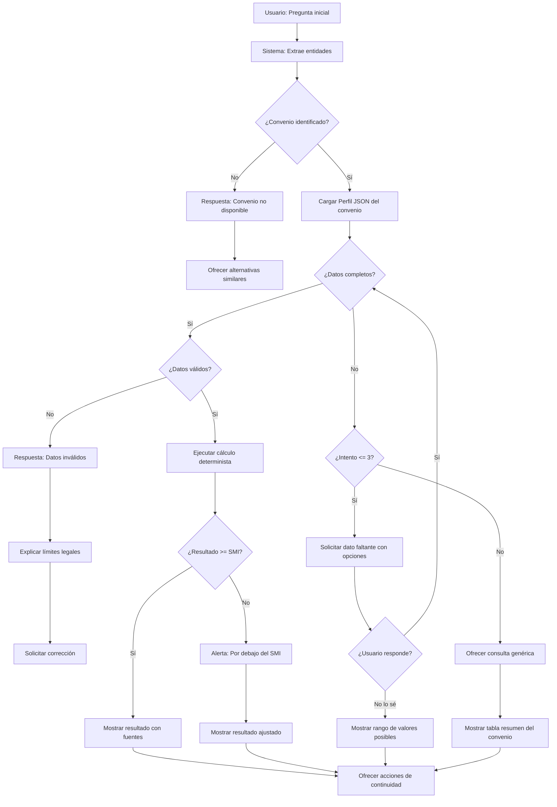

# Brief

**Versión:** 2.0 (Edición Consultoría IA) | **Responsable:** Solo Dev | **Estatus:** Listo para ejecución

---

## 1. Contexto y Antecedentes

El acceso a los convenios colectivos en España es una barrera para trabajadores y profesionales de RRHH. Los documentos en PDF del BOE/REGCON son difíciles de navegar. Mientras que las herramientas generales (ChatGPT) pueden resumir textos, no están optimizadas para la precisión numérica y la jerarquía de variables (categorías, niveles, pluses) que exige el sector laboral.

---

## 2. Objetivos

### Principal

Desarrollar un **"Consultor Laboral Automatizado"** que no solo extraiga texto, sino que interprete y calcule condiciones basadas en variables específicas del usuario.

### Secundarios

- Automatizar la ingesta y estructuración de los 100 convenios más usados.
- Lograr un rendimiento SEO 100/100 en Core Web Vitals para atraer tráfico orgánico.
- Implementar un sistema de monetización SaaS con control estricto de costes de API.

---

## 3. Problema / Oportunidad

### Problema

Los usuarios no necesitan leer el convenio; necesitan saber cuánto cobrar o cuánto tiempo de prueba tienen según su caso específico (X categoría, Y horas, Z tipo de empresa).

### Oportunidad

Crear una herramienta que "entienda" la estructura lógica de cada convenio (perfiles JSON) para guiar al usuario en la consulta.

### 3.1 Desarrolando el problema. ¿Realmente es un problema?

Partimos de la afirmación de una directora de negocio de una ETT la cual dice

> "Lo que no hace nadie a día de hoy es analizar el convenio, que es muy complicado. Decirle a la IA tengo que contratar camareras de piso y gobernantas, que van a trabajar tantas horas a la semana en tal horario en el hotel x que es de categoría tal y cuanto tengo que pagar"

Aquí el problema no es que la IA no pueda leer los convenios, sino que los **Convenios Colectivos** en España son documentos extremadamente complejos, con estructuras no normalizadas y tablas salariales que cambian cada año (o a mitad de año por el SMI).

### 3.2 ¿Por qué fallan los modelos actuales al intentar sacar esta información con un solo "prompt"?

- **Falta de actualización:** Los convenios se publican en el BOE o boletines provinciales constantemente. Una IA comercial tiene un "corte de conocimiento" y no sabe qué se acordó ayer en el convenio de Hostelería de Baleares.
- **Ambigüedad legal:** Un convenio puede decir: *"El plus de nocturnidad será el 25% del salario base, salvo que el trabajador haya sido contratado específicamente para horario nocturno"*. Una IA estándar suele ignorar estas condiciones "si/entonces".
- **Cálculo matemático vs. Generación de texto:** Las IAs son modelos de lenguaje, no calculadoras. Para dar el precio exacto, no solo hay que leer el convenio, hay que aplicar una lógica aritmética que las IAs suelen fallar si el proceso no es guiado.

### 3.3 ¿Y usando modelos más avanzados?

La IA **sí es capaz de leerlo y extraer datos**, pero sigue teniendo dos fallos críticos para un entorno legal:

-  **Fiabilidad Matemática:** Las IAs son "predictores de texto", no calculadoras. Si le pides que calcule el salario bruto anual sumando 12 pagas, 2 extras prorrateadas y un plus de transporte de $3,50$€/día efectivo, la IA puede "aproximar" y equivocarse por 20 euros. **En una nómina, un error de 1 céntimo es un problema legal.**
- **La "trampa" del PDF:** Los convenios tienen tablas salariales en formatos complejos (celdas combinadas, notas al pie). Una IA estándar a veces lee mal la fila de una categoría si el PDF está mal escaneado

### 3.4 Por qué fallan las IAs comerciales: Ejemplo práctico

**Prompt de prueba a GPT 5.1:**

> "Según el Convenio de Hostelería de Valencia, calcula el salario de un ayudante de cocina con 12 horas extra y 40 horas nocturnas."

**Resultado:** La IA no pudo responder porque:

1. **Corte de conocimiento:** Las tablas salariales están en PDFs no indexados
2. **Ambigüedad temporal:** No sabe si usar datos de 2024 o 2026
3. **Falta de contexto:** No sabe la categoría del hotel (3/4/5 estrellas)

**Conclusión:** Sin acceso estructurado a los datos del convenio (Perfil JSON), ninguna IA comercial puede dar respuestas precisas.

---

## 4. Propuesta de Valor

> **"**[**WorkRules.eu**](http://WorkRules.eu)**: La inteligencia que traduce el BOE en respuestas exactas. Calcula salarios, periodos de prueba y pluses de forma instantánea y fiable."**

---

## 5. Alcance del Proyecto (Scope)

### Incluye

- **Motor de Razonamiento:** Capacidad de interpretar variables (Categoría, Grupo, Antigüedad).
- **Sistema RAG Avanzado:** Búsqueda semántica + Contexto estructurado (JSON de tablas).
- **Chat Autoguiado:** La IA sugiere los parámetros necesarios según el convenio elegido.
- **Gestión de Usuarios:** Niveles Free, Premium (privacidad de PDFs) y Enterprise.
- **Validación:** Enlace directo a la fuente oficial en cada respuesta.

### No incluye

- Cálculo de nóminas reales (con retenciones IRPF/SS).
- Asesoría jurídica vinculante (Disclaimer obligatorio).

---

## 5.1 Disclaimer Legal Obligatorio

Toda respuesta del sistema debe incluir o enlazar al siguiente aviso legal:

> **Aviso Legal**
>
> La información proporcionada por [WorkRules.eu](http://WorkRules.eu) tiene carácter meramente informativo y no constituye asesoramiento jurídico, laboral ni fiscal.
>
> - Los cálculos mostrados son aproximaciones basadas en la interpretación automatizada de convenios colectivos y pueden no reflejar la totalidad de complementos, acuerdos de empresa o circunstancias individuales.
> - **No sustituye** la consulta con un profesional cualificado (abogado laboralista, graduado social o asesoría).
> - [WorkRules.eu](http://WorkRules.eu) no se hace responsable de decisiones tomadas en base a esta información.
> - Los datos salariales pueden variar por actualizaciones del convenio, revisiones del IPC o acuerdos posteriores no indexados.
>
> Para cálculos oficiales de nómina, consulte con su gestoría o utilice software homologado.

### Implementación del Disclaimer

| Ubicación | Formato |
|---|---|
| Footer de la web | Enlace permanente a página /legal |
| Primera respuesta del chat | Mensaje colapsable "Ver aviso legal" |
| Exportación PDF | Pie de página en cada hoja |
| Registro de usuario | Checkbox de aceptación obligatorio |

---

## 6. Arquitectura Técnica (Resumen)

| Capa | Tecnología |
|---|---|
| Frontend | React 19 + Vite + shadcn/ui + Vercel AI SDK (Streaming) |
| Backend | Supabase (PostgreSQL + pgvector + Edge Functions) |
| Pipeline de Ingesta | n8n + LlamaParse (Conversión de tablas a Markdown/JSON) |
| Cerebro IA | Anthropic Claude Sonnet 4 (`claude-sonnet-4-20250514`) |

---

## 7. Diferenciador Técnico: El "Perfil de Convenio"

Cada convenio procesado generará dos activos en la base de datos:

1. **Vectores:** Para búsqueda semántica de texto legal.
2. **Esquema JSON:** Un diccionario dinámico que mapea las variables críticas (ej: categorías disponibles, niveles de hotel, grupos profesionales) para que la IA sepa qué preguntar al usuario.

### Ejemplo de Perfil JSON - Hostelería

```json
{
  "convenio": "Hostelería Madrid",
  "variables_criticas": ["Categoría Profesional", "Categoría Hotel", "Años Antigüedad"],
  "valores_posibles": {
    "Categoría Hotel": ["3 estrellas", "4 estrellas", "5 estrellas"],
    "Categoría Profesional": ["Gobernanta", "Camarera", "Recepcionista"]
  }
}
```

### Ejemplo de Perfil JSON - Consultoría

```json
{
  "convenio": "Consultoras TIC",
  "variables_criticas": ["Área Funcional", "Grupo", "Nivel"],
  "valores_posibles": {
    "Área Funcional": ["1", "2", "3"],
    "Grupo": ["A", "B", "C"]
  }
}
```

---

## 8. Restricciones y Riesgos

| Restricción | Mitigación |
|---|---|
| **Presupuesto:** Límite de 100€/mes | Cachear respuestas y usar modelos eficientes (Claude Haiku) para consultas simples |
| **Alucinaciones:** Riesgo de cálculos erróneos | La IA debe mostrar siempre el "paso a paso" del cálculo y citar el artículo del PDF |
| **Mantenibilidad:** Evitar código específico por convenio | Todo el sistema debe ser agnóstico y basarse en los metadatos del JSON |

---

## 9. KPIs de Éxito

- **Precisión de Cálculo:** 100% de éxito en tests sobre los 10 convenios piloto.
- **Retención:** Usuarios que realizan más de 3 consultas por sesión.
- **Conversión:** Lograr los primeros 5-10 usuarios Premium mediante contactos en ETTs y SEO.

---

## 10. Cronograma

> **Ver detalle completo en **[**Ciclo de vida**](./ciclo-de-vida.md)

---

## ESCENARIO DE USO: Análisis de Convenio y Cálculo de Costes (Sector ETT)

**Contexto:** El usuario (Directora de Negocio) necesita una respuesta precisa y legalmente vinculante basada en un convenio específico, sin necesidad de aportar ella misma los datos salariales.

---

### 1. Entrada del Usuario (Prompt Natural)

> Usuario: "Según el Convenio de Hostelería de Valencia para 2026, tengo un ayudante de cocina a jornada completa en un hotel de 3 estrellas. Este mes ha realizado 12 horas extraordinarias en días laborables y ha trabajado 40 horas en horario nocturno. Necesito el cálculo del valor de la hora ordinaria, el pago de las extras y el plus de nocturnidad con pagas prorrateadas."

---

### 2. Procesamiento del Sistema (Lógica Interna)

1. **Identificación de Entidades:** El modelo detecta: `Convenio: Valencia Hostelería`, `Categoría: Ayudante de Cocina`, `Establecimiento: Hotel 3*`, `Año: 2026`.
2. **Consulta a Base de Datos (RAG):** El sistema recupera los valores validados de la base de datos interna:
	- Salario Base Anual: **19.850,00 €**
	- Jornada Anual: **1.826 horas**
	- Recargo Horas Extra (Laborables): **+75%**
	- Plus Nocturnidad: **+25% del valor hora ordinaria**
3. **Cálculo Determinista (Motor de Código):** Se ejecutan las fórmulas matemáticas exactas fuera del modelo de lenguaje para garantizar precisión decimal.

---

### 3. Respuesta de la IA (Salida Estructurada)

**Respuesta del Chat:**

He localizado el **Convenio Colectivo de Hostelería de Valencia** (última revisión salarial publicada en BOPV para 2026). Para un **Ayudante de Cocina** en un establecimiento de **3 estrellas**, el desglose es el siguiente:

### ■ Conceptos Base (Cálculo 2026)

- **Salario Base Anual:** 19.850,00 €
- **Valor Hora Ordinaria:** **10,87 €** *(Basado en 1.826h anuales)*
- **Valor Hora Extra (+75%):** **19,02 €**
- **Plus Nocturnidad/hora (+25%):** **2,72 €**

### ■ Liquidación de Variables (Mes actual)

| Concepto | Cantidad | Precio/Unidad | Total Devengado |
|---|---|---|---|
| **Horas Extraordinarias** | 12 h | 19,02 € | **228,24 €** |
| **Plus de Nocturnidad** | 40 h | 2,72 € | **108,80 €** |

### ■ Resumen de Coste Mensual (Prorrateo de Pagas Extras incluido)

- **Salario Base Mensual:** 1.654,17 €
- **Total Complementos Variables:** 337,04 €
- **TOTAL BRUTO MENSUAL:** **1.991,21 €**

> Referencia Legal: Cálculo basado en el Art. 32 (Horas extraordinarias) y Art. 35 (Plus de Nocturnidad) del convenio vigente.

**¿Qué deseas hacer ahora?**

1. Generar informe de costes para el cliente (PDF).
2. Comparar con un hotel de 4 estrellas.
3. Calcular el coste total de seguridad social (Cuota patronal).

---

### 4. Interacción de Continuidad (Flexibilidad)

> Usuario: "Cambia el hotel a 4 estrellas e incluye un plus de idiomas por nivel C1."

> Sistema: Actualizando... En hoteles de 4 estrellas, el salario base anual asciende a 20.400 €. Según el Art. 40, el plus de idiomas para C1 añade 45,50 € fijos mensuales. El nuevo Total Bruto es de 2.091,65 €.

# Protocolo completo de iteración con el chat

Para garantizar la precisión legal del 100%, el sistema implementa un protocolo exhaustivo que cubre todos los estados posibles de una consulta.

---

## Diagrama de Flujo del Chat



---

## 1. Estados de Datos y Acciones

El sistema clasifica cada consulta en uno de estos estados:

| Estado | Descripción | Acción del Sistema |
|---|---|---|
| **Completos** | Todos los parámetros obligatorios presentes | Ejecutar cálculo inmediato |
| **Incompletos** | Faltan parámetros del Perfil JSON | Solicitar con menú de opciones |
| **Ambiguos** | Valor con múltiples interpretaciones posibles | Clarificar con lista extraída del convenio |
| **Inválidos** | Valor imposible o fuera de rango legal | Rechazar, explicar límite y pedir corrección |
| **Conflictivos** | Datos que se contradicen entre sí | Mostrar inconsistencia y pedir confirmación |

---

## 2. Jerarquía de Parámetros (Orden de Solicitud)

Cuando faltan múltiples datos, el sistema los solicita en este orden de prioridad:

```javascript
1º Convenio colectivo
   └─ 2º Categoría profesional
       └─ 3º Nivel de establecimiento (si aplica)
           └─ 4º Tipo de jornada (completa/parcial)
               └─ 5º Variables específicas (antigüedad, plus, etc.)
```

---

## 3. Límites de Interacción

- **Máximo 3 preguntas** antes de ofrecer consulta genérica o tabla resumen
- **Siempre ofrecer "No lo sé"** como opción válida, explicando el impacto
- **Sugerir valor más común** cuando exista un estándar habitual
- **No repetir preguntas** ya respondidas en la misma sesión

---

## 4. Escenarios de Respuesta

### A) Datos Completos → Cálculo Directo

**Cuando:** El usuario proporciona todos los parámetros necesarios en el prompt inicial.

**Ejemplo de entrada:**

> "Según el Convenio de Hostelería de Valencia para 2026, tengo un ayudante de cocina a jornada completa en un hotel de 3 estrellas. Este mes ha realizado 12 horas extraordinarias en días laborables y ha trabajado 40 horas en horario nocturno."

**Respuesta del sistema:**

1. Confirmar convenio y parámetros identificados
2. Mostrar cálculo paso a paso con fórmulas
3. Presentar tabla resumen de conceptos
4. Citar artículos del convenio usados
5. Ofrecer acciones de continuidad

---

### B) Datos Incompletos → Solicitud Guiada

**Cuando:** Faltan parámetros obligatorios del Perfil JSON.

**Estructura de respuesta:**

1. **Confirmación:** "He encontrado el convenio \[Nombre\]..."
2. **Bloqueo informativo:** "Para calcular el importe exacto necesito saber \[Dato Faltante\], ya que el salario varía según esta variable."
3. **Menú de opciones:** Lista extraída directamente del texto legal.
4. **Opción escape:** "Si no conoces este dato, puedo mostrarte un rango de valores posibles."

**Ejemplo:**

> **Usuario:** "¿Sueldo de recepcionista en Baleares?"

> **Sistema:** "He localizado el Convenio de Hostelería de Baleares. Para calcular el salario exacto de recepcionista, necesito dos datos adicionales:

> **1. Zona del establecimiento:**
> - Palma (Nivel 1)
> - Resto de Mallorca/Menorca (Nivel 2)
> - Ibiza/Formentera (Nivel 3)

> **2. Categoría del hotel:**
> - 3 estrellas
> - 4 estrellas
> - 5 estrellas

> Si no conoces alguno de estos datos, puedo mostrarte la tabla completa con todos los rangos."

---

### C) Convenio No Disponible

**Cuando:** El convenio solicitado no está indexado en la base de datos.

**Respuesta:**

> "El convenio de **\[Nombre del convenio\]** aún no está disponible en WorkRules. Actualmente tenemos indexados \[X\] convenios.

> **¿Qué puedo hacer por ti?**
> 1. Notificarte cuando lo añadamos (próximamente)
> 2. Buscar un convenio similar de tu sector
> 3. Consultar el convenio estatal de \[Sector\] como referencia

> *Nota: Los convenios se añaden por orden de demanda. Tu solicitud nos ayuda a priorizar.*"

---

### D) Datos Inválidos o Fuera de Rango

**Cuando:** El usuario proporciona valores imposibles o ilegales.

**Ejemplos de detección:**

- Horas extra \> 80 anuales (límite legal Art. 35 ET)
- Jornada \> 40h semanales sin justificación
- Período de prueba \> máximo del convenio

**Respuesta:**

> "⚠️ **Dato fuera de rango:** Has indicado 40 horas extra en un día, pero el Estatuto de los Trabajadores establece un máximo de **80 horas extra anuales** (Art. 35.2 ET).

> ¿Quizás te refieres a:
> - 40 horas extra **este mes**?
> - 40 horas **nocturnas** (no extra)?

> Por favor, confirma el dato correcto para continuar."

---

### E) Resultado por Debajo del SMI

**Cuando:** El cálculo resultante es inferior al Salario Mínimo Interprofesional.

**Respuesta:**

> "⚠️ **Alerta de Salario Mínimo**
> El cálculo según convenio resulta en **\[X\]€/mes**, pero el SMI vigente para 2026 es de **1.134€/mes** (14 pagas) o **1.323€/mes** (12 pagas prorrateadas).

> **Por ley, se aplica el salario mayor.** El salario mínimo para este trabajador sería:
> - Bruto mensual: **1.323,00€**
> - Bruto anual: **15.876,00€**

> *Referencia: Art. 27 del Estatuto de los Trabajadores.*

> ¿Quieres ver el desglose completo con el ajuste aplicado?"

---

### F) Datos Conflictivos

**Cuando:** La información proporcionada se contradice.

**Ejemplo:** Usuario dice "jornada completa" pero indica "20 horas semanales".

**Respuesta:**

> "He detectado una posible inconsistencia en tu consulta:

> - Indicas **jornada completa**
> - Pero mencionas **20 horas semanales**
> En el Convenio de \[Nombre\], la jornada completa son **40 horas semanales** (1.826h anuales). Una jornada de 20h sería un **contrato a tiempo parcial al 50%**.
> ¿Cuál es la situación correcta?
> 1. Jornada completa (40h/semana)
> 2. Tiempo parcial (20h/semana)"

---

### G) Error Técnico / Timeout

**Cuando:** Fallo de base de datos, API o timeout de procesamiento.

**Respuesta:**

> "No he podido completar el cálculo en este momento debido a un problema técnico.
> **Tu consulta ha sido guardada.** Opciones:
> 1. Reintentar ahora
> 2. Recibir el resultado por email cuando esté listo
> 3. Contactar con soporte

> *Disculpa las molestias. Nuestro equipo ha sido notificado automáticamente.*"

---

## 5. Beneficios del Protocolo

| Beneficio | Descripción |
|---|---|
| **Cero errores por suposición** | El sistema nunca asume valores; siempre pregunta o muestra rangos |
| **Educación del usuario** | Ayuda a identificar qué datos solicitar siempre a sus clientes |
| **Cumplimiento legal** | Validación automática contra SMI y límites del ET |
| **Experiencia fluida** | Máximo 3 preguntas antes de ofrecer alternativas |
| **Transparencia** | Siempre muestra la fuente legal de cada cálculo |
