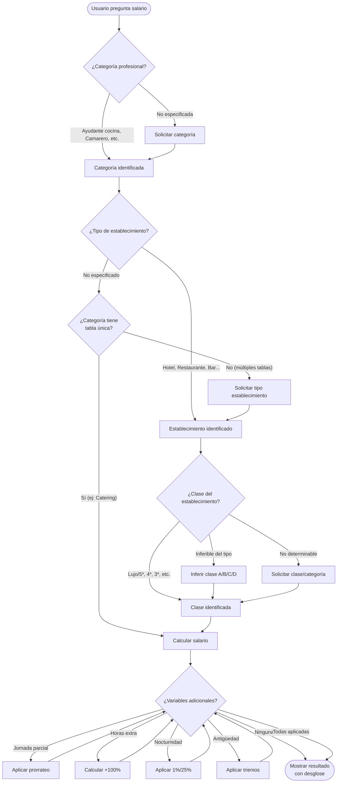
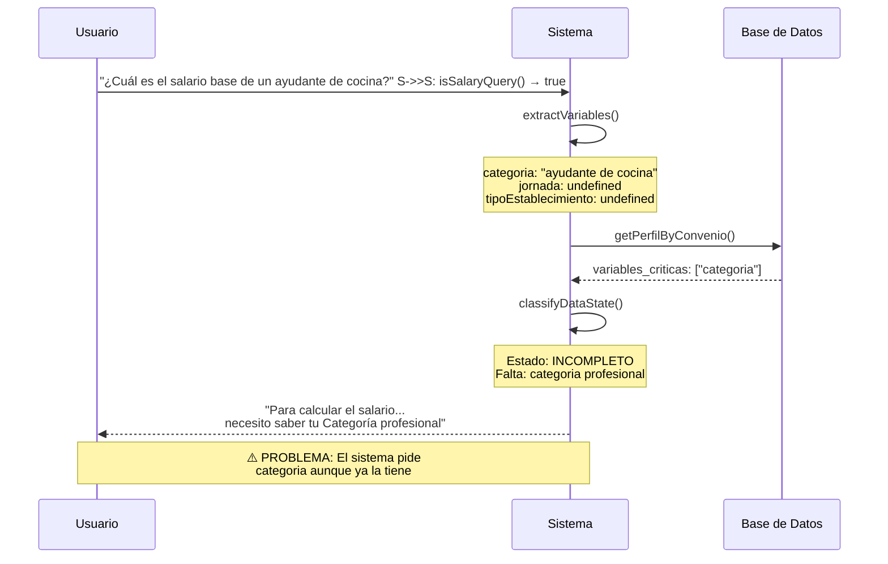
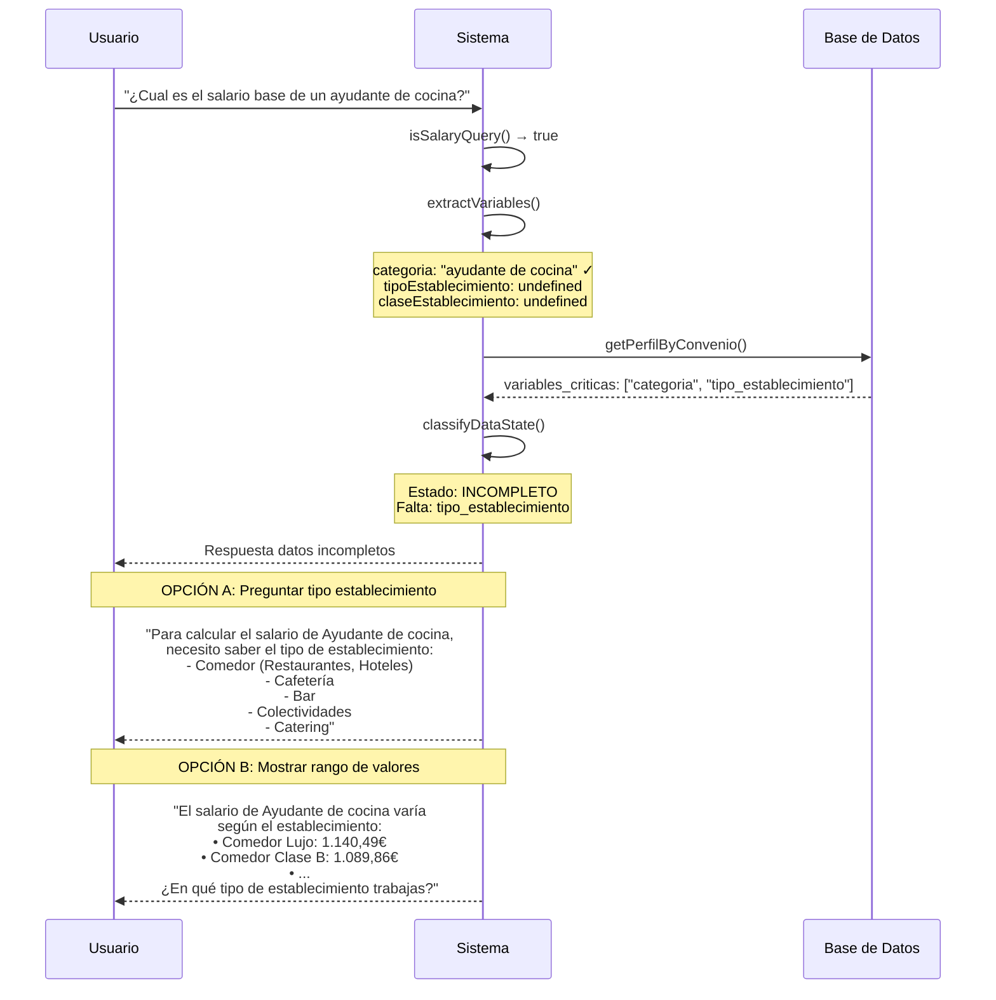
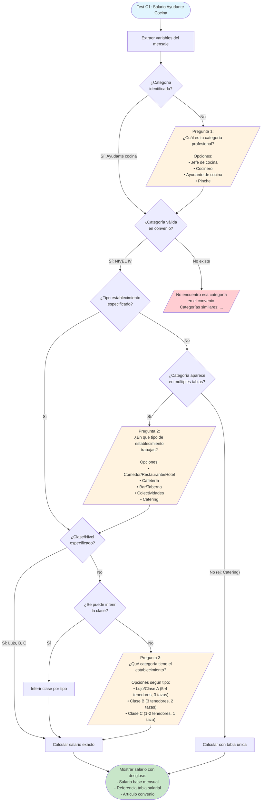
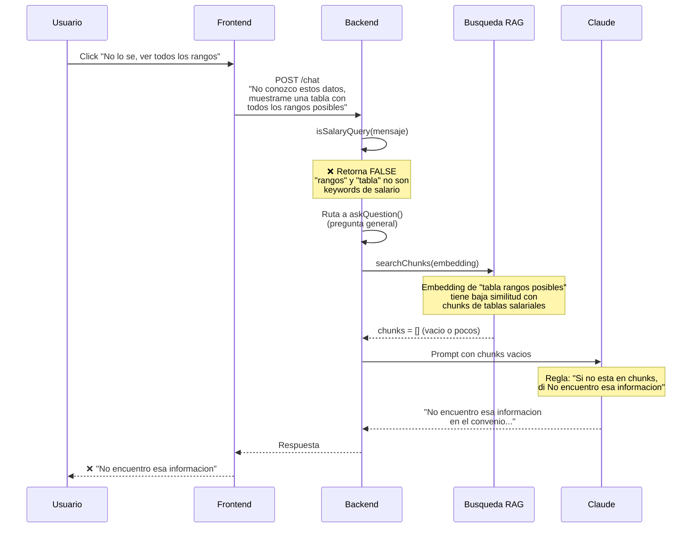
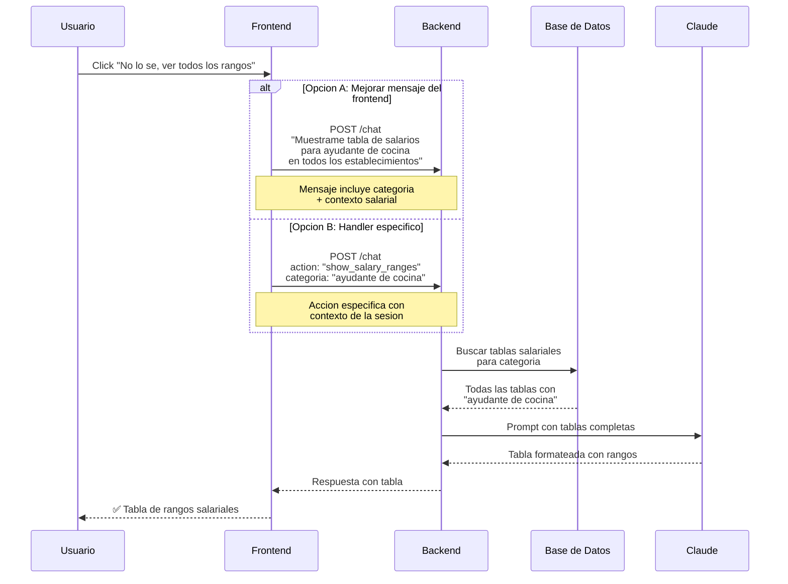
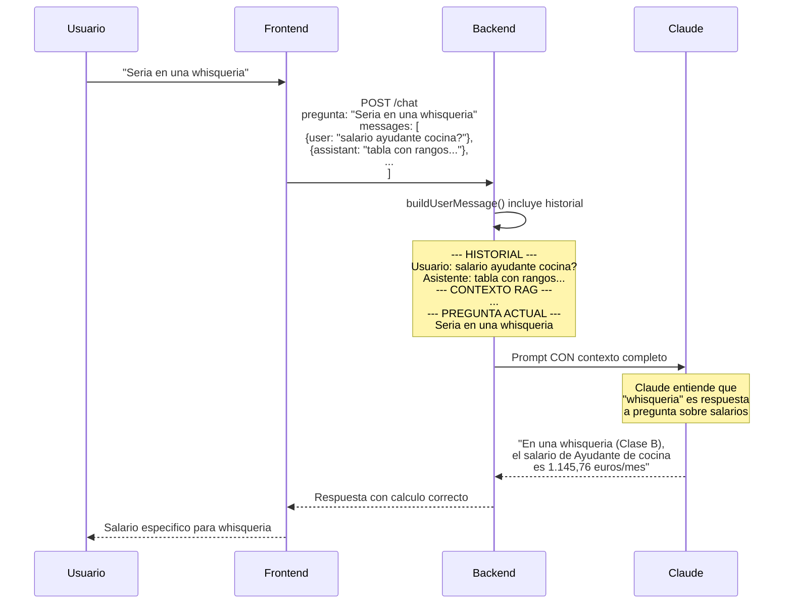

# Datos de Referencia: Convenio Colectivo Hosteleria Madrid

> **Fuente:** BOCM 06/04/2024 - Convenio colectivo de Hosteleria de la Comunidad de Madrid
> **URL:** https://www.ccoo-servicios.es/archivos/BOCM-20240406-Conv-hosteleria.pdf
> **Vigencia:** _____ - _____
> **Codigo Convenio:** _____

---

## Flujo de Calculo Salarial

El convenio de Hostelería de Madrid tiene una estructura salarial compleja donde el salario base depende de múltiples variables. A continuación se detalla el flujo de decisión:



### Variables Críticas para Cálculo

| Variable | Obligatoria | Opciones/Valores | Notas |
|----------|-------------|------------------|-------|
| **Categoría profesional** | ✅ Sí | Ver sección C | Nivel I a V |
| **Tipo establecimiento** | ⚠️ Depende | Comedor, Cafetería, Bar, Hotel, Catering... | Algunas categorías tienen tabla única |
| **Clase establecimiento** | ⚠️ Depende | A (Lujo), B, C, D (Catering) | Se puede inferir en algunos casos |
| **Jornada** | ❌ No | Completa (40h), Parcial (Xh) | Default: completa |
| **Horas extra** | ❌ No | 0-80h/año | Límite legal 80h anuales |
| **Horas nocturnas** | ❌ No | Horas entre 22:00-08:00 | Tramos 1% y 25% |
| **Antigüedad** | ❌ No | Años en empresa | Trienios |

### Tablas Salariales por Subsector

El convenio tiene **tablas salariales separadas** para cada subsector:

1. **Comedor** (Restaurantes, Hoteles con comedor)
2. **Cafetería** (Cafeterías 1-3 tazas)
3. **Bar** (Bares, Tabernas, Cafés-Bar)
4. **Colectividades** (Comedores colectivos)
5. **Catering** (Empresas de catering)

Cada tabla tiene sus propios salarios por nivel y categoría de establecimiento (Lujo/A, B, C).

---

## A) Jornada y Tiempo de Trabajo

### Jornada Laboral
- **Jornada máxima semanal:** 40 horas de trabajo efectivo
- **Jornada máxima anual:** 1.800 horas de trabajo efectivo
- **Articulo de referencia:** Art. 14

### Vacaciones
- **Dias de vacaciones:** 30 días naturales ininterrumpidos al año
- **Periodo preferente:** Se puede pactar el disfrute en dos periodos de 15 días; en ese caso, uno de ellos debe coincidir necesariamente con el periodo comprendido entre el 15 de junio y el 15 de septiembre.
- **Articulo de referencia:** Art. 18

### Descanso Semanal
- **Dias de descanso:** 2 días de descanso semanal.
En centros de 20 o más trabajadores, serán 2 días ininterrumpidos.

En centros de menos de 20 trabajadores, no son necesariamente ininterrumpidos.

- **Articulo de referencia:** Art. 17

### Festivos
- **Festivos trabajados - compensacion:** Festivos trabajados - compensación: La persona trabajadora puede exigir un justificante por cada festivo trabajado. Si no se entrega en 15 días tras solicitarlo, se computa como trabajado. La licencia por asuntos propios o licencias especiales pueden descontarse de las "fiestas abonables" (festivos) según el caso.
- **Articulo de referencia:** Art. 16 (Calendario laboral) y Art. 19 (Licencias).
---

## B) Periodos de Prueba

El convenio de Hostelería de Madrid **no establece periodos de prueba específicos por categoría**. Se remite a normativa externa.

> **Art. 8 - Período de prueba:** "Se estará a la legislación vigente y a lo dispuesto en el Acuerdo Laboral de Ámbito Estatal vigente para el Sector de Hostelería."

- **Articulo de referencia:** Art. 8

---

## C) Niveles Retributivos y Categorias Profesionales

> **Nota:** El convenio organiza las categorías por NIVELES RETRIBUTIVOS (I a V), no por grupos funcionales.

### NIVEL I (Jefaturas)
- Jefe/a de Administración (Contable General, Jefe/a de Contabilidad)
- Jefe/a Comercial
- Jefe/a de Primera de Casinos
- Jefe/a de Cocina
- Jefe/a de Catering
- Jefe/a de Restaurante o Sala (Jefe/a de Comedor, Primer/a Maitre, Maestresala)
- Jefe/a de Operaciones Catering
- Jefe/a de Servicios de Catering
- Jefe/a de Servicios Técnicos

### NIVEL II-A (Segundas Jefaturas)
- Jefe/a de Segunda de Casinos
- Segundo/a Jefe/a de Cocina
- Segundo/a Jefe/a de Restaurante o Sala (Segundo/a Jefe/a de Comedor, Primer/a Encargado/a de Mostrador)

### NIVEL II-B (Especialistas Senior)
- Jefe/a de Partida
- Repostero/a de Catering
- Jefe/a de Sala de Catering
- Supervisor/a de Catering
- Jefe/a de Sector
- Segundo/a Encargado/a de Mostrador
- Sumiller
- Barman/Barwoman

### NIVEL II-C (Sector Catering)
- Oficial/a de Repostero/a de Catering
- Cocinero/a de Catering
- Jefe/a de Equipo de Catering

### NIVEL III / III-A (Oficiales y Encargados)
- Recepcionista, Administrativo/a (Tenedor/a de cuentas, Interventor/a, Contable, Oficial de 1ª, Facturista, Cajero/a)
- Relaciones Públicas
- Comercial
- Oficial/a de Primera de Casinos
- Cocinero/a
- Repostero/a
- Encargado/a de Economato (Bodeguero/a, Encargado/a de Almacén)
- Camarero/a (Dependiente de Cafetería, Dependiente de 1ª, Planchista, Cafetero/a, Cajero/a de Comedor, Segundo/a Barman)
- Conductor/a de Equipo de Catering
- Ayudante de Supervisor/a
- Encargado/a de Sección o Turno (Encargado/a de Sala, de Lencería, de Fregadores)
- Lencero/a, Planchador/a, Lavandero/a
- Especialista de Mantenimiento y Servicios (Mecánico/a, Ebanista, Carpintero/a, Electricista, Albañil, Pintor/a, Conductor/a, Fontanero/a, Jardinero/a)

### NIVEL III-B (Sector Catering)
- Ayudante de Equipo de Catering
- Especialista de Mantenimiento y Servicios Técnicos de Catering (flota, instalaciones, edificios)

### NIVEL IV (Ayudantes)
- Ayudante de Recepción (Intérprete, Conserje de Casino, Ordenanza de Salón)
- Ayudante Administrativo (Oficial de Contabilidad, Oficial de 2ª, Auxiliar de Oficina)
- Telefonista
- Oficial/a de Segunda de Casinos
- Ayudante de Economato
- Ayudante de Cocina (Ayudante de Repostero/a, Oficial/a de Repostero/a)
- Preparador/a o Montador/a de Catering
- Ayudante de Camarero/a (Ayudante Cafeterías, Dependiente de 2ª, Ayudante de Barman)
- Ayudante de Equipo de Catering
- Repartidor

### NIVEL V (Auxiliares)
- Portero/a, Aparcacoches, Vigilante, Botones, Cobrador/a, Taquillero/a, Guardarropa, Auxiliar de Oficina, Auxiliar de Recepción
- Auxiliar de Casinos, Aspirante de Casinos
- Auxiliar de Cocina y Economato (Marmitón, Pinche, Fregador/a, Mozo de Almacén, Personal de Platería)
- Auxiliar de Preparación/Montaje de Catering
- Auxiliar de Limpieza (Personal de Limpieza, Fregador/a, Limpiador/a, Mozo de Lavandería)
- Auxiliar de Mantenimiento y Servicios (Ayudante de Mecánico/a, Ebanista, Carpintero/a, Electricista, Lavacoches)

- **Articulo de referencia:** Anexo I - Tablas Salariales

---

## C.2) Clasificación de Establecimientos a Efectos Retributivos

### CLASE A (Alta categoría)
- Restaurantes de 5 y 4 tenedores
- Bar-Restaurante de 5 y 4 tenedores
- Restaurante-Espectáculo
- Salones de banquetes
- Cafeterías de 3 tazas
- Discotecas y Salas de Baile
- Salas de Fiesta
- Servicios de comida y bebida en Casinos de 1ª y 2ª categoría

### CLASE B (Media-alta categoría)
- Restaurantes de 3 tenedores
- Bar-Restaurante de 3 tenedores
- Autoservicio de Restauración
- Cafeterías de 2 tazas
- Bares Especiales (Pub, bares de copas, bares americanos, whisquerías)
- Cafés Espectáculo
- Salas de Juventud
- Salones de Juegos y Recreativos
- Salones de Recreo y Diversión (Billares, Futbolines)
- Servicios de comida y bebida en Casinos de 3ª y 4ª categoría

### CLASE C (Categoría estándar)
- Restaurantes de 2 y 1 tenedor
- Bar-Restaurante de 2 y 1 tenedor
- Cafeterías de 1 taza
- Chocolaterías, Heladerías, Salones de Té, Croisanterías
- Cafés-Bares
- Bares
- Tabernas
- Bodegas

### CLASE D (Catering)
- Empresas de Catering

> **Nota:** Los establecimientos no listados se clasifican por asimilación a la actividad y categoría más similar.

- **Articulo de referencia:** Anexo I - Clasificación de Establecimientos

---

## D) Tablas Salariales 2024

> **Nota:** Indicar si los importes son MENSUALES o ANUALES

### Por Grupo y Categoria

| Grupo | Nivel | Categoria | Salario Base Mensual | Salario Base Anual |
|-------|-------|-----------|---------------------|-------------------|
| I | 1 | _____ | _____ EUR | _____ EUR |
| I | 2 | _____ | _____ EUR | _____ EUR |
| II | 1 | _____ | _____ EUR | _____ EUR |
| II | 2 | _____ | _____ EUR | _____ EUR |
| III | 1 | _____ | _____ EUR | _____ EUR |
| III | 2 | _____ | _____ EUR | _____ EUR |
| IV | 1 | Recepcionista 1a | _____ EUR | _____ EUR |
| IV | 2 | Recepcionista 2a | _____ EUR | _____ EUR |
| IV | 3 | _____ | _____ EUR | _____ EUR |
| V | 1 | Jefe de cocina | _____ EUR | _____ EUR |
| V | 2 | Segundo jefe cocina | _____ EUR | _____ EUR |
| V | 3 | Cocinero | _____ EUR | _____ EUR |
| V | 4 | Ayudante de cocina | _____ EUR | _____ EUR |
| V | 5 | Pinche | _____ EUR | _____ EUR |
| VI | 1 | Jefe de sala | _____ EUR | _____ EUR |
| VI | 2 | Camarero | _____ EUR | _____ EUR |
| VI | 3 | Ayudante camarero | _____ EUR | _____ EUR |
| VI | 4 | Barman | _____ EUR | _____ EUR |
| VII | 1 | Gobernanta | _____ EUR | _____ EUR |
| VII | 2 | Subgobernanta | _____ EUR | _____ EUR |
| VII | 3 | Camarera de pisos | _____ EUR | _____ EUR |
| VII | 4 | Limpiador/a | _____ EUR | _____ EUR |
| VIII | 1 | _____ | _____ EUR | _____ EUR |
| VIII | 2 | _____ | _____ EUR | _____ EUR |

### Por Tipo de Establecimiento (si aplica)

| Tipo Establecimiento | Categoria ejemplo | Variacion |
|---------------------|-------------------|-----------|
| Hotel 5* | Recepcionista | +___% |
| Hotel 4* | Recepcionista | Base |
| Hotel 3* | Recepcionista | -___% |
| Restaurante | Camarero | _____ EUR |
| Cafeteria | Camarero | _____ EUR |
| Bar | Camarero | _____ EUR |

- **Articulo de referencia:** Art. _____
- **Anexo tablas salariales:** Anexo _____

---

## E) Complementos Salariales

### Plus de Nocturnidad
- **Horario nocturno:** de 22:00 a 08:00 horas
- **Tramos y porcentajes:**
  - **22:00 a 00:00:** 1% sobre salario base
  - **00:00 a 08:00:** 25% sobre salario base
- **Fórmula de cálculo:** `Incremento valor hora nocturna = (Salario Base x %) / (4 x 40)`
- **Jornada nocturna completa:** Si se trabajan 5 o más horas entre las 22:00 y las 08:00, toda la jornada se considera nocturna (se aplica el 25%)
- **Vacaciones, festivos, IT y descansos:** Se abona la media de lo percibido por nocturnidad en los últimos 3 meses trabajados (excepto si la nocturnidad es esporádica)
- **Trabajos nocturnos por naturaleza:** Personal de salas de baile, discotecas, salas de fiesta, tablaos flamencos y cafés-teatros (no tienen plus adicional, ya está contemplado en su salario)
- **Condiciones más beneficiosas:** Se respetan las que pudieran existir en la empresa
- **Articulo de referencia:** Art. 27

### Plus de Antiguedad / Trienios
- **Importe por trienio:** _____ EUR o _____% del salario base
- **Maximo trienios:** _____
- **Articulo de referencia:** Art. _____

### Horas Extraordinarias
- **Definición:** Se considera hora extraordinaria toda aquella que se realice sobre la duración máxima de la jornada ordinaria semanal de trabajo establecida en el calendario laboral.
- **Recargo hora extra:** 100% sobre la hora ordinaria
- **Compensación alternativa:** Por pacto individual o acuerdo colectivo, puede compensarse en tiempo de descanso retribuido a razón de 1,5 horas de descanso por cada hora extraordinaria trabajada.
- **Control:** La empresa debe entregar mensualmente a la Representación Legal de los trabajadores (o a cada trabajador si no existe RLT) una relación firmada y sellada con el nombre del trabajador y número de horas extras realizadas.
- **Maximo horas extra anuales:** 80 horas (límite legal Art. 35.2 ET)
- **Articulo de referencia:** Art. 15

### Plus de Idiomas
- **Existe:** Si / No
- **Importe:** _____ EUR/mes
- **Requisitos:** _____
- **Articulo de referencia:** Art. _____

### Plus de Transporte
- **Existe:** Si / No
- **Importe:** _____ EUR/mes
- **Articulo de referencia:** Art. _____

### Manutención
- **Existe:** Si / No
- **Valoracion:** _____ EUR/dia
- **Articulo de referencia:** Art. _____

### Uniforme/Vestuario
- **Obligacion empresa:** Si / No
- **Compensacion si no proporciona:** _____ EUR
- **Articulo de referencia:** Art. _____

### Otros Complementos
| Concepto | Importe | Condiciones |
|----------|---------|-------------|
| _____ | _____ EUR | _____ |
| _____ | _____ EUR | _____ |
| _____ | _____ EUR | _____ |

---

## F) Pagas Extraordinarias

- **Numero de pagas extras:** _____ (normalmente 2: verano y Navidad)
- **Importe cada paga:** Salario base + _____ (o % del salario)
- **Fechas de abono:**
  - Paga de verano: _____
  - Paga de Navidad: _____
- **Prorrateo mensual permitido:** Si / No
- **Articulo de referencia:** Art. _____

---

## G) Licencias y Permisos

| Motivo | Dias | Retribuido |
|--------|------|------------|
| Matrimonio | _____ dias | Si / No |
| Nacimiento hijo | _____ dias | Si / No |
| Fallecimiento familiar 1er grado | _____ dias | Si / No |
| Fallecimiento familiar 2o grado | _____ dias | Si / No |
| Traslado domicilio | _____ dias | Si / No |
| Deber inexcusable | _____ | Si / No |
| Examen | _____ | Si / No |
| Lactancia | _____ | Si / No |

- **Articulo de referencia:** Art. _____

---

## H) Contratacion

### Tipos de Contrato
- **Contrato fijo-discontinuo:** _____
- **Contrato temporal:** _____
- **Contrato formativo:** _____

### Indemnizaciones Fin Contrato
| Tipo Contrato | Indemnizacion |
|---------------|---------------|
| Temporal | _____ dias/año |
| Indefinido (despido procedente) | _____ dias/año |
| Indefinido (despido improcedente) | _____ dias/año |

- **Articulo de referencia:** Art. _____

---

## I) Limites Legales Aplicables (Estatuto de los Trabajadores)

| Concepto | Limite Legal | Articulo ET |
|----------|--------------|-------------|
| Jornada maxima semanal | 40 horas | Art. 34.1 |
| Horas extra maximas/año | 80 horas | Art. 35.2 |
| Descanso minimo entre jornadas | 12 horas | Art. 34.3 |
| Descanso semanal minimo | 1,5 dias | Art. 37.1 |
| Vacaciones minimas | 30 dias naturales | Art. 38.1 |
| Periodo prueba max (tecnicos titulados) | 6 meses | Art. 14.1 |
| Periodo prueba max (otros) | 2 meses | Art. 14.1 |

### SMI 2024
- **SMI mensual (14 pagas):** _____ EUR
- **SMI mensual (12 pagas):** _____ EUR
- **SMI diario:** _____ EUR

---

## J) Articulos Clave del Convenio

| Tema | Articulo | Pagina PDF |
|------|----------|------------|
| Ambito de aplicacion | Art. _____ | Pag. _____ |
| Jornada laboral | Art. _____ | Pag. _____ |
| Vacaciones | Art. _____ | Pag. _____ |
| Periodo de prueba | Art. _____ | Pag. _____ |
| Grupos profesionales | Art. _____ | Pag. _____ |
| Tablas salariales | Art. _____ / Anexo _____ | Pag. _____ |
| Horas extraordinarias | Art. 15 | Pag. _____ |
| Plus nocturnidad | Art. 27 | Pag. _____ |
| Antiguedad/Trienios | Art. _____ | Pag. _____ |
| Pagas extraordinarias | Art. _____ | Pag. _____ |
| Licencias y permisos | Art. _____ | Pag. _____ |

---

## K) Flujos de Test - Analisis de Casos

### Test C1: Salario Ayudante de Cocina

**Pregunta del usuario:**
> "¿Cuál es el salario base de un ayudante de cocina?"
#### Flujo Actual (Implementado)



#### Problema Detectado

El sistema actual tiene dos issues:

1. **No reconoce "ayudante de cocina" como categoría válida**: Aunque el usuario especifica la categoría en la pregunta, el sistema no la detecta correctamente y vuelve a preguntarla.

2. **No pregunta por tipo/clase de establecimiento**: El convenio de Hostelería Madrid tiene **5 tablas salariales diferentes** (Comedor, Cafetería, Bar, Colectividades, Catering), cada una con clases (A/Lujo, B, C). El "Ayudante de cocina" aparece en TODAS las tablas con salarios diferentes.

#### Flujo Esperado (Correcto)



#### Arbol de Decision Completo



#### Variables Necesarias para Test C1

| Variable | Valor en pregunta | Estado | Acción requerida |
|----------|-------------------|--------|------------------|
| **Categoría profesional** | "ayudante de cocina" | ✅ Presente | Detectar correctamente |
| **Tipo establecimiento** | No especificado | ❌ Faltante | Preguntar |
| **Clase establecimiento** | No especificado | ⚠️ Depende | Preguntar o inferir |
| **Jornada** | No especificada | ➖ Opcional | Default: completa |

#### Salarios de Referencia - Ayudante de Cocina (Nivel IV)

> **Fuente:** Valores extraídos de las tablas salariales indexadas del convenio (Anexo I - Tablas Salariales 2024)

| Subsector | Clase | Salario Mensual | Salario Anual |
|-----------|-------|-----------------|---------------|
| **Comedor** | Lujo/A | 1.145,76 € | 16.040,64 € |
| **Comedor** | Primera | 1.145,76 € | 16.040,64 € |
| **Comedor** | Segunda | 1.145,76 € | 16.040,64 € |
| **Comedor** | Tercera | 1.073,78 € | 15.032,92 € |
| **Catering** | D | 1.150,73 € | 16.110,22 € |
| **Sección 3ª** | - | 1.095,93 € | 15.343,02 € |

**Condiciones adicionales:**
- Plus convenio durante 11 meses
- Manutención por cuenta de la empresa
- Promoción automática: Ayudantes con +4 años de antigüedad perciben salario de categoría superior (Art. 24)

#### Respuesta Esperada del Chat

**Opción 1: Solicitar tipo de establecimiento**

```
He identificado que buscas el salario de **Ayudante de cocina**
(Nivel IV) según el Convenio de Hostelería de Madrid.

**Necesito más información**
Convenio: Convenio colectivo de Hostelería de Madrid
Pregunta 1 de 2

El salario de Ayudante de cocina varía según el tipo de establecimiento.
¿En qué tipo trabajas?

- **Comedor** (Restaurantes, Hoteles con comedor)
- **Cafetería** (Cafeterías 1-3 tazas)
- **Bar** (Bares, Tabernas, Cafés-Bar)
- **Colectividades** (Comedores colectivos)
- **Catering** (Empresas de catering)

[btn: Calcular] [btn: Ver todos los rangos]
```

**Opción 2: Mostrar rango completo**

```
El salario base de **Ayudante de cocina** (Nivel IV) según el
Convenio de Hostelería de Madrid varía entre:

| Establecimiento | Clase | Salario mensual |
|-----------------|-------|-----------------|
| Comedor         | Lujo/A | 1.145,76 €     |
| Comedor         | Primera | 1.145,76 €    |
| Comedor         | Segunda | 1.145,76 €    |
| Comedor         | Tercera | 1.073,78 €    |
| Catering        | D | 1.150,73 €         |
| Sección 3ª      | - | 1.095,93 €         |

**Referencia:** Anexo I - Tablas Salariales 2024

¿En qué tipo de establecimiento trabajas para darte el valor exacto?
```

---

### Test C1.1: Boton "No lo se, ver todos los rangos"

**Contexto:** El usuario presiona el boton despues de que el sistema pide la categoria profesional.

#### Flujo Actual (Con Bug)



#### Causa Raiz del Bug

| Paso | Componente | Problema |
|------|------------|----------|
| 1 | `useChatPage.ts:590` | Envia texto generico: "muestrame tabla con todos los rangos" |
| 2 | `variable-extractor.ts:276` | `isSalaryQuery()` no detecta "rangos" como consulta salarial |
| 3 | `handlers.ts:192` | Ruta incorrecta: va a `askQuestion()` en vez de `calculateSalary()` |
| 4 | `ask-question.ts` | Busqueda RAG con embedding generico → 0 chunks |
| 5 | `prompts.ts:77` | Prompt dice "si no hay info en chunks, responde que no encuentras" |

**Contraste:** La pregunta directa "¿Cuales son los rangos de un ayudante de cocina?" SÍ funciona porque:
- Contiene "rangos" + "ayudante de cocina" (categoria especifica)
- El embedding tiene mayor similitud con chunks de tablas salariales
- RAG devuelve chunks relevantes → Claude puede responder

#### Flujo Esperado (Corregido)



#### Soluciones Propuestas

**Solucion 1: Mejorar el mensaje enviado (Frontend)**

Archivo: `src/ui/components/workrules/pages/ChatPage/useChatPage.ts`

```typescript
// ANTES (linea 594)
const text = "No conozco estos datos, muestrame una tabla con todos los rangos posibles";

// DESPUÉS - incluir contexto de la pregunta original
const text = `Muestrame una tabla con todos los salarios posibles para ${categoriaEnContexto || 'todas las categorias'} segun el convenio`;
```

**Solucion 2: Mejorar isSalaryQuery() (Backend)**

Archivo: `supabase/functions/_shared/core/chat/variable-extractor.ts`

```typescript
// Agregar deteccion de "ver rangos/tabla de salarios"
if (/(?:tabla|rangos?|todos?\s+los).{0,20}(?:salario|sueldo|retribuc)/i.test(lowerMessage)) {
  return true;
}
if (/muestr(?:a|ame).{0,30}(?:rangos?|tabla)/i.test(lowerMessage)) {
  return true;
}
```

**Solucion 3: Crear handler especifico para "show_ranges" (Backend)**

Archivo: `supabase/functions/_shared/core/chat/handlers.ts`

```typescript
// Antes de clasificar como salario/pregunta
if (isShowRangesRequest(request.pregunta)) {
  return showSalaryRanges({
    convenioId: request.convenio_id,
    categoria: request.variables?.categoria, // de sesion anterior
    userId,
  });
}
```

**Solucion 4: Mejorar prompt para busquedas genericas (Backend)**

Archivo: `supabase/functions/_shared/core/chat/prompts.ts`

```typescript
// Agregar fallback cuando no hay chunks
// Si la pregunta es sobre "rangos/tabla" y no hay chunks,
// buscar con keywords alternativos: "tabla salarial", "retribuciones"
```

#### Matriz de Impacto de Soluciones

| Solucion | Esfuerzo | Impacto | Riesgo | Estado |
|----------|----------|---------|--------|--------|
| 1. Mejorar mensaje FE | Bajo | Medio | Bajo | ✅ **IMPLEMENTADO** |
| 2. Mejorar isSalaryQuery | Medio | Alto | Medio | ✅ **IMPLEMENTADO** |
| 3. Handler show_ranges | Alto | Alto | Medio | ✅ **IMPLEMENTADO** |
| 4. Mejorar prompts | Medio | Medio | Alto | Evaluar con mas tests |

#### Cambios Implementados (2026-04-05)

**Solucion 1: Frontend - `useChatPage.ts`**
```typescript
// Antes: mensaje generico
const text = "No conozco estos datos, muestrame una tabla con todos los rangos posibles";
// Antes: mensaje generico
const text = "No conozco estos datos, muestrame una tabla con todos los rangos posibles";

// DESPUÉS: incluye contexto de categoria
const categoriaDetectada = /* extraido del ultimo mensaje */;
const text = `Muestrame una tabla con todos los salarios posibles para ${categoriaDetectada} segun el convenio`;```typescript
// Nuevos patrones en isSalaryQuery():
if (/rangos?\s{0,3}salarial/i.test(lowerMessage)) return true;
if (/tabla.{0,20}(?:salario|sueldo|rangos?|retribuc)/i.test(lowerMessage)) return true;
if (/muestr(?:a|ame).{0,30}(?:rangos?|tabla)/i.test(lowerMessage)) return true;

// Nueva funcion isShowRangesRequest() para detectar "ver todos los rangos"
```

**Solucion 3: Backend - `handlers.ts`**
```typescript
// Nueva funcion transformRangesRequest() que convierte:
// "No lo se, muestrame rangos" → "Muestrame tabla salarial completa para [categoria]"

// En classifyAndExecute():
if (isShowRangesRequest(request.pregunta)) {
  const transformedPregunta = transformRangesRequest(request.pregunta);
  return askQuestion({ pregunta: transformedPregunta, ... });
}
```

#### Respuesta Esperada del Boton

Cuando el usuario presiona "No lo se, ver todos los rangos" para Ayudante de Cocina:

```markdown
## Rangos salariales - Ayudante de Cocina

Segun el Convenio de Hosteleria de Madrid, el salario de
**Ayudante de Cocina** (Nivel IV) varia segun el establecimiento:

### Por Subsector y Clase

| Subsector | Clase | Salario Mensual | Salario Anual |
|-----------|-------|-----------------|---------------|
| Comedor | Lujo/A | 1.145,76 € | 16.040,64 € |
| Comedor | Primera | 1.145,76 € | 16.040,64 € |
| Comedor | Segunda | 1.145,76 € | 16.040,64 € |
| Comedor | Tercera | 1.073,78 € | 15.032,92 € |
| Catering | D | 1.150,73 € | 16.110,22 € |
| Seccion 3a | - | 1.095,93 € | 15.343,02 € |

### Condiciones Adicionales
- **Manutención:** A cargo de la empresa
- **Plus convenio:** Durante 11 meses
- **Promoción automática:** Ayudantes con +4 años de antigüedad
  perciben salario de categoria superior (Art. 24)

**Referencia:** Anexo I - Tablas Salariales 2024

---
¿En qué tipo de establecimiento trabajas?
Esto me permitirá darte el cálculo exacto.
```

---

### Test C1.2: Problema de Perdida de Contexto Multi-turno

**Contexto:** Tras el flujo "No lo se, ver todos los rangos", el usuario responde "Seria en una whisqueria" pero el sistema pierde el contexto de que estabamos hablando de salarios de ayudante de cocina.

#### Causa Raiz Identificada (2026-04-06)

El sistema **NO enviaba el historial de mensajes anteriores** al backend. Cada peticion era **stateless**:

```typescript
// ANTES - chat-api.ts
body: JSON.stringify({
  convenio_id: convenioId,
  pregunta,           // Solo la pregunta actual, SIN historial
  session_id: sessionId,
  stream: true,
}),
```

#### Solucion Implementada (2026-04-06)

Se implemento soporte para enviar el historial de conversacion al backend:

**Archivos modificados:**

1. `supabase/functions/_shared/core/chat/types.ts`
   - Nuevo tipo `ChatHistoryMessage`
   - Campo `messages?: ChatHistoryMessage[]` en `ChatRequest` y `CalculateSalaryInput`

2. `src/lib/chat-api.ts`
   - Nuevo campo `messages` en `ChatApiOptions`
   - Se envia `messages` en el body de la peticion

3. `src/ui/hooks/useChatStream.ts`
   - Construye `historyMessages` con los ultimos 10 mensajes
   - Los pasa a `streamChat()`

4. `supabase/functions/_shared/core/chat/prompts.ts`
   - Nueva funcion `formatHistoryForContext()`
   - `buildUserMessage()` ahora recibe y formatea `historyMessages`
   - El historial se incluye ANTES del contexto RAG en el prompt

5. `supabase/functions/_shared/core/chat/ask-question.ts` y `calculate-salary.ts`
   - Pasan `input.messages` a `buildUserMessage()`

6. `supabase/functions/_shared/core/chat/handlers.ts`
   - Pasa `request.messages` a los use cases

#### Flujo Corregido



#### Validacion

- [x] Tests Deno pasan (315/315)
- [x] TypeScript compila sin errores
- [x] ESLint sin warnings
- [ ] Test manual pendiente

---

### Test C1.3: Mencionar Excepciones (Manutencion en Whisquerias)

**Contexto:** El convenio indica que las whisquerias estan EXCLUIDAS del derecho a manutencion. El chat debe mencionar esta excepcion.

#### Problema Detectado

El chat calculo correctamente el salario (1.145,76 + 191,22 = 1.336,98 euros), pero no menciono que:

> "En la seccion quinta, **excepto en bares americanos y whisquerias**, la manutencion sera a cargo de la empresa..."

#### Solucion Implementada (2026-04-06)

Se anadieron reglas en los prompts para que Claude mencione excepciones relevantes:

**Archivo:** `supabase/functions/_shared/core/chat/prompts.ts`

**Regla 9 en ASK-QUESTION:**
```
9. **EXCEPCIONES Y CONDICIONES ESPECIALES**: Si el contexto menciona excepciones,
   exclusiones o condiciones especiales que apliquen al caso del usuario
   (ej: "excepto en whisquerias", "salvo para contratos temporales"),
   DEBES mencionarlas en tu respuesta.
```

**Regla 7 en CALCULATE-SALARY:**
```
7. **EXCEPCIONES Y COMPLEMENTOS ESPECIALES**: Si el contexto menciona excepciones
   o condiciones especiales para el tipo de establecimiento o categoria del usuario
   (ej: "excepto en whisquerias la manutencion no aplica"), DEBES mencionarlas.
   Indica claramente que complementos SI aplican y cuales NO aplican.
```

#### Respuesta Esperada Tras Fix

```
En una whisqueria (Clase B), el salario de Ayudante de cocina es:

| Concepto | Importe |
|----------|---------|
| Salario Base | 1.145,76 € |
| Plus Convenio | 191,22 € |
| **TOTAL MENSUAL** | **1.336,98 €** |

**Nota importante:** Las whisquerias y bares americanos estan excluidos
del derecho a manutencion segun el convenio (a diferencia de otros
establecimientos de hosteleria donde si aplica).
```

#### Solucion Adicional: Query Expander (2026-04-06)

El problema es que la busqueda RAG no recuperaba el chunk con la excepcion de manutencion porque "whisqueria" tiene baja similitud semantica con "excepto bares americanos y whisquerias".

**Archivo:** `supabase/functions/_shared/core/chat/query-expander.ts`

Se anadieron sinonimos para tipos de establecimiento con excepciones:

```typescript
whiskeria: [
  "whisquería",
  "bares especiales",
  "sección quinta",
  "excepto manutención",
  "clase B",
],
whisqueria: [
  "whiskería",
  "bares especiales",
  "sección quinta",
  "excepto manutención",
  "clase B",
],
```

Ahora cuando el usuario dice "seria en una whisqueria", la query se expande a:
```
seria en una whisqueria whisquería bares especiales sección quinta excepto manutención clase B
```

Esto mejora la similitud semantica con los chunks que contienen las excepciones.

#### Validacion

- [x] Tests Deno pasan (319/319)
- [x] Test manual realizado
- [ ] **PROBLEMA PENDIENTE**: El chat sigue incluyendo manutencion incorrectamente

---

### Test C1.4: PROBLEMA PENDIENTE - Manutencion en Whisquerias

**Estado:** ❌ NO RESUELTO (2026-04-06)

#### Problema Actual

A pesar de los cambios en prompts y query-expander, el chat **sigue incluyendo la manutencion** (57,82€) para whisquerias cuando NO deberia:

```
Respuesta actual del chat (INCORRECTA):
- Salario base: 1.145,76€
- Plus convenio: 191,22€
- Manutención: 57,82€  ← NO DEBERIA APARECER
- Total: 1.394,80€     ← INCORRECTO (deberia ser 1.336,98€)
```

#### Causa Raiz Identificada

El **perfil JSON** del convenio (`convenio_perfiles.perfil_data`) tiene la manutencion SIN la excepcion:

```json
{
  "nombre": "Manutención",
  "articulo": "Art. 28",
  "condicion": "Establecimientos con servicio restaurante/elaboren comidas",
  "valor_2025": 57.82
  // FALTA: "excepcion": "NO aplica a whisquerias ni bares americanos"
}
```

Claude lee el perfil JSON y ve que la manutencion aplica a "establecimientos con servicio restaurante", y como una whisqueria puede tener cocina, asume que aplica.

El chunk con la excepcion (124/144/160) dice:
> "En la seccion quinta, **excepto en bares americanos y whisquerias**, la manutencion sera a cargo de la empresa..."

Pero este chunk **no se esta recuperando** en la busqueda RAG, o no tiene suficiente peso frente al perfil JSON.

#### Solucion Propuesta para Proxima Sesion

**Opcion 1: Actualizar el perfil JSON** (RECOMENDADA)

Modificar el campo de manutencion en `convenio_perfiles` para incluir la excepcion:

```json
{
  "nombre": "Manutención",
  "articulo": "Art. 28",
  "condicion": "Establecimientos con servicio restaurante/elaboren comidas",
  "excepcion": "NO aplica a whisquerias ni bares americanos (seccion quinta del convenio)",
  "valor_2025": 57.82
}
```

**Opcion 2: Busqueda RAG adicional**

Hacer una segunda busqueda especifica cuando se detecta un tipo de establecimiento con excepciones conocidas.

**Opcion 3: Aumentar chunks recuperados**

Subir `DEFAULT_CHUNK_LIMIT` de 8 a 12-15 para aumentar probabilidad de recuperar el chunk de excepciones.

#### Archivos Modificados en Esta Sesion (pendientes de validar)

| Archivo | Cambio | Estado |
|---------|--------|--------|
| `prompts.ts` | Reglas 7 y 9 sobre excepciones | ✅ Implementado |
| `query-expander.ts` | Sinonimos para whisqueria | ✅ Implementado |
| `query-expander.test.ts` | Tests para whisqueria | ✅ 319 tests pasan |
| `types.ts` | Campo `messages` para historial | ✅ Implementado |
| `chat-api.ts` | Enviar historial al backend | ✅ Implementado |
| `useChatStream.ts` | Construir historial | ✅ Implementado |
| `ask-question.ts` | Pasar historial a prompt | ✅ Implementado |
| `calculate-salary.ts` | Pasar historial a prompt | ✅ Implementado |
| `handlers.ts` | Pasar messages a use cases | ✅ Implementado |

#### Proximos Pasos

1. [ ] Actualizar perfil JSON con excepcion de manutencion
2. [ ] Probar flujo completo
3. [ ] Verificar calculo correcto: 1.145,76 + 191,22 = **1.336,98€** (sin manutencion)

---

## L) Notas Adicionales

_Espacio para anotaciones durante la revision del PDF:_

```
[Fecha] - [Nota]

```

---

## Validacion de Datos

- [ ] Seccion A completada (Jornada)
- [ ] Seccion B completada (Periodos prueba)
- [ ] Seccion C completada (Grupos/Categorias)
- [ ] Seccion D completada (Tablas salariales)
- [ ] Seccion E completada (Complementos)
- [ ] Seccion F completada (Pagas extras)
- [ ] Seccion G completada (Licencias)
- [ ] Seccion H completada (Contratacion)
- [ ] Seccion I verificada (Limites legales)
- [ ] Seccion J completada (Articulos clave)

**Fecha de completado:** _____
**Revisado por:** _____
