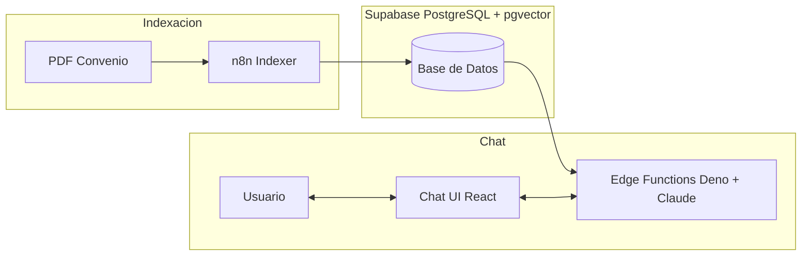
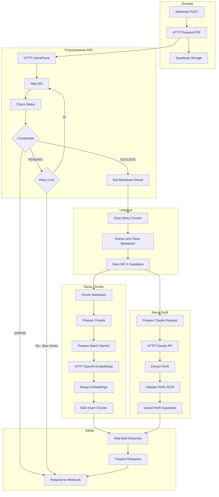
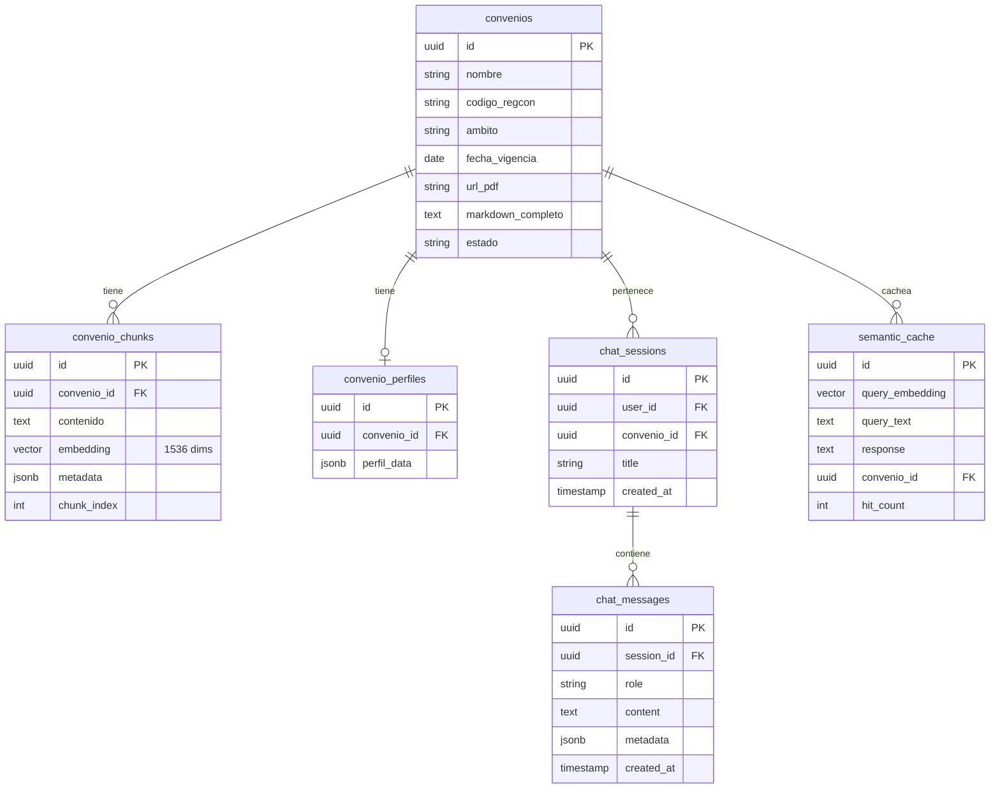
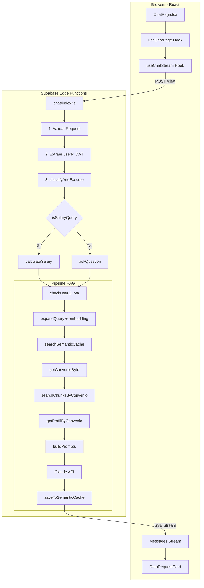
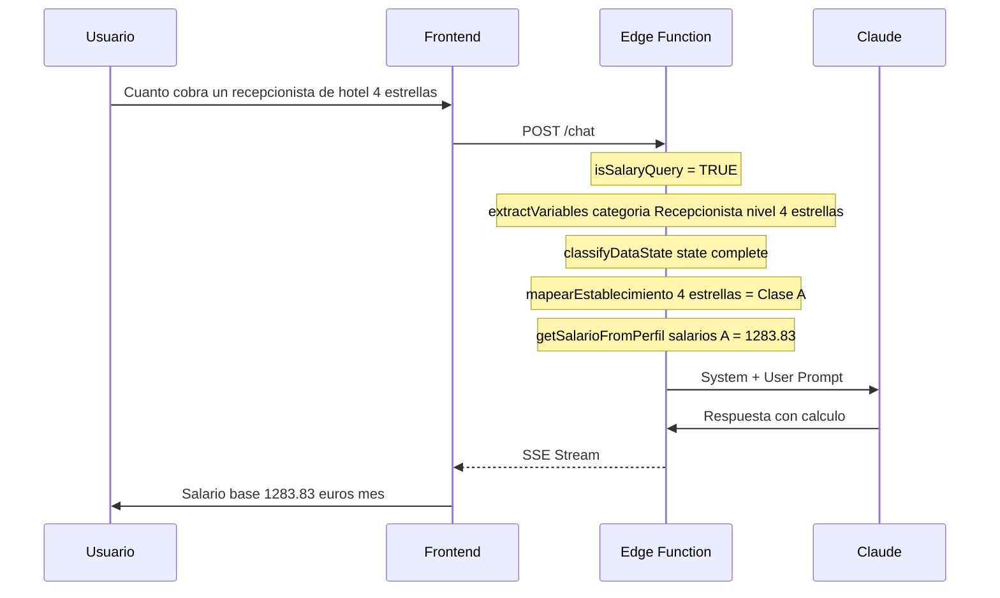
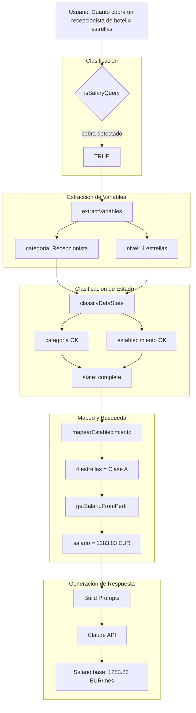
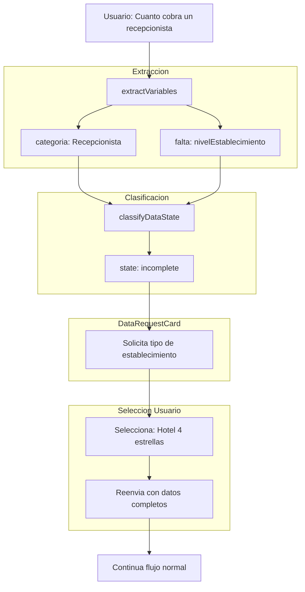
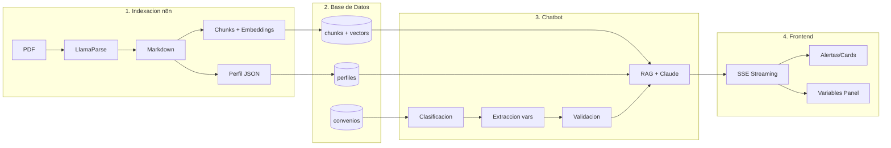

# WorkRules - Flujo Completo de la Aplicación

Este documento describe el funcionamiento completo de WorkRules, desde la indexación de convenios colectivos hasta la respuesta a preguntas de usuarios sobre salarios y condiciones laborales.

---

## Tabla de Contenidos

1. [Visión General](#visión-general)
2. [Fase 1: Indexación de Convenios (n8n)](#fase-1-indexación-de-convenios-n8n)
3. [Esquema de Base de Datos](#esquema-de-base-de-datos)
4. [Perfil del Convenio](#perfil-del-convenio)
5. [Fase 2: Flujo del Chatbot](#fase-2-flujo-del-chatbot)
6. [Ejemplo Práctico](#ejemplo-práctico)

---

## Visión General

WorkRules es una aplicación de consulta de convenios colectivos españoles que combina:

- **RAG (Retrieval-Augmented Generation)**: Para responder preguntas basándose en el texto del convenio
- **Extracción estructurada**: Para obtener información salarial precisa del perfil JSON
- **Cálculo salarial**: Para computar salarios con complementos, horas extra, nocturnidad, etc.



---

## Fase 1: Indexación de Convenios (n8n)

El workflow de n8n (`Workrules-Indexer.json`) procesa PDFs de convenios colectivos y los prepara para búsqueda semántica.

### Diagrama de Flujo del Indexer



### Descripción de Nodos de Código

#### 1. Extract and Clean Markdown (`ref_extract_and_clean_md.js`)

**Función**: Limpia y normaliza el markdown extraído por LlamaParse.

- Normaliza múltiples saltos de línea
- Convierte line endings Windows a Unix
- Obtiene metadatos del webhook (código REGCON, nombre, ámbito, fecha vigencia)

#### 2. Chunk Markdown (`ref_chunk_markdown.js`)

**Función**: Divide el markdown en fragmentos semánticos optimizados para RAG.

**Configuración**:
- `TARGET_TOKENS = 450` - Tamaño ideal de chunk
- `MAX_TOKENS = 600` - Límite máximo
- `MIN_TOKENS = 100` - Mínimo para contenido genérico
- `MIN_TOKENS_ARTICULO = 25` - Mínimo para artículos (unidades semánticas cortas)
- `OVERLAP_CHARS = 200` - Solapamiento entre chunks

**Características**:
- Detecta y preserva tablas salariales como chunks especiales
- Extrae artículos y secciones del convenio
- Clasifica chunks por tipo: `tabla_salarial`, `tabla`, `definicion`, `procedimiento`, `jornada`, `sanciones`, `normativa`
- Respeta límites de artículos (no mezcla artículos diferentes en un chunk)
- Detecta secciones de ANEXO (que no tienen artículos numerados)

#### 3. Prepare Chunks for Insert (`ref_prepare_chunks_for_insert.js`)

**Función**: Agrupa todos los chunks y prepara estadísticas.

**Output**:
```javascript
{
  chunks: [...],
  total_chunks: 150,
  stats: { avg_tokens: 420, min_tokens: 45, max_tokens: 598 }
}
```

#### 4. Prepare Batch for OpenAI (`ref_prepare_batch_for_openai.js`)

**Función**: Prepara el payload para la API de embeddings de OpenAI.

**Modelo**: `text-embedding-3-small` (1536 dimensiones)

```javascript
{
  openai_payload: {
    input: ["texto chunk 1", "texto chunk 2", ...],
    model: "text-embedding-3-small",
    encoding_format: "float"
  }
}
```

#### 5. Merge Embeddings with Chunks (`ref_merge_embeddings_with_chunks.js`)

**Función**: Combina los embeddings devueltos por OpenAI con los chunks originales.

- Valida que hay el mismo número de embeddings que chunks
- Verifica dimensión correcta (1536)
- Calcula costes estimados

#### 6. Prepare Claude Request (`ref_prepare_claude_request_v2.js`)

**Función**: Construye el prompt para que Claude extraiga el perfil estructurado del convenio.

**Modelo**: `claude-sonnet-4-20250514`

El prompt solicita a Claude:
1. Datos básicos (nombre, ámbito, vigencia)
2. Variables críticas para cálculos
3. **TODAS** las categorías profesionales con:
   - Nombre y sinónimos
   - Nivel retributivo
   - Salarios por tipo de establecimiento (A, B, C, D)
4. Mapeo de establecimientos (hotel 4 estrellas → Clase A)
5. Jornada laboral
6. Complementos salariales con excepciones
7. Horas extra
8. Período de prueba
9. Vacaciones

#### 7. Extract Perfil Claude (`ref_extract_perfil_claude.js`)

**Función**: Procesa la respuesta de Claude y extrae el texto JSON.

- Valida estructura de respuesta Anthropic
- Calcula estadísticas de uso (tokens, coste)

#### 8. Validate Perfil JSON (`ref_validate_perfil_json.js`)

**Función**: Valida y normaliza el JSON del perfil.

**Campos requeridos**: `convenio`, `ambito`, `variables_criticas`, `categorias_profesionales`, `jornada`

**Validaciones**:
- Parseo JSON robusto (con brace-matching para extraer JSON de texto mixto)
- Validación de tipos de complementos
- Normalización de decimales en salarios

#### 9. Upsert Perfil Supabase (`ref_upsert_perfil_supabase.js`)

**Función**: Guarda el perfil en la tabla `convenio_perfiles`.

- Elimina perfil anterior si existe (delete + insert = upsert)
- Retorna estadísticas de categorías y complementos guardados

---

## Esquema de Base de Datos



### Ejemplo: Estado de la BD tras indexar un convenio

```sql
-- 1. Tabla convenios
SELECT id, nombre, codigo_regcon, estado FROM convenios;

-- Resultado:
-- ┌──────────────────────────────────────┬─────────────────────────────────┬───────────────┬────────┐
-- │ id                                   │ nombre                          │ codigo_regcon │ estado │
-- ├──────────────────────────────────────┼─────────────────────────────────┼───────────────┼────────┤
-- │ a1b2c3d4-e5f6-7890-abcd-ef1234567890 │ Hostelería Comunidad de Madrid  │ 28/00001      │ activo │
-- └──────────────────────────────────────┴─────────────────────────────────┴───────────────┴────────┘

-- 2. Tabla convenio_chunks (fragmentos con embeddings)
SELECT chunk_index,
       LEFT(contenido, 100) as contenido_preview,
       metadata->>'articulo' as articulo,
       metadata->>'tipo' as tipo
FROM convenio_chunks
WHERE convenio_id = 'a1b2c3d4-e5f6-7890-abcd-ef1234567890'
ORDER BY chunk_index
LIMIT 5;

-- Resultado:
-- ┌─────────────┬─────────────────────────────────────────────────────────┬──────────┬───────────────┐
-- │ chunk_index │ contenido_preview                                       │ articulo │ tipo          │
-- ├─────────────┼─────────────────────────────────────────────────────────┼──────────┼───────────────┤
-- │ 1           │ ## Art. 1.- Ámbito territorial. El presente Convenio... │ Art. 1   │ normativa     │
-- │ 2           │ ## Art. 2.- Ámbito funcional. Afecta a todas las...     │ Art. 2   │ normativa     │
-- │ 3           │ ## Art. 18.- Vacaciones. Las personas trabajadoras...   │ Art. 18  │ jornada       │
-- │ 4           │ | Categoría | Clase A | Clase B | Clase C |...          │ NULL     │ tabla_salarial│
-- │ 5           │ ## Art. 32.- Horas extraordinarias. Las horas extra...  │ Art. 32  │ normativa     │
-- └─────────────┴─────────────────────────────────────────────────────────┴──────────┴───────────────┘

-- 3. Tabla convenio_perfiles (perfil estructurado)
SELECT
  perfil_data->>'convenio' as convenio,
  perfil_data->>'ambito' as ambito,
  jsonb_array_length(perfil_data->'categorias_profesionales') as num_categorias,
  jsonb_array_length(perfil_data->'complementos') as num_complementos
FROM convenio_perfiles
WHERE convenio_id = 'a1b2c3d4-e5f6-7890-abcd-ef1234567890';

-- Resultado:
-- ┌─────────────────────────────────┬────────────┬────────────────┬──────────────────┐
-- │ convenio                        │ ambito     │ num_categorias │ num_complementos │
-- ├─────────────────────────────────┼────────────┼────────────────┼──────────────────┤
-- │ Hostelería Comunidad de Madrid  │ provincial │ 45             │ 8                │
-- └─────────────────────────────────┴────────────┴────────────────┴──────────────────┘
```

---

## Perfil del Convenio

El archivo `database/perfil_schema.json` define la estructura JSON que Claude debe extraer de cada convenio. Este perfil es **fundamental** para los cálculos salariales.

### Estructura del Perfil

```javascript
{
  "convenio": "Hostelería de la Comunidad de Madrid",
  "ambito": "provincial",  // estatal | autonomico | provincial | empresa
  "vigencia": {
    "inicio": "2024",
    "fin": "2026",
    "prorroga_automatica": true
  },
  "codigo_convenio": "28/00001",

  // Variables que el sistema DEBE preguntar al usuario
  "variables_criticas": [
    "categoria profesional",
    "tipo de establecimiento",
    "jornada"
  ],

  // TODAS las categorías profesionales con salarios
  "categorias_profesionales": [
    {
      "nombre": "Recepcionista",
      "sinonimos": ["Recepcionista de Hotel", "Recepción"],
      "grupo": "Recepción/Conserjería",
      "nivel": "III",
      "area_funcional": "Recepción",
      "salarios": {
        "A": 1283.83,  // Hotel 5-4 estrellas
        "B": 1250.91,  // Hotel 3 estrellas
        "C": 1160.37,  // Hotel 2-1 estrellas
        "D": 1277.36   // Catering
      }
    },
    // ... más categorías
  ],

  // Mapeo de tipos comunes a clases del convenio
  "mapeo_establecimientos": {
    "hotel 5 estrellas": "A",
    "hotel 4 estrellas": "A",
    "hotel 3 estrellas": "B",
    "hotel 2 estrellas": "C",
    "restaurante 4 tenedores": "A",
    "bar": "C",
    "catering": "D"
  },

  "jornada": {
    "horas_anuales": 1802,
    "horas_semanales": 40,
    "distribucion_irregular": true,
    "articulo": "Art. 14"
  },

  "tablas_salariales": {
    "ano_referencia": "2024",
    "num_pagas": 14,
    "pagas_extra": 2
  },

  // Complementos con excepciones
  "complementos": [
    {
      "nombre": "Plus Manutención",
      "tipo": "cantidad_fija",
      "valor": 6.42,
      "base_calculo": "por_dia_trabajado",
      "excepcion": "No aplica a whisquerías ni bares americanos",
      "articulo": "Art. 15"
    },
    {
      "nombre": "Plus Nocturnidad",
      "tipo": "porcentaje",
      "valor": 25,
      "base_calculo": "salario_hora",
      "articulo": "Art. 21"
    }
    // ... más complementos
  ],

  "horas_extra": {
    "recargo_laborable_pct": 75,
    "recargo_festivo_pct": 100,
    "maximo_anual": 80,
    "articulo": "Art. 32"
  }
}
```

### Importancia del Perfil

El perfil permite:

1. **Cálculos directos**: No necesitar RAG para obtener salarios
2. **Validación**: Verificar que categorías/establecimientos existen
3. **Sugerencias**: Ofrecer opciones válidas al usuario
4. **Excepciones**: Aplicar correctamente complementos según tipo de establecimiento

---

## Fase 2: Flujo del Chatbot

### Arquitectura del Chat



### Componentes del Frontend

#### ChatPage.tsx

Layout de 3 columnas:
- **Sidebar** (izquierda): Navegación de conversaciones
- **Chat** (centro): Área de mensajes + input
- **VariablesPanel** (derecha): Variables del convenio seleccionado

#### useChatPage.ts

Hook principal que maneja:
- Estado del convenio seleccionado
- Integración con `useChatStream` (API real) o `useChat` (mocks)
- Estados especiales del protocolo:
  - `incomplete`: Datos faltantes → `DataRequestCard`
  - `invalid`: Datos inválidos → `AlertInvalidData`
  - `smi_alert`: Salario menor a SMI → `AlertSMI`
  - `conflicting`: Datos contradictorios → `AlertConflict`

### Edge Functions

#### handlers.ts - `classifyAndExecute()`

```typescript
export async function classifyAndExecute(
  request: ChatRequest,
  userId: string
): Promise<ChatUseCaseResult> {

  // 1. ¿Es solicitud de "ver rangos/opciones"?
  if (isShowRangesRequest(request.pregunta)) {
    const transformedPregunta = transformRangesRequest(request.pregunta);
    return askQuestion({ ...request, pregunta: transformedPregunta });
  }

  // 2. ¿Es cálculo salarial?
  const isSalary = isSalaryQuery(request.pregunta);

  if (isSalary) {
    return calculateSalary({
      convenioId: request.convenio_id,
      pregunta: request.pregunta,
      userId,
      variablesConocidas: request.variables,
      stream: request.stream
    });
  }

  // 3. Pregunta general
  return askQuestion({
    convenioId: request.convenio_id,
    pregunta: request.pregunta,
    userId,
    stream: request.stream
  });
}
```

#### variable-extractor.ts - `isSalaryQuery()`

Detecta si es consulta salarial buscando:
- Keywords: `salario`, `sueldo`, `nómina`, `nocturnidad`
- Patrones: `cuanto cobra`, `calcular`, `horas extra`, `plus`, `complemento`

**Excluye** preguntas informativas: `qué dice el convenio sobre...`, `cómo funciona...`

#### calculate-salary.ts - Flujo completo

```typescript
export async function calculateSalary(input): Promise<CalculateSalaryResult> {

  // 1. Verificar cuota del usuario
  const quota = await deps.checkUserQuota(input.userId);
  if (!quota.hasQuota) return { type: "quota_exceeded", ... };

  // 2. Expandir consulta con sinónimos + generar embedding
  const expandedQuery = expandQuery(input.pregunta);
  const embedding = await deps.embedQuestion(expandedQuery);

  // 3. Buscar en caché semántico (threshold 95%)
  const cacheHit = await deps.searchSemanticCache(embedding, input.convenioId);
  if (cacheHit) return { type: "cache_hit", response: cacheHit.response };

  // 4. Obtener convenio
  const convenio = await deps.getConvenioById(input.convenioId);
  if (!convenio) return { type: "not_found", ... };

  // 5. Buscar chunks + perfil en paralelo
  const [chunks, perfil] = await Promise.all([
    deps.searchChunksByConvenio(embedding, input.convenioId, 8, 0.45),
    deps.getPerfilByConvenio(input.convenioId)
  ]);

  // 6. Extraer variables del mensaje
  const extractedVars = extractVariables(input.pregunta, perfil);
  const allVariables = mergeVariables(input.variablesConocidas, extractedVars);

  // 7. Clasificar estado de datos
  const classification = classifyDataState(allVariables, perfil);

  // Estados no completos
  if (classification.state === "incomplete") {
    return {
      type: "incomplete_data",
      message: buildIncompleteMessage(classification, convenio.nombre),
      missingVariables: classification.missingVariables,
      suggestions: classification.suggestions
    };
  }

  if (classification.state === "invalid") {
    return { type: "invalid_data", ... };
  }

  if (classification.state === "conflicting") {
    return { type: "invalid_data", conflictingVariables: ... };
  }

  // 8. Estado COMPLETO → Construir prompts y llamar a Claude
  const systemPrompt = buildSystemPrompt("calculate-salary", promptContext);
  const userMessage = buildUserMessage(chunks, perfil, input.pregunta, allVariables);

  const response = await deps.createChatResponse({ systemPrompt, userMessage });

  // 9. Guardar en caché
  await deps.saveToSemanticCache(embedding, input.pregunta, response, input.convenioId);

  return { type: "salary_calculated", response, desglose: {...} };
}
```

#### data-classifier.ts - Validación de datos

Verifica:
- **Límites legales**: Horas extra ≤ 80/año, jornada ≤ 40h/semana
- **Conflictos**: Jornada "completa" pero 20h semanales
- **Variables faltantes**: Según `variables_criticas` del perfil

---

## Ejemplo Práctico

### Pregunta: "¿Cuánto cobra un recepcionista de hotel de 4 estrellas?"



#### Paso 1: Frontend envía la pregunta

```javascript
// useChatPage.ts
await realSendMessage("¿Cuánto cobra un recepcionista de hotel de 4 estrellas?");
```

```http
POST /functions/v1/chat
Authorization: Bearer <jwt>
Content-Type: application/json

{
  "convenio_id": "a1b2c3d4-...",
  "pregunta": "¿Cuánto cobra un recepcionista de hotel de 4 estrellas?",
  "stream": true
}
```

#### Paso 2: Clasificación de la consulta

```typescript
// handlers.ts
isSalaryQuery("¿Cuánto cobra un recepcionista...") // → true (contiene "cobra")
// → Ejecuta calculateSalary()
```

#### Paso 3: Extracción de variables

```typescript
// variable-extractor.ts
extractVariables("recepcionista de hotel de 4 estrellas", perfil)
// → {
//     categoria: "Recepcionista",        // Match en perfil.categorias_profesionales
//     nivelEstablecimiento: "4 estrellas" // Extraído con regex
//   }
```

#### Paso 4: Clasificación de estado

```typescript
// data-classifier.ts
classifyDataState(variables, perfil)
// → {
//     state: "complete",  // Tenemos categoría + nivel establecimiento
//     extractedVariables: { categoria: "Recepcionista", nivelEstablecimiento: "4 estrellas" }
//   }
```

**Nota**: Si faltara la categoría o el tipo de establecimiento, el sistema devolvería:

```javascript
{
  type: "incomplete_data",
  message: "Para calcular el salario según el Convenio de Hostelería de Madrid, necesito saber tu **categoría profesional**:\n\n- Recepcionista\n- Camarero/a\n- Ayudante de cocina\n...",
  missingVariables: ["categoria profesional"],
  suggestions: { "categoria profesional": ["Recepcionista", "Camarero/a", ...] }
}
```

#### Paso 5: Búsqueda de salario en perfil

```typescript
// prompts.ts
const salarioResult = getSalarioFromPerfil(perfil, "Recepcionista", "hotel 4 estrellas");
// → {
//     salario: 1283.83,
//     nivel: "III",
//     clase: "A",  // hotel 4 estrellas → Clase A
//     categoria: { nombre: "Recepcionista", ... }
//   }
```

**Mapeo de establecimiento**:
```javascript
perfil.mapeo_establecimientos["hotel 4 estrellas"] // → "A"
perfil.categorias_profesionales.find(c => c.nombre === "Recepcionista").salarios["A"] // → 1283.83
```

#### Paso 6: Construcción de prompt para Claude

```typescript
// System prompt (calculate-salary template)
const systemPrompt = `Eres un asistente experto en cálculos laborales...
Convenio: Hostelería de Madrid
Tablas: 2024
SMI: 1.221€/mes
Jornada anual: 1.802 horas

REGLA: Muestra SIEMPRE el paso a paso del cálculo...`;

// User message con contexto
const userMessage = `
--- CONTEXTO DEL CONVENIO ---
[1] (Art. 32) - Horas extraordinarias
Las horas extra tendrán un recargo del 75% sobre días laborables...

--- PERFIL DEL CONVENIO ---
Variables criticas: categoria profesional, tipo de establecimiento
Categorias: Recepcionista (1283.83 euros/mes clase A), Camarero...
Jornada anual: 1802 horas
Complementos: Plus Manutención (6.42 euros/día)...

--- DATOS DEL USUARIO ---
- categoria: Recepcionista
- nivelEstablecimiento: 4 estrellas

--- PREGUNTA ACTUAL ---
¿Cuánto cobra un recepcionista de hotel de 4 estrellas?
`;
```

#### Paso 7: Respuesta de Claude

```markdown
**Cálculo para Recepcionista - Hotel 4 estrellas (Clase A):**

**Paso 1:** Salario base mensual
- Según la tabla salarial (Clase A, Nivel III): **1.283,83 €/mes**

**Paso 2:** Cálculo anual
- Salario mensual × 14 pagas: 1.283,83 × 14 = **17.973,62 €/año**

| Concepto | Importe Mensual | Importe Anual |
|----------|-----------------|---------------|
| Salario Base | 1.283,83 € | 17.973,62 € |
| **TOTAL BRUTO** | **1.283,83 €** | **17.973,62 €** |

**Complementos adicionales que podrían aplicar:**
- Plus Manutención: 6,42 €/día trabajado (Art. 15)
- Plus Nocturnidad: +25% por hora nocturna (Art. 21)

**Referencia:** Tabla salarial Anexo I (2024), Nivel III, Clase A

> **Nota:** Este cálculo es una aproximación bruta. Para el salario neto, consulte con su asesoría fiscal.
```

#### Paso 8: Respuesta al frontend

```javascript
// Stream SSE
data: {"type": "text", "content": "**Cálculo para Recepcionista..."}
data: {"type": "text", "content": "- Según la tabla salarial..."}
...
data: {"type": "citation", "articulo": "Art. 15", "seccion": "Complementos"}
data: {"type": "done", "metadata": {"response_length": 842}}
```

### Flujo del ejemplo completo



### Flujo alternativo: Datos incompletos

Si el usuario pregunta solo "¿Cuánto cobra un recepcionista?" (sin especificar hotel):



---

## Resumen

WorkRules implementa un sistema completo de consulta de convenios colectivos:



1. **Indexación** (n8n):
   - PDF → LlamaParse → Markdown
   - Markdown → Chunks semánticos → Embeddings (OpenAI)
   - Markdown → Claude → Perfil JSON estructurado

2. **Base de datos** (Supabase/PostgreSQL):
   - `convenios`: Datos principales
   - `convenio_chunks`: Fragmentos con embeddings (pgvector)
   - `convenio_perfiles`: Perfil estructurado para cálculos

3. **Chatbot** (Edge Functions):
   - Clasificación: ¿Pregunta general o cálculo salarial?
   - Extracción de variables del mensaje
   - Validación de datos (completos, válidos, sin conflictos)
   - RAG: Búsqueda vectorial + Perfil → Prompt → Claude
   - Respuesta con citaciones y desglose

4. **Frontend** (React):
   - Chat con streaming SSE
   - Estados especiales (DataRequestCard, Alertas)
   - Panel de variables del convenio
