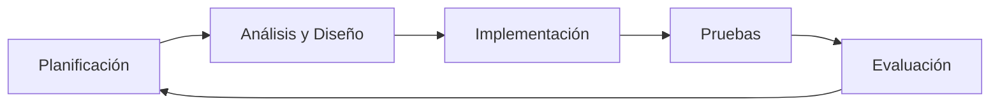
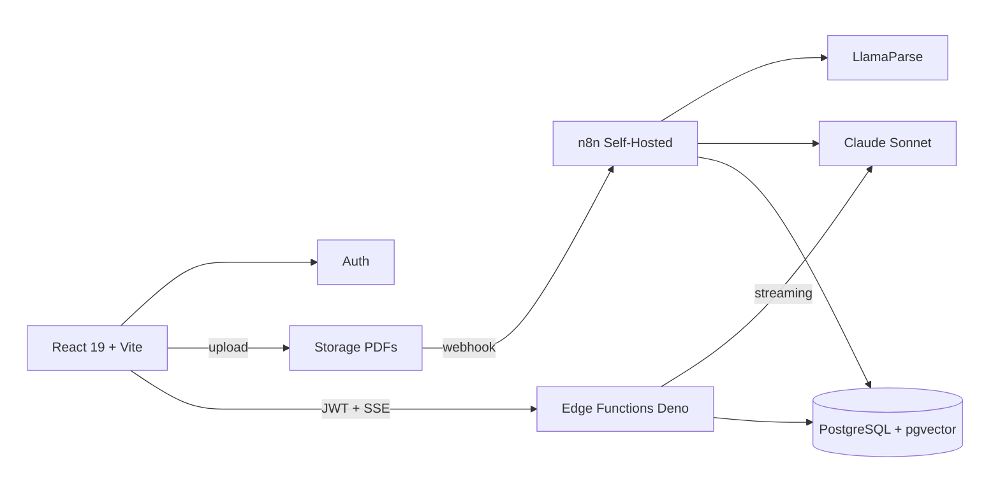
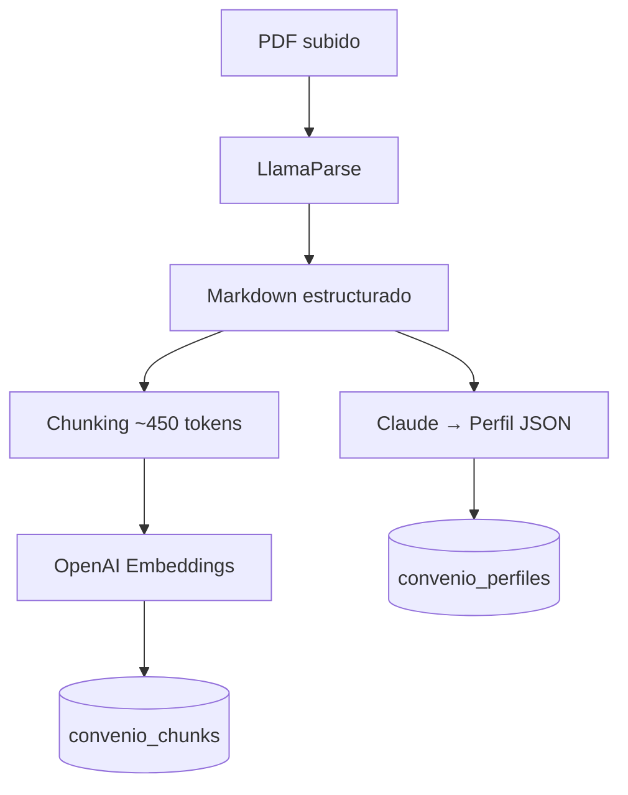
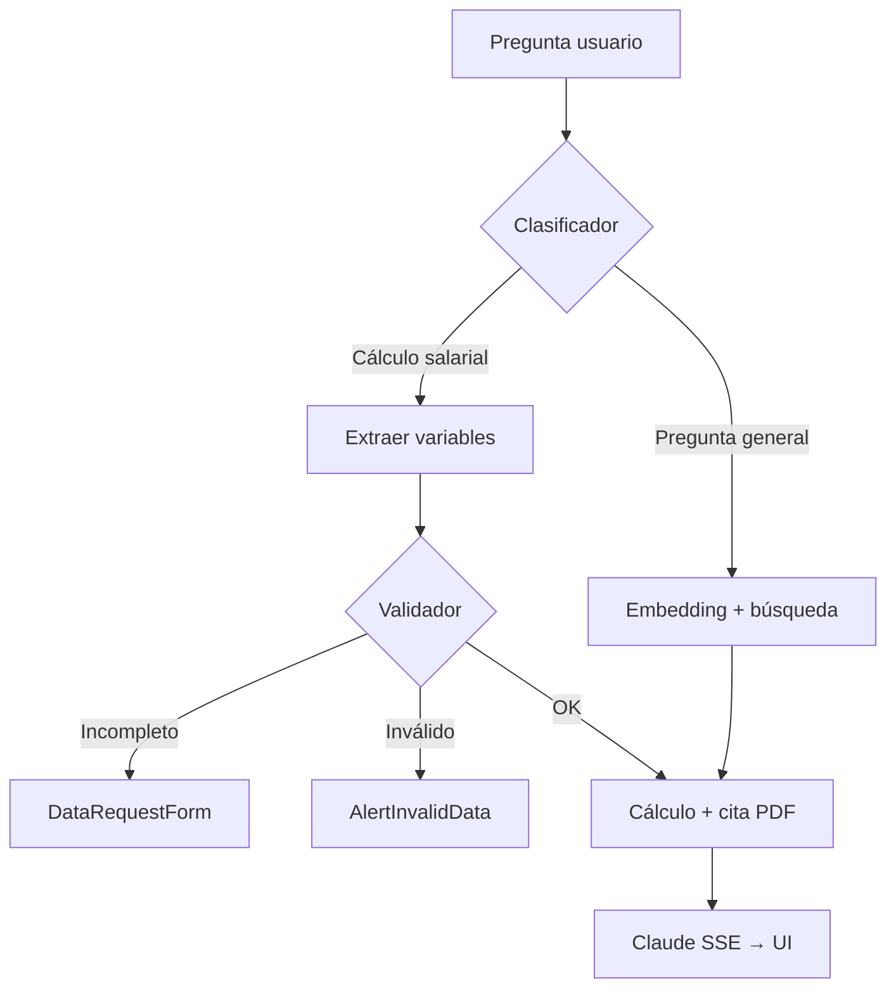

# Diseño · Ciclo de vida

<div class="grid grid-cols-5 gap-2 mt-6 text-xs mb10">
<div class="border border-primary/40 rounded p-3 bg-primary/5">
<div class="font-bold text-primary mb-1">Fase 1 · Ingesta</div>
Pipeline ETL en n8n: PDF oficial → markdown → chunks vectorizados + Perfil JSON estructurado.
</div>
<div class="border border-primary/40 rounded p-3 bg-primary/5">
<div class="font-bold text-primary mb-1">Fase 2 · Razonamiento</div>
Retriever RAG sobre Supabase + Edge Functions: clasificación, extracción de variables y validación.
</div>
<div class="border border-primary/40 rounded p-3 bg-primary/5">
<div class="font-bold text-primary mb-1">Fase 3 · Experiencia</div>
Chat con streaming SSE, UI dinámica por protocolo y citas al PDF oficial.
</div>
<div class="border border-white/20 rounded p-3 opacity-50">
<div class="font-bold mb-1">Fase 4 · Monetización</div>
Planes premium y pagos. La subida privada de convenios ya está disponible en el MVP para usuarios habilitados manualmente.
</div>
<div class="border border-white/20 rounded p-3 opacity-50">
<div class="font-bold mb-1">Fase 5 · Escalado</div>
Watchdog del BOE: detección y reindexación automática de convenios nuevos o actualizados.
</div>
</div>



<div class="text-sm opacity-80 mt-2">
Modelo <strong>iterativo-incremental</strong>: cada fase entrega valor tangible y permite recoger feedback antes del siguiente incremento. Las fases 1-3 + entrega TFM componen el MVP en producción. Fase 4-5 son post-TFM.
</div>

<!--
Elegí modelo iterativo-incremental por dos razones. Primero porque soy un único desarrollador y necesito entregar valor tangible cada pocas semanas, no quedarme atascado en planificación. Segundo porque trabajo con un stakeholder real (BDL Eurofilms) y quiero su feedback temprano.
Las fases del proyecto están alineadas con el dominio: Back es el pipeline de datos (vectorización), Brain es la inteligencia (RAG + cálculo), Face es la experiencia (chat y UI). Fase 4 (Business: auth, pagos) y Fase 5 (Scale: watchdog del BOE para detectar convenios actualizados automáticamente) son posteriores al TFM.
El diagrama de la derecha es el ciclo clásico: planificación → análisis → implementación → pruebas → evaluación, repetido. Cada vuelta es una iteración dentro de la fase actual.
-->

---

# Diseño · Arquitectura

<div class="text-sm     mb-2">
Monolito modular + serverless híbrido. Dos flujos separados por naturaleza temporal.
</div>



<div class="grid grid-cols-2 gap-4 mt-4 text-sm">
<div class="border-l-2 border-primary pl-3">
<strong>Síncrono · Chat</strong><br />
Request-Response, latencia &lt; 3s, Edge Functions Deno.
</div>
<div class="border-l-2 border-primary pl-3">
<strong>Asíncrono · Ingesta</strong><br />
Event-driven, latencia 30s-5min, n8n + LlamaParse + Claude.
</div>
</div>

<!--
La decisión arquitectónica clave es separar dos flujos por su naturaleza temporal. El chat necesita respuesta sub-segundo: va por Edge Functions de Supabase. La ingesta de un PDF puede tardar minutos: va por n8n, asíncrono, event-driven.
Esto es un monolito modular en el sentido de que todo el dominio vive en un solo repositorio, pero el despliegue es distribuido: frontend en Vercel, edge functions en Supabase, n8n en Hostinger. Cada componente escala por su cuenta y los costes en reposo son cero.
La base de datos es PostgreSQL con pgvector. Una sola DB cubre todo: datos relacionales, perfiles JSON (en JSONB), embeddings (en pgvector), cache semántico y auth. Esto simplifica enormemente las operaciones.
-->

---

# Diseño · Flujo de indexación (asíncrono)

<div class="text-sm opacity-80 mb-2">
Pipeline ETL en n8n: PDF oficial → markdown estructurado → dos ramas paralelas (chunks vectorizados + Perfil JSON).
</div>

<div class="overflow-hidden flex justify-center">



</div>

<div class="mt-4 grid grid-cols-2 gap-4 text-xs">
<div class="border-l-2 border-primary pl-3">
<strong>Rama Chunks:</strong> búsqueda semántica RAG. Embedding por chunk (1536d) en pgvector con HNSW.
</div>
<div class="border-l-2 border-primary pl-3">
<strong>Rama Perfil JSON:</strong> Claude extrae la estructura (categorías, salarios, complementos) para cálculos deterministas.
</div>
</div>

<!--
Primer flujo: indexación. Es asíncrono porque procesar un PDF puede tardar minutos. Por eso vive en n8n, no en Edge Functions.
Cinco pasos. Uno: llega el PDF (subido por un usuario premium o detectado por el Watchdog en el futuro). Dos: LlamaParse lo convierte en markdown estructurado respetando tablas y jerarquía. Tres: bifurcación en dos ramas paralelas — esta es la decisión clave del pipeline.
Rama de arriba — chunks: chunking de ~450 tokens, embeddings con OpenAI text-embedding-3-small (1536 dimensiones), bulk insert en convenio_chunks. Esto sirve para búsqueda semántica clásica RAG.
Rama de abajo — Perfil JSON: el markdown completo se pasa a Claude Sonnet con un prompt que pide extraer la estructura del convenio (categorías profesionales, tablas salariales, complementos). Se valida contra un schema y se guarda en convenio_perfiles.
Dos ramas porque cubren dos necesidades distintas: chunks para "qué dice el convenio sobre X", perfil JSON para "calcula el salario de Y con estos datos".
-->

---

# Diseño · Flujo del chat (síncrono)

<div class="text-sm opacity-80 mb-2">
Edge Function <code>/chat</code>: clasificación → RAG o extracción → validación → respuesta streaming con cita al PDF.
</div>

<div class="overflow-hidden flex justify-center">



</div>

<div class="mt-3 text-xs opacity-80">
La validación es lo que distingue a WorkRules de un chat genérico: <strong>no inventa, pide lo que falta</strong>. Cada estado tiene un componente UI específico (guardrails visuales).
</div>

<!--
Segundo flujo: chat. Es síncrono, latencia objetivo sub-3 segundos. Vive en Edge Functions de Supabase.
La pregunta entra al clasificador, un prompt corto a Claude que decide entre dos ramas: "pregunta general" o "cálculo salarial".
Rama pregunta general: hacemos embedding de la query con OpenAI y buscamos en pgvector los top-k chunks más similares. Esos chunks van a Claude como contexto para responder con cita.
Rama cálculo salarial: extraemos las variables relevantes del Perfil JSON del convenio (categoría, antigüedad, horas extra, complementos). Pasan al validador.
El validador es el corazón del sistema. Clasifica el estado de los datos en cuatro categorías: completos, incompletos (falta info), inválidos (un valor fuera del rango legal — p.ej. más horas extra de las permitidas por el Estatuto), conflictivos (el usuario ha dado dos valores contradictorios).
Según el estado, la UI renderiza un componente distinto: DataRequestForm si faltan datos, AlertInvalidData si son ilegales. Esto son los guardrails: la IA no improvisa, pide lo que falta.
Si todo está OK, cálculo determinista en código + respuesta de Claude streaming con cita al artículo del convenio. Ambas ramas (pregunta general y cálculo) terminan en streaming SSE al cliente.
-->

---

# Diseño · Clean Architecture

<div class="grid grid-cols-2 gap-6 mt-2 text-sm overflow-hidden">
<div class="min-w-0">

**Frontend (`src/`)**

```
core/             # Domain (negocio)
├─ convenio/      # types, entities
├─ chat/          # types, entities
└─ auth/          # types

application/      # Casos de uso
├─ convenio/      # repository, service
├─ chat/          # repository, service
└─ auth/

infrastructure/   # Adapters externos
└─ supabase.ts    # Client + adapters

ui/               # Presentación
├─ components/    # shadcn + workrules
└─ hooks/         # useChat, useConvenio
```

<div class="text-xs opacity-70 mt-2">
Dependencias hacia adentro: <code>ui → application → core ← infrastructure</code>.
</div>

</div>
<div class="min-w-0">

**Backend (`supabase/functions/`)**

```
_shared/
├─ core/          # Dominio + Aplicación
│  ├─ chat/       # ask, calculate-salary
│  ├─ convenio/   # types
│  └─ salary/    # validators, classifier
└─ lib/           # Infraestructura
   ├─ supabase.ts
   ├─ anthropic.ts
   └─ openai.ts

chat/index.ts          # POST /chat
upload-convenio/       # privado
```

<div class="text-xs opacity-70 mt-2">
Clean Architecture <strong>pragmática</strong>: por feature (no por capa) en backend, sin clases ni contenedor DI. Edge Functions son efímeras: patrón funcional.
</div>

</div>
</div>

<!--
Aplicamos Clean Architecture pragmática en ambos lados.
Frontend: separación en tres carpetas. core/ contiene la lógica de negocio agnóstica a React — types, repositories, services. Podría reutilizarse en una app móvil o CLI. ui/ es todo lo visual, con shadcn como base y nuestros propios componentes organizados con Atomic Design (atoms, molecules, organisms, pages). lib/ es infraestructura compartida, principalmente el cliente Supabase. Las dependencias apuntan hacia adentro: ui depende de core, core no sabe nada de ui ni de Supabase, lib implementa los puertos que core define.
Backend: misma filosofía pero organizada por feature en lugar de por capa. core/chat/ contiene tanto los tipos como los use cases (ask-question, calculate-salary) como los prompts. core/salary/ tiene los validadores. lib/ son los clientes externos: Supabase, Anthropic, OpenAI. Decisión consciente: sin clases, sin contenedor DI. Las Edge Functions son efímeras (cold start, sin estado entre invocaciones), así que el patrón funcional es más idiomático.
La ventaja práctica: para testear los validadores de salario no necesito levantar Supabase ni gastar tokens. Los tests de core/ corren en milisegundos.
-->
