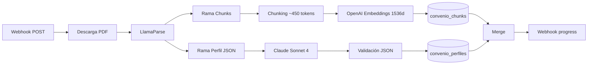

# Implementación · Stack

<div class="grid grid-cols-3 gap-4 mt-4 text-sm">
<div>

**Frontend**
- React 19 + Vite 7
- Tailwind CSS 4
- Vercel AI SDK (`useChat`)
- Zustand + TanStack Query
- shadcn/ui · Radix
- Storybook 10

</div>
<div>

**Backend / Datos**
- Supabase (BaaS)
- PostgreSQL + pgvector
- Edge Functions (Deno)
- Storage (PDFs)
- RLS + Auth JWT

</div>
<div>

**IA / Orquestación**
- Claude Sonnet 4 (razonamiento + extracción)
- OpenAI `text-embedding-3-small`
- LlamaParse (PDF → MD)
- n8n self-hosted (Hostinger)
- Sentry · Plausible

</div>
</div>

<div class="mt-6 p-3 border-l-2 border-primary text-xs opacity-80">
<strong>Filosofía de stack:</strong> serverless donde tenga sentido (coste cero en reposo), self-hosted donde el coste fijo se justifique (n8n), un proveedor para razonamiento (Claude) y otro para embeddings (OpenAI) — separación que permite cambiar uno sin tocar el otro.
</div>

<!--
Stack dividido en tres bloques. Frontend: React 19 con Vite 7 — versiones recientes pero estables. Tailwind 4 ya en producción. Para el chat usamos el Vercel AI SDK que tiene un hook useChat que gestiona el streaming SSE automáticamente. Estado: Zustand para cliente, TanStack Query para servidor.
Backend: todo en Supabase. Una BaaS cubre DB, auth, storage y compute (Edge Functions). PostgreSQL nos da datos relacionales + JSONB para los perfiles + pgvector para embeddings, todo en una sola DB.
IA: dos proveedores distintos a propósito. Claude para razonamiento porque es el que mejor maneja cláusulas condicionales largas. OpenAI solo para embeddings porque su modelo small es muy eficiente en coste y suficiente para nuestra escala. Si mañana sale algo mejor, cambiar uno no afecta al otro. n8n self-hosted en Hostinger porque para orquestación de workflows ETL es mucho más cómodo que escribir code para cada paso.
-->

---

# Implementación · RAG e indexación (n8n)

<div class="grid grid-cols-5 gap-2 text-xs mt-4 mb10">
<div class="border border-primary/30 rounded p-2 text-center">
<div class="font-bold text-primary">1. PDF</div>
<div class="opacity-70 mt-1">Webhook POST</div>
</div>
<div class="border border-primary/30 rounded p-2 text-center">
<div class="font-bold text-primary">2. LlamaParse</div>
<div class="opacity-70 mt-1">PDF → Markdown</div>
</div>
<div class="border border-primary/30 rounded p-2 text-center">
<div class="font-bold text-primary">3. Bifurcación</div>
<div class="opacity-70 mt-1">2 ramas paralelas</div>
</div>
<div class="border border-primary/30 rounded p-2 text-center">
<div class="font-bold text-primary">4. Persistencia</div>
<div class="opacity-70 mt-1">Bulk insert</div>
</div>
<div class="border border-primary/30 rounded p-2 text-center">
<div class="font-bold text-primary">5. Merge</div>
<div class="opacity-70 mt-1">Notificación SSE</div>
</div>
</div>



<div class="mt-10 grid grid-cols-2 gap-4 text-xs">
<div class="border-l-2 border-primary pl-3">
<strong>Rama Chunks:</strong> búsqueda semántica clásica. Embedding por chunk, almacenado en pgvector con índice HNSW.
</div>
<div class="border-l-2 border-primary pl-3">
<strong>Rama Perfil JSON:</strong> Claude extrae la estructura del convenio (categorías, salarios, complementos) para cálculos deterministas.
</div>
</div>

<!--
Pipeline de ingesta. Cuando llega un PDF, n8n lo procesa en cinco pasos.
Uno: webhook POST con el ID del convenio y la URL del PDF en Storage.
Dos: LlamaParse lo convierte en markdown estructurado, respetando tablas y jerarquía.
Tres: bifurcación en dos ramas paralelas. Esta es la decisión clave del pipeline.
Rama chunks: hacemos chunking de unos 450 tokens por chunk, generamos embeddings con OpenAI text-embedding-3-small (1536 dimensiones), y los insertamos en bulk en convenio_chunks. Esto sirve para búsqueda semántica clásica RAG.
Rama Perfil JSON: le pasamos el markdown completo a Claude Sonnet con un prompt que le pide extraer la estructura del convenio en JSON — categorías profesionales, tablas salariales, complementos. Lo validamos contra un schema y lo guardamos en convenio_perfiles.
Cuatro: merge de las dos ramas.
Cinco: notificación al frontend vía webhook que llega como SSE al usuario que subió el PDF.
Dos ramas porque cubren dos necesidades distintas: chunks para "qué dice el convenio sobre X", perfil JSON para "calcula el salario de Y".
-->

---

# Implementación · Retriever y Claude

<div class="grid grid-cols-2 gap-6 mt-4 text-sm">
<div>

**Edge Function `/chat`**

```typescript
1. Auth JWT → extractUserIdFromRequest
2. Clasificador:
   "pregunta general" | "cálculo salarial"
3a. RAG: embedding(query) → pgvector → top-k chunks
3b. Cálculo: extraer variables del Perfil JSON
4. Validador:
   completos | incompletos | inválidos | conflictivos
5. Prompt builder + Claude SSE → cliente
```

</div>
<div>

**Protocolo de respuesta**

| Estado | UI |
|---|---|
| Completo | Respuesta + cita PDF |
| Incompleto | `DataRequestForm` |
| Inválido | `AlertInvalidData` |
| Conflictivo | `AlertConflict` |
| < SMI | `AlertSMI` |
| Sin datos | `ConvenioNotFound` |

<div class="text-xs opacity-70 mt-3">
Cada estado tiene un componente React específico. La IA no improvisa: si faltan datos, devuelve un formulario; si hay un conflicto, lo expone.
</div>

</div>
</div>

<!--
La Edge Function /chat es el corazón del backend. Cinco pasos.
Uno: autenticación. Extraemos el user ID del JWT de Supabase. Si no es válido, 401.
Dos: clasificador. Un prompt corto a Claude que devuelve "pregunta general" o "cálculo salarial". Esto decide la rama.
Tres-a si es pregunta general: hacemos embedding de la query con OpenAI, buscamos en pgvector los top-k chunks más similares al embedding, y pasamos esos chunks a Claude como contexto.
Tres-b si es cálculo salarial: usamos el Perfil JSON del convenio para identificar qué variables nos faltan (categoría, antigüedad, horas extra, etc.).
Cuatro: validador. Clasifica el estado de los datos: completos, incompletos (falta info), inválidos (un valor fuera del rango legal, p.ej. más horas extra de las permitidas), conflictivos (el usuario ha dado dos valores contradictorios).
Cinco: prompt builder construye el system prompt según el estado y la respuesta llega como SSE streaming al cliente.
La tabla de la derecha es lo que llamamos "guardrails UI". Cada estado tiene un componente React específico. Esto es lo que evita las alucinaciones: si la IA no tiene datos suficientes, no inventa — devuelve un formulario para que el usuario rellene. Si los datos son ilegales (más horas extra que el máximo del Estatuto de los Trabajadores), salta una alerta roja.
-->

---

# Implementación · Frontend

<div class="grid grid-cols-2 gap-6 text-sm">
<div>

**Stack y patrones**

- **React 19** + **Vite 7** + **Tailwind CSS 4**
- **Vercel AI SDK** (`useChat` → streaming SSE).
- **Zustand** — estado de UI (sidebar, modal, tema).
- **TanStack Query** — server state + caché.
- **shadcn/ui** sobre Radix — base accesible.
- **Atomic Design** para componentes propios.

</div>
<div>

**UI dinámica por protocolo**

- `ChatWindow` — mensajes streaming.
- `ConvenioSelector` — selector de convenio.
- `VariablesPanel` — variables del cálculo en curso.
- `DataRequestForm` — formulario generado dinámicamente cuando faltan datos.
- `AlertInvalidData` / `AlertConflict` / `AlertSMI` — guardrails visuales.
- `CitationCard` — link directo al PDF oficial (`#page=N`).

</div>
</div>

<div class="mt-6 p-3 border-l-2 border-primary text-xs">
<strong>Design System:</strong> tokens en <code>tokens.json</code> → Style Dictionary → variables CSS. Storybook documenta colores, tipografías y componentes propios.
</div>

<!--
Frontend en React 19 con Vite 7. Tailwind 4 para estilos. Para el chat usamos el Vercel AI SDK — su hook useChat gestiona el streaming SSE, los mensajes parciales, los errores. No tengo que implementar yo el parsing de tokens.
Estado dividido: Zustand para client state (qué sidebar está abierto, qué tema), TanStack Query para server state (lista de convenios, historial). Esto evita el típico problema de mezclar todo en un solo store y tener que invalidar manualmente.
Componentes: base sobre shadcn/ui que a su vez es sobre Radix Primitives. Encima, nuestros propios componentes en Atomic Design: atoms (Logo, Badge), molecules (ConvenioCard, ChatBubble), organisms (ChatWindow, ConvenioSelector), pages.
La parte interesante es que la UI es dinámica según el protocolo del backend. Si el backend dice "datos incompletos", el frontend renderiza un DataRequestForm con selects y chips construidos a partir del Perfil JSON del convenio. Esto significa que el formulario se adapta a cada convenio sin código específico.
Design System: tokens centralizados en tokens.json, procesados con Style Dictionary y exportados como variables CSS para Tailwind y los componentes. Storybook documenta todo.
-->

---

# Implementación · Base de datos

<div class="grid grid-cols-2 gap-6 mt-4 text-sm">
<div>

**Una sola DB, múltiples funciones**

| Tabla | Tipo | Uso |
|---|---|---|
| `convenios` | Relacional | Metadatos del convenio |
| `convenio_chunks` | pgvector 1536d | RAG semántico |
| `convenio_perfiles` | JSONB | Estructura para cálculos |
| `chat_sessions` | Relacional | Historial conversaciones |
| `semantic_cache` | pgvector | Respuestas cacheadas |
| `auth.*` | Supabase | Usuarios, sesiones |

</div>
<div>

**Búsqueda y cache**

```sql
-- Top-k chunks similares
search_similar_chunks(
  embedding, threshold, count
)

-- Chunks de un convenio concreto
search_chunks_by_convenio(
  embedding, convenio_id, threshold, count
)

-- Cache semántico por similitud
search_semantic_cache(
  embedding, threshold, convenio_id
)
```

<div class="text-xs opacity-70 mt-2">
RLS activa en tablas con datos de usuario. Cache reduce coste de API y latencia.
</div>

</div>
</div>

<!--
Una decisión arquitectónica clave: una sola base de datos para todo. PostgreSQL con extensiones cubre los seis tipos de datos que necesitamos.
Datos relacionales: convenios, sesiones de chat, usuarios.
Vectores: pgvector para los embeddings de chunks. Índice HNSW para búsqueda rápida.
JSON estructurado: JSONB para los perfiles de convenio. Indexable, consultable con operadores ->, ->>.
Auth: Supabase usa tablas auth.* — JWT y sesiones.
Archivos: Supabase Storage, bucket convenios-pdf.
Cache semántico: una pequeña tabla con embeddings de queries previas y sus respuestas. Antes de gastar tokens, buscamos si una query similar ya fue respondida con threshold alto (0.95+). Esto ahorra mucho coste en preguntas repetidas.
Las tres funciones SQL de la derecha son las que usa el retriever. La del medio (filtrar por convenio_id) es importante porque sin ella mezclaríamos chunks de convenios distintos en la misma respuesta. RLS activa garantiza que un usuario solo ve sus propios PDFs privados.
Plan de escalado: pgvector aguanta hasta 500K vectores con HNSW. Por encima evaluamos Qdrant. No es problema a corto plazo.
-->

---

# Implementación · Backend Supabase

<div class="grid grid-cols-2 gap-6 mt-4 text-sm">
<div>

**Edge Functions (Deno)**

| Endpoint | Auth | Función |
|---|---|---|
| `POST /chat` | JWT | RAG + chat streaming |
| `POST /upload-convenio` | JWT | Subida privada premium |
| `POST /webhook-progress` | Secret | Notif. progreso ingesta |

**Auth**

- Supabase Auth (email + magic link).
- JWT en `Authorization: Bearer`.
- Verificación en cada Edge Function vía `extractUserIdFromRequest`.

</div>
<div>

**Row Level Security**

```sql
-- Solo el dueño ve sus chats
CREATE POLICY "Users see own chats"
ON chat_sessions FOR SELECT
USING (auth.uid() = user_id);

-- PDFs privados solo del dueño
CREATE POLICY "Users see own pdfs"
ON storage.objects FOR SELECT
USING (
  bucket_id = 'convenios-pdf'
  AND auth.uid()::text = owner
);
```

<div class="text-xs opacity-70 mt-2">
RLS activa en producción. Sin policy, ningún rol anónimo accede a datos privados.
</div>

</div>
</div>

<!--
Backend en Supabase Edge Functions. Tres endpoints actuales.
/chat: el principal, lo hemos explicado. JWT obligatorio.
/upload-convenio: para usuarios premium que quieren subir un convenio propio que no está en la base de datos pública. JWT + bucket privado.
/webhook-progress: lo llama n8n cuando avanza la ingesta para que el frontend actualice la barra de progreso. Autenticación por header X-Webhook-Secret porque n8n no tiene JWT del usuario.
Auth con Supabase: email + magic link. El JWT viaja en Authorization: Bearer en cada llamada. Cada Edge Function verifica antes de hacer cualquier cosa.
RLS — Row Level Security — es lo que protege los datos a nivel base de datos. Aunque alguien encontrase una forma de llamar a la DB saltándose la Edge Function, las policies impiden ver datos de otro usuario. Las dos policies de ejemplo: una para chats, otra para PDFs en Storage. Si no hay policy, el rol anónimo no ve nada.
-->

---

# Implementación · Contenedores y DevOps

<div class="grid grid-cols-2 gap-6 mt-4 text-sm">
<div>

**Despliegue**

| Componente | Hosting | Build |
|---|---|---|
| Frontend | Vercel | `vite build` |
| Storybook | Vercel (subpath) | `storybook build` |
| Edge Functions | Supabase Cloud | `supabase functions deploy` |
| n8n + workflows | Hostinger VPS + Docker | `docker compose up -d` |
| Dominio | `workrules.eu` (Hostinger DNS) | — |

</div>
<div>

**CI/CD · GitHub Actions**

- **Pull request:** lint, typecheck, unit + Playwright.
- **Merge a `main`:** deploy preview → Vercel → producción.
- **Snyk + Dependabot:** análisis de dependencias automatizado.
- **Source maps a Sentry** en cada deploy.

```yaml
# .github/workflows/playwright.yml
- name: Cache browsers
  uses: actions/cache@v4
  with:
    path: ~/.cache/ms-playwright
```

</div>
</div>

<!--
Despliegue distribuido entre tres proveedores.
Frontend en Vercel con Vite build, incluye Storybook bajo subpath. Edge Functions en Supabase Cloud, deploy desde CLI. n8n en un VPS de Hostinger con Docker Compose — porque queremos persistir credenciales y workflows entre deploys, y self-hosted en VPS sale más barato que Cloud para nuestra escala. El dominio workrules.eu lo gestiona Hostinger DNS apuntando a Vercel.
CI/CD en GitHub Actions. Tres pipelines.
Uno: en cada pull request corremos lint, typecheck, tests unitarios (Vitest), tests E2E (Playwright). Si algo falla, no se mergea.
Dos: en merge a main, deploy preview de Vercel para validar visualmente, luego producción.
Tres: Snyk y Dependabot analizan dependencias cada semana y abren PRs con actualizaciones de seguridad. Esto lo refactorizamos en TFM.7.
Source maps de Sentry se suben en cada deploy para que los errores en producción se vean con el código original, no el minificado.
-->
