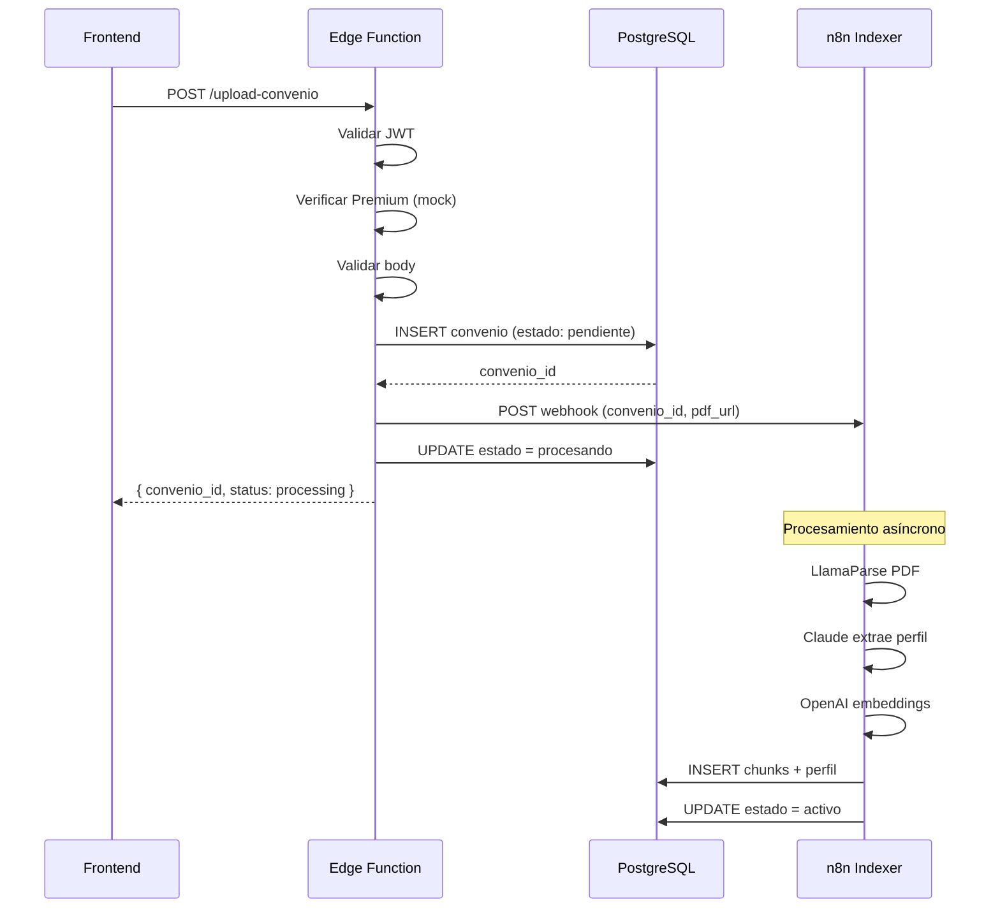

# Edge Function: upload-convenio

Edge Function para procesar subidas de convenios colectivos en formato PDF por parte de usuarios premium.

## Responsabilidades

1. **Autenticación**: Verificar que el usuario está autenticado mediante JWT
2. **Autorización**: Verificar que el usuario tiene suscripción premium (mock por ahora)
3. **Validación**: Validar request body (file_url, nombre_archivo, visibilidad)
4. **Persistencia**: Crear registro en tabla `convenios` con estado `pendiente`
5. **Webhook**: Disparar webhook a n8n para iniciar procesamiento
6. **Estado**: Actualizar estado del convenio a `procesando`

## Endpoint

```
POST /functions/v1/upload-convenio
```

## Request

### Headers

- `Authorization`: Bearer token (JWT de Supabase Auth) - **Requerido**
- `Content-Type`: application/json

### Body

```json
{
  "file_url": "https://storage.supabase.co/.../convenio.pdf",
  "nombre_archivo": "convenio-hosteleria-madrid.pdf",
  "visibilidad": "privado" | "publico",  // opcional, default: "privado"
  "pdf_hash": "a1b2c3d4..."  // opcional, SHA-256 del archivo (64 chars hex)
}
```

### Validaciones

- `file_url`: String no vacío (URL del archivo en Supabase Storage)
- `nombre_archivo`: String no vacío (nombre original del archivo)
- `visibilidad`: "publico" o "privado" (opcional, default: "privado")
- `pdf_hash`: SHA-256 hash del PDF (opcional, 64 caracteres hexadecimales)

## Response

### Success (200)

```json
{
  "convenio_id": "uuid-del-convenio",
  "status": "processing",
  "message": "Convenio en cola de procesamiento"
}
```

### Duplicate (200)

Si el usuario ya tiene un convenio con el mismo PDF (mismo hash):

```json
{
  "convenio_id": "uuid-del-convenio-existente",
  "status": "duplicate",
  "message": "Ya tienes un convenio con este PDF",
  "existing_convenio": {
    "id": "uuid-del-convenio-existente",
    "nombre": "Convenio de Hosteleria de Madrid"
  }
}
```

### Errors

#### 401 Unauthorized

```json
{
  "error": "No autorizado"
}
```

Usuario no envió header `Authorization`.

#### 401 Unauthorized

```json
{
  "error": "No autenticado"
}
```

JWT inválido o expirado.

#### 400 Bad Request

```json
{
  "error": "file_url is required and must be a string"
}
```

Request body inválido. Posibles errores:
- `file_url is required and must be a string`
- `nombre_archivo is required and must be a string`
- `visibilidad must be 'publico' or 'privado'`
- `Request body must be an object`
- `Invalid JSON`

#### 500 Internal Server Error

```json
{
  "error": "Error creando convenio",
  "details": "..."
}
```

Error al insertar en base de datos.

## Flujo de Procesamiento



## Variables de Entorno

- `SUPABASE_URL`: URL del proyecto Supabase
- `SUPABASE_ANON_KEY`: Clave anónima de Supabase
- `N8N_WEBHOOK_URL`: URL del webhook de n8n (opcional)

Si `N8N_WEBHOOK_URL` no está configurado, el convenio se queda en estado `pendiente` y no se procesa automáticamente.

## Testing Local

### 1. Iniciar Supabase

```bash
supabase start
```

### 2. Obtener JWT Token

Desde la aplicación frontend o usando el dashboard de Supabase.

### 3. Hacer Request

```bash
curl -i --location --request POST 'http://127.0.0.1:54321/functions/v1/upload-convenio' \
  --header 'Authorization: Bearer eyJhbGc...' \
  --header 'Content-Type: application/json' \
  --data '{
    "file_url": "https://example.com/test.pdf",
    "nombre_archivo": "convenio-test.pdf",
    "visibilidad": "privado"
  }'
```

### Expected Response

```json
{
  "convenio_id": "550e8400-e29b-41d4-a716-446655440000",
  "status": "processing",
  "message": "Convenio en cola de procesamiento"
}
```

## Running Tests

```bash
# Unit tests
deno test --allow-all --config supabase/functions/deno.json supabase/functions/upload-convenio/

# All edge function tests
pnpm test:deno
```

## Database Schema

### Tabla: convenios

```sql
CREATE TABLE convenios (
  id UUID PRIMARY KEY DEFAULT gen_random_uuid(),
  nombre TEXT NOT NULL,
  url_pdf TEXT,
  visibilidad VARCHAR(10) DEFAULT 'publico' CHECK (visibilidad IN ('publico', 'privado')),
  owner_id UUID REFERENCES auth.users(id),
  estado VARCHAR(20) DEFAULT 'pendiente' CHECK (estado IN ('pendiente', 'procesando', 'activo', 'error')),
  error_message TEXT,
  created_at TIMESTAMP WITH TIME ZONE DEFAULT NOW(),
  updated_at TIMESTAMP WITH TIME ZONE DEFAULT NOW()
);
```

### Row Level Security (RLS)

```sql
-- Usuarios ven convenios públicos o propios
CREATE POLICY "convenios_visibility" ON convenios
  FOR SELECT USING (
    visibilidad = 'publico'
    OR owner_id = auth.uid()
    OR owner_id IS NULL  -- convenios legacy sin owner
  );
```

## Integration con n8n

El webhook enviado a n8n contiene:

```json
{
  "convenio_id": "uuid",
  "pdf_url": "https://storage.supabase.co/.../archivo.pdf",
  "nombre_archivo": "convenio-hosteleria-madrid.pdf",
  "visibilidad": "privado",
  "owner_id": "user-uuid"
}
```

El workflow de n8n (`Workrules-Indexer.json`) debe:

1. Descargar PDF desde `pdf_url`
2. Procesar con LlamaParse
3. Extraer perfil con Claude
4. Generar embeddings con OpenAI
5. Insertar chunks y perfil en DB
6. Actualizar `convenios.estado` a `activo` o `error`

## TODOs

- [ ] Implementar verificación real de suscripción premium (por ahora es mock)
- [ ] Añadir rate limiting por usuario
- [ ] Implementar validación de URL (verificar que es del bucket correcto)
- [ ] Añadir logging estructurado con niveles
- [ ] Implementar retry automático si falla webhook n8n
